# Account Information & Quantity Feature Implementation Plan (Updated)

## Overview

This plan adds two critical features to the TrustBridge Market platform:

1. **Account Information** - Uses existing `Post_Credentials` table for storing account credentials (only visible after purchase)
2. **Remaining Quantity** - Inventory tracking for posts with multiple accounts

## Database Changes

### SQL Migration Commands

Run these commands to update your database:

```sql
-- =====================================================
-- MIGRATION SCRIPT: Account Information & Quantity
-- Run this on your TrustBridge database
-- =====================================================

-- 1. Update Categories table - Simplify to flat structure
-- First remove parent-child relationships
UPDATE Categories SET parent_id = NULL;

-- 2. Add remaining_quantity column to Posts table
ALTER TABLE Posts
ADD COLUMN remaining_quantity INT DEFAULT 1 COMMENT 'Available inventory count';

-- 3. Update existing Posts to have default quantity
UPDATE Posts SET remaining_quantity = 1 WHERE remaining_quantity IS NULL;

-- 4. Add "Out of Stock" status to Post_Statuses
INSERT INTO Post_Statuses (status_name, description)
VALUES ('Out of Stock', 'Product is out of stock - no inventory remaining')
ON DUPLICATE KEY UPDATE description = 'Product is out of stock - no inventory remaining';

-- 5. (Optional) Update Categories to simplified list
-- Uncomment below if you want to reset categories:
/*
DELETE FROM Categories WHERE category_id > 0;
ALTER TABLE Categories AUTO_INCREMENT = 1;

INSERT INTO Categories (category_name, category_icon, display_order) VALUES
('Giải trí', 'ph-game-controller', 1),
('Nghe Nhạc', 'ph-music-notes', 2),
('Xem Phim', 'ph-play-circle', 3),
('Khác', 'ph-dots-three', 4);
*/
```

### Existing Post_Credentials Table Structure

The existing table will be used:

```sql
CREATE TABLE Post_Credentials (
    credential_id INT AUTO_INCREMENT PRIMARY KEY,
    post_id INT UNIQUE,                        -- One-to-one with Posts
    account_username VARCHAR(255) NOT NULL,
    account_password VARCHAR(255) NOT NULL,
    security_notes TEXT,
    FOREIGN KEY (post_id) REFERENCES Posts(post_id)
);
```

**Note:** We'll use `security_notes` field to store additional account information like login instructions, profile slot, etc.

## Architecture Flow

```mermaid
flowchart TD
    subgraph Seller Flow
        A[Seller creates post] --> B[Fill form with credentials and quantity]
        B --> C[Post saved with remaining_quantity]
        C --> D[PostCredential saved separately]
    end

    subgraph Database
        E[(Posts Table)]
        F[(Post_Credentials Table)]
        E -->|1:1| F
    end

    subgraph Buyer Flow
        G[Buyer views product] --> H[Credentials HIDDEN]
        H --> I[Buyer purchases]
        I --> J[remaining_quantity decrements]
        J --> K{quantity = 0?}
        K -->|Yes| L[Status = Out of Stock]
        K -->|No| M[Status remains Available]
        L --> N[Buyer views order details]
        M --> N
        N --> O[Credentials REVEALED from Post_Credentials]
    end
```



## Implementation Steps

### Step 1: Update Post Entity

**File:** `src/main/java/com/group3/accounttrade/entity/Post.java`

Add:

- `remainingQuantity` (Integer, default 1)
- `@OneToOne` relationship to `PostCredential` (mappedBy, cascade all, orphanRemoval)

### Step 2: Update PostCredential Entity

**File:** `src/main/java/com/group3/accounttrade/entity/PostCredential.java`

Keep existing structure, ensure:

- `@OneToOne` back to Post
- `securityNotes` can hold multi-line text

### Step 3: Create PostCredentialRepository

**File:** `src/main/java/com/group3/accounttrade/repository/PostCredentialRepository.java`

Add methods:

- `findByPost_PostId(Integer postId)`
- `deleteByPost_PostId(Integer postId)`

### Step 4: Update PostForm DTO

**File:** `src/main/java/com/group3/accounttrade/dto/PostForm.java`

Add fields:

- `accountUsername` (String, @NotBlank)
- `accountPassword` (String, @NotBlank)
- `securityNotes` (String) - Multi-line text for additional info
- `remainingQuantity` (Integer, @Min(1), default 1)

### Step 5: Update PostService

**File:** `src/main/java/com/group3/accounttrade/service/PostService.java`

Modify:

- `createPost()` - Create PostCredential along with Post
- `updatePost()` - Update PostCredential along with Post
- Add `PostCredentialRepository` dependency

### Step 6: Update Seller Forms

**Files:**

- `src/main/resources/templates/seller_create_post.html`
- `src/main/resources/templates/seller_edit_post.html`

Add fields:

- Account Username (text input)
- Account Password (password input or text)
- Security Notes (textarea - multi-line)
- Remaining Quantity (number input, min 1)

### Step 7: Update BuyerTransactionService

**File:** `src/main/java/com/group3/accounttrade/service/BuyerTransactionService.java`

Modify `checkoutPost()`:

- Check `remainingQuantity > 0`
- Decrement `remainingQuantity`
- If `remainingQuantity == 0`, set status to "Out of Stock"

### Step 8: Update BuyerController

**File:** `src/main/java/com/group3/accounttrade/controller/BuyerController.java`

Add endpoint:

- `GET /buyer/orders/{transactionId}` - Show order details with credentials

### Step 9: Create Order Details Page

**File:** `src/main/resources/templates/buyer_order_detail.html`

Display:

- Product title, seller, price, status
- **Account Information section:**
  - Username
  - Password
  - Security Notes (instructions)

### Step 10: Update buyer_purchases.html

Add "View Details" button linking to order details page

## Security Considerations

1. **Credential Access Control**
   - Only buyer who completed purchase can view
   - Must verify `transaction.buyer.username == authenticated.username`
   - Transaction must be in appropriate status (not Pending refund)

2. **Quantity Race Condition**
   - Use `@Transactional` with optimistic locking
   - Check quantity before decrement
   - Handle `OptimisticLockException`

3. **Form Security**
   - Credentials never sent to marketplace pages
   - PostCredential loaded only when buyer views order

## Files to Modify/Create

| File                            | Action | Changes                                                                |
| ------------------------------- | ------ | ---------------------------------------------------------------------- |
| `Post.java`                     | Modify | Add remainingQuantity, OneToOne to PostCredential                      |
| `PostCredential.java`           | Verify | Ensure correct mapping                                                 |
| `PostCredentialRepository.java` | Create | New repository interface                                               |
| `PostForm.java`                 | Modify | Add accountUsername, accountPassword, securityNotes, remainingQuantity |
| `PostService.java`              | Modify | Handle credential creation/update                                      |
| `BuyerTransactionService.java`  | Modify | Add quantity decrement logic                                           |
| `BuyerController.java`          | Modify | Add order detail endpoint                                              |
| `seller_create_post.html`       | Modify | Add credential input fields                                            |
| `seller_edit_post.html`         | Modify | Add credential input fields with existing values                       |
| `buyer_purchases.html`          | Modify | Add view details link                                                  |
| `buyer_order_detail.html`       | Create | New page showing credentials                                           |

## Testing Checklist

- [ ] Create post with credentials and quantity
- [ ] Edit post and modify credentials
- [ ] View product page - credentials NOT visible
- [ ] Purchase product - quantity decrements
- [ ] View order details - credentials visible
- [ ] Purchase until quantity = 0 - status changes to Out of Stock
- [ ] Cannot purchase Out of Stock items
- [ ] Non-buyer cannot access credentials
- [ ] PostCredential deleted when Post deleted (cascade)
