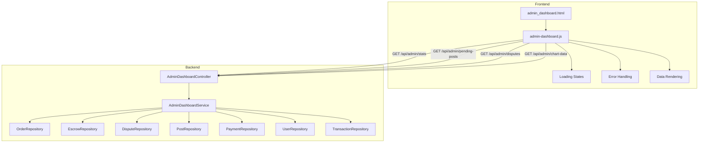

# Admin Dashboard Refactoring Plan

## Overview

This plan outlines the refactoring of the admin dashboard to replace all hardcoded placeholder values with dynamic data retrieved from the backend API. The implementation includes necessary JavaScript fetch calls, proper error handling, and loading states.

## Current State Analysis

### Hardcoded Values Identified in [`admin_dashboard.html`](src/main/resources/templates/admin_dashboard.html)

1. **Metrics Grid - Lines 161-220**
   - Transaction Volume (24h): `1.062.500.000 ₫` with `+12.5%` trend
   - Escrow Holdings: `3.125.000.000 ₫` with `450 transactions`
   - Platform Fee Revenue (Monthly): `385.500.000 ₫` with `+5.2%` trend
   - Alerts: `3` complaints, `12` pending approvals

2. **Pending Approvals Section - Lines 241-296**
   - Three hardcoded product items awaiting approval
   - Static seller names, prices, and product titles

3. **Dispute Center - Lines 299-353**
   - Single hardcoded dispute row
   - Static transaction ID, amount, description, and user names

4. **Chart Data - Lines 369-386**
   - Hardcoded weekly labels: `['Mon', 'Tue', 'Wed', 'Thu', 'Fri', 'Sat', 'Sun']`
   - Hardcoded data values: `[25000, 32000, 28000, 39000, 42000, 45000, 41000]`

5. **Sidebar Alert Badge - Line 137**
   - Hardcoded dispute count: `3`

---

## Architecture

### Data Flow Diagram



---

## Implementation Plan

### Phase 1: Backend Service Layer

#### 1.1 Create AdminDashboardService.java

**Location:** `src/main/java/com/group3/accounttrade/service/AdminDashboardService.java`

**Methods:**

- `getDashboardStats()` - Returns aggregated platform statistics
- `getPendingApprovals(int limit)` - Returns posts pending admin approval
- `getPendingDisputes(int limit)` - Returns disputes requiring attention
- `getTransactionVolumeChartData(int days)` - Returns daily transaction volumes

**DTOs:**

```java
public record AdminDashboardStats(
    BigDecimal dailyTransactionVolume,
    double dailyVolumeChangePercent,
    BigDecimal escrowHoldings,
    long escrowTransactionCount,
    BigDecimal monthlyFeeRevenue,
    double monthlyRevenueChangePercent,
    long pendingDisputeCount,
    long pendingApprovalCount
) {}

public record PendingPostDTO(
    Integer postId,
    String title,
    String sellerName,
    BigDecimal price,
    String categoryName,
    LocalDateTime createdAt
) {}

public record DisputeDTO(
    Long disputeId,
    String disputeNumber,
    String orderNumber,
    BigDecimal orderAmount,
    String reason,
    String buyerName,
    String sellerName,
    LocalDateTime openedAt
) {}

public record ChartDataPoint(
    String label,
    BigDecimal value
) {}
```

#### 1.2 Add Repository Methods

**OrderRepository additions:**

```java
@Query("SELECT SUM(o.totalAmount) FROM Order o WHERE o.createdAt BETWEEN :start AND :end AND o.orderStatus.statusName IN :statusNames")
BigDecimal sumVolumeBetweenDates(LocalDateTime start, LocalDateTime end, List<String> statusNames);

@Query("SELECT COUNT(o) FROM Order o WHERE o.createdAt BETWEEN :start AND :end")
long countBetweenDates(LocalDateTime start, LocalDateTime end);
```

**PostRepository additions:**

```java
@Query("SELECT p FROM Post p WHERE p.postStatus.statusName = :statusName ORDER BY p.createdAt DESC")
List<Post> findByPostStatus(String statusName, Pageable pageable);

@Query("SELECT COUNT(p) FROM Post p WHERE p.postStatus.statusName = :statusName")
long countByPostStatusName(String statusName);
```

**PaymentRepository additions:**

```java
@Query("SELECT SUM(p.amount) FROM Payment p WHERE p.paymentStatus.statusName = 'COMPLETED' AND p.paidAt BETWEEN :start AND :end")
BigDecimal sumCompletedPaymentsBetween(LocalDateTime start, LocalDateTime end);
```

---

### Phase 2: Backend Controller Layer

#### 2.1 Create AdminDashboardController.java

**Location:** `src/main/java/com/group3/accounttrade/controller/AdminDashboardController.java`

**Endpoints:**

| Method | Endpoint                        | Description                   | Response               |
| ------ | ------------------------------- | ----------------------------- | ---------------------- |
| GET    | `/api/admin/stats`              | Dashboard statistics          | `AdminDashboardStats`  |
| GET    | `/api/admin/pending-posts`      | Posts awaiting approval       | `List<PendingPostDTO>` |
| GET    | `/api/admin/disputes`           | Active disputes               | `List<DisputeDTO>`     |
| GET    | `/api/admin/chart-data`         | Transaction volume chart data | `List<ChartDataPoint>` |
| POST   | `/api/admin/posts/{id}/approve` | Approve a post                | `Success response`     |
| POST   | `/api/admin/posts/{id}/reject`  | Reject a post                 | `Success response`     |

**Security:** All endpoints require `ROLE_ADMIN`

---

### Phase 3: Frontend Implementation

#### 3.1 Create JavaScript Module

**Location:** `src/main/resources/static/js/admin-dashboard.js`

**Module Structure:**

```javascript
const AdminDashboard = {
    // Configuration
    config: {
        apiBaseUrl: '/api/admin',
        refreshInterval: 30000, // 30 seconds
        chartDays: 7
    },

    // State management
    state: {
        stats: null,
        pendingPosts: [],
        disputes: [],
        chartData: [],
        loading: {},
        errors: {}
    },

    // API methods
    api: {
        fetchStats(),
        fetchPendingPosts(),
        fetchDisputes(),
        fetchChartData(),
        approvePost(postId),
        rejectPost(postId)
    },

    // UI methods
    ui: {
        showLoading(section),
        hideLoading(section),
        showError(section, message),
        renderStats(stats),
        renderPendingPosts(posts),
        renderDisputes(disputes),
        renderChart(data),
        updateBadges()
    },

    // Initialization
    init()
};
```

#### 3.2 Loading States Implementation

**HTML Structure for Loading:**

```html
<div id="stats-loading" class="hidden">
  <div class="animate-pulse flex space-x-4">
    <div class="flex-1 space-y-4 py-1">
      <div class="h-4 bg-gray-200 rounded w-3/4"></div>
      <div class="h-4 bg-gray-200 rounded w-1/2"></div>
    </div>
  </div>
</div>
```

**CSS Classes:**

- `.skeleton-loading` - Animated loading placeholder
- `.hidden` - Display none
- `.error-state` - Error message styling

#### 3.3 Error Handling Implementation

**Error Display Pattern:**

```javascript
showError(section, message) {
    const errorContainer = document.getElementById(`${section}-error`);
    if (errorContainer) {
        errorContainer.innerHTML = `
            <div class="bg-red-50 border border-red-200 text-red-700 px-4 py-3 rounded-lg flex items-center gap-2">
                <i class="ph-fill ph-warning-circle"></i>
                <span>${message}</span>
                <button onclick="AdminDashboard.retry('${section}')" class="ml-auto text-red-600 hover:text-red-800">
                    <i class="ph-bold ph-arrow-clockwise"></i> Retry
                </button>
            </div>
        `;
        errorContainer.classList.remove('hidden');
    }
}
```

---

### Phase 4: HTML Template Updates

#### 4.1 Add Data Bindings to admin_dashboard.html

**Metrics Grid Updates:**

```html
<!-- Total Platform Volume -->
<div class="card bg-gray-900 text-white ...">
  <h3 class="text-gray-400 text-sm font-bold mb-1 relative z-10">
    Khối lượng giao dịch (24h)
  </h3>
  <div
    id="stat-volume"
    class="text-3xl font-bold mb-2 relative z-10 tracking-tight"
  >
    <span class="skeleton-loading">---</span>
  </div>
  <div
    id="stat-volume-trend"
    class="flex items-center gap-1 text-success text-sm font-bold relative z-10"
  >
    <!-- Dynamic trend indicator -->
  </div>
</div>
```

**Pending Posts List Updates:**

```html
<div id="pending-posts-container" class="space-y-4">
  <!-- Dynamic content loaded here -->
  <div id="pending-posts-loading" class="text-center py-4">
    <i class="ph ph-spinner ph-spin text-2xl text-gray-400"></i>
  </div>
</div>
```

**Disputes Table Updates:**

```html
<tbody id="disputes-table-body" class="divide-y divide-gray-100">
  <!-- Dynamic content loaded here -->
</tbody>
```

#### 4.2 Add Script Reference

```html
<script src="/js/admin-dashboard.js"></script>
<script>
  document.addEventListener("DOMContentLoaded", function () {
    AdminDashboard.init();
  });
</script>
```

---

## File Changes Summary

### New Files to Create

| File                                                                             | Description                              |
| -------------------------------------------------------------------------------- | ---------------------------------------- |
| `src/main/java/com/group3/accounttrade/service/AdminDashboardService.java`       | Service for aggregating admin statistics |
| `src/main/java/com/group3/accounttrade/controller/AdminDashboardController.java` | REST API controller for admin endpoints  |
| `src/main/java/com/group3/accounttrade/dto/AdminDashboardStats.java`             | DTO for dashboard statistics             |
| `src/main/java/com/group3/accounttrade/dto/PendingPostDTO.java`                  | DTO for pending posts                    |
| `src/main/java/com/group3/accounttrade/dto/DisputeDTO.java`                      | DTO for disputes                         |
| `src/main/resources/static/js/admin-dashboard.js`                                | Frontend JavaScript module               |

### Files to Modify

| File                                                                      | Changes                              |
| ------------------------------------------------------------------------- | ------------------------------------ |
| `src/main/java/com/group3/accounttrade/repository/OrderRepository.java`   | Add admin query methods              |
| `src/main/java/com/group3/accounttrade/repository/PostRepository.java`    | Add post status queries              |
| `src/main/java/com/group3/accounttrade/repository/PaymentRepository.java` | Add payment aggregation queries      |
| `src/main/resources/templates/admin_dashboard.html`                       | Add data bindings and loading states |

---

## API Response Examples

### GET /api/admin/stats

```json
{
  "dailyTransactionVolume": 1062500000,
  "dailyVolumeChangePercent": 12.5,
  "escrowHoldings": 3125000000,
  "escrowTransactionCount": 450,
  "monthlyFeeRevenue": 385500000,
  "monthlyRevenueChangePercent": 5.2,
  "pendingDisputeCount": 3,
  "pendingApprovalCount": 12
}
```

### GET /api/admin/pending-posts

```json
[
  {
    "postId": 123,
    "title": "CS:GO Prime Acc (Global)",
    "sellerName": "GamerX",
    "price": 3750000,
    "categoryName": "Gaming",
    "createdAt": "2026-03-19T00:00:00"
  }
]
```

### GET /api/admin/disputes

```json
[
  {
    "disputeId": 1,
    "disputeNumber": "DSP-001",
    "orderNumber": "TRX-8241",
    "orderAmount": 11250000,
    "reason": "Tài khoản bị khóa sau 2 giờ",
    "buyerName": "UserABC",
    "sellerName": "ProGamer99",
    "openedAt": "2026-03-19T00:00:00"
  }
]
```

### GET /api/admin/chart-data?days=7

```json
[
  { "label": "Mon", "value": 25000000 },
  { "label": "Tue", "value": 32000000 },
  { "label": "Wed", "value": 28000000 },
  { "label": "Thu", "value": 39000000 },
  { "label": "Fri", "value": 42000000 },
  { "label": "Sat", "value": 45000000 },
  { "label": "Sun", "value": 41000000 }
]
```

---

## Security Considerations

1. **Authentication:** All admin endpoints require authenticated user
2. **Authorization:** All endpoints require `ROLE_ADMIN` authority
3. **CSRF Protection:** POST endpoints include CSRF token
4. **Input Validation:** All parameters validated before processing
5. **Rate Limiting:** Consider implementing rate limiting for admin APIs

---

## Error Handling Strategy

### Backend Error Responses

| HTTP Status               | Scenario                |
| ------------------------- | ----------------------- |
| 401 Unauthorized          | User not authenticated  |
| 403 Forbidden             | User lacks ADMIN role   |
| 404 Not Found             | Resource not found      |
| 500 Internal Server Error | Unexpected server error |

### Frontend Error Handling

1. **Network Errors:** Display retry button with error message
2. **Authentication Errors:** Redirect to login page
3. **Authorization Errors:** Display access denied message
4. **Server Errors:** Display generic error with retry option

---

## Testing Checklist

- [ ] Verify all API endpoints return correct data
- [ ] Test loading states display correctly
- [ ] Test error states display and retry functionality
- [ ] Verify chart updates with real data
- [ ] Test approve/reject post functionality
- [ ] Verify dispute intervention functionality
- [ ] Test responsive design on mobile devices
- [ ] Verify CSRF protection on POST endpoints
- [ ] Test with various admin user scenarios

---

## Implementation Order

1. **Backend First:** Create service and controller with all endpoints
2. **Frontend Second:** Create JavaScript module with API integration
3. **Integration Third:** Update HTML template with data bindings
4. **Testing Last:** Verify all functionality works end-to-end

This approach ensures the backend is stable before frontend integration, making debugging easier if issues arise.
