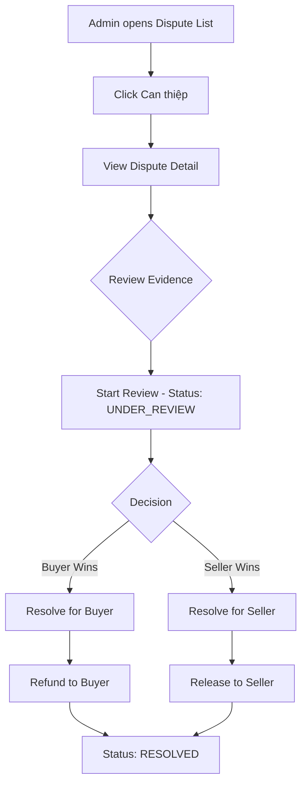

# Admin Dispute Intervention Implementation Plan

## Overview

This plan outlines the implementation of the "Can thiệp" (Intervene) action in the Admin Dispute Management page. When an admin clicks the "Can thiệp" button, they should be taken to a detailed dispute view where they can review evidence, communicate with parties, and resolve the dispute.

## Current State Analysis

### Existing Infrastructure

| Component                                                                                                         | Status                  | Description                                     |
| ----------------------------------------------------------------------------------------------------------------- | ----------------------- | ----------------------------------------------- |
| [`AdminDashboardController.java`](src/main/java/com/group3/accounttrade/controller/AdminDashboardController.java) | ✅ Complete             | REST API endpoints for dispute operations       |
| [`AdminController.java`](src/main/java/com/group3/accounttrade/controller/AdminController.java)                   | ⚠️ Missing detail route | Page controller for admin views                 |
| [`admin_disputes.html`](src/main/resources/templates/admin_disputes.html)                                         | ✅ Complete             | Dispute list page with "Can thiệp" button       |
| [`admin-disputes.js`](src/main/resources/static/js/admin-disputes.js)                                             | ⚠️ Missing handler      | JavaScript module - button has no click handler |
| [`DisputeDetailDTO.java`](src/main/java/com/group3/accounttrade/dto/DisputeDetailDTO.java)                        | ✅ Complete             | DTO with all dispute details                    |
| [`DisputeService.java`](src/main/java/com/group3/accounttrade/service/DisputeService.java)                        | ✅ Complete             | Service with resolution methods                 |

### Available REST API Endpoints

The following endpoints are already implemented in [`AdminDashboardController.java`](src/main/java/com/group3/accounttrade/controller/AdminDashboardController.java):

| Endpoint                                         | Method | Purpose                 |
| ------------------------------------------------ | ------ | ----------------------- |
| `/api/admin/disputes/{disputeId}`                | GET    | Get dispute detail      |
| `/api/admin/disputes/{disputeId}/assign`         | POST   | Assign admin to dispute |
| `/api/admin/disputes/{disputeId}/review`         | POST   | Start review process    |
| `/api/admin/disputes/{disputeId}/resolve/buyer`  | POST   | Resolve in buyer favor  |
| `/api/admin/disputes/{disputeId}/resolve/seller` | POST   | Resolve in seller favor |
| `/api/admin/disputes/{disputeId}/notes`          | POST   | Add admin notes         |

## Implementation Steps

### Step 1: Add Page Route in AdminController

Add a GET endpoint to serve the dispute detail page:

```java
@GetMapping("/disputes/{id}")
public String viewAdminDisputeDetail(@PathVariable Long id, Model model) {
    model.addAttribute("disputeId", id);
    return "admin_dispute_detail";
}
```

**File to modify:** [`AdminController.java`](src/main/java/com/group3/accounttrade/controller/AdminController.java)

### Step 2: Create admin_dispute_detail.html Template

Create a new Thymeleaf template with the following sections:

#### Template Structure

```
┌─────────────────────────────────────────────────────────────┐
│ Navigation Bar                                              │
├─────────────────────────────────────────────────────────────┤
│ Sidebar │ Main Content                                      │
│         │ ┌─────────────────────────────────────────────────┤
│         │ │ Header: Dispute # + Status Badge                │
│         │ ├─────────────────────────────────────────────────┤
│         │ │ Stats Cards: Status, Amount, Opened, Deadline   │
│         │ ├─────────────────────────────────────────────────┤
│         │ │ Order Information Card                          │
│         │ ├─────────────────────────────────────────────────┤
│         │ │ Parties Section:                                │
│         │ │ ┌──────────────┬──────────────┐                │
│         │ │ │ Buyer Card   │ Seller Card  │                │
│         │ │ └──────────────┴──────────────┘                │
│         │ ├─────────────────────────────────────────────────┤
│         │ │ Evidence Section:                               │
│         │ │ - Buyer Evidence                                │
│         │ │ - Seller Response                               │
│         │ │ - Images/Attachments                            │
│         │ ├─────────────────────────────────────────────────┤
│         │ │ Timeline / Message History                      │
│         │ ├─────────────────────────────────────────────────┤
│         │ │ Admin Actions Panel:                            │
│         │ │ - Start Review Button                           │
│         │ │ - Add Notes Form                                │
│         │ │ - Resolve for Buyer Button                      │
│         │ │ - Resolve for Seller Button                     │
│         │ └─────────────────────────────────────────────────┤
└─────────┴───────────────────────────────────────────────────┘
```

**File to create:** `src/main/resources/templates/admin_dispute_detail.html`

### Step 3: Create admin-dispute-detail.js Module

Create a JavaScript module to handle:

1. Loading dispute details from API
2. Rendering dispute information
3. Handling admin actions (review, resolve, notes)
4. Real-time updates

```javascript
const AdminDisputeDetail = (function () {
  const state = {
    disputeId: null,
    dispute: null,
    loading: false,
  };

  async function loadDispute() {
    /* ... */
  }
  async function startReview() {
    /* ... */
  }
  async function resolveForBuyer() {
    /* ... */
  }
  async function resolveForSeller() {
    /* ... */
  }
  async function addNotes() {
    /* ... */
  }

  return {
    init: function (disputeId) {
      /* ... */
    },
    refresh: function () {
      /* ... */
    },
    startReview: startReview,
    resolveForBuyer: resolveForBuyer,
    resolveForSeller: resolveForSeller,
    addNotes: addNotes,
  };
})();
```

**File to create:** `src/main/resources/static/js/admin-dispute-detail.js`

### Step 4: Update admin-disputes.js

Add the `intervene` function to handle the "Can thiệp" button click:

```javascript
function intervene(disputeId) {
  window.location.href = "/admin/disputes/" + disputeId;
}

// Update renderDisputes to include onclick handler:
html +=
  '<button onclick="AdminDisputes.intervene(' +
  dispute.disputeId +
  ')" ...>Can thiệp</button>';
```

**File to modify:** [`admin-disputes.js`](src/main/resources/static/js/admin-disputes.js)

## Dispute Resolution Flow



## State Transitions

| Current Status | Action             | New Status   | Effect                   |
| -------------- | ------------------ | ------------ | ------------------------ |
| OPENED         | Start Review       | UNDER_REVIEW | Escrow remains FROZEN    |
| UNDER_REVIEW   | Resolve for Buyer  | RESOLVED     | Escrow → REFUNDED        |
| UNDER_REVIEW   | Resolve for Seller | RESOLVED     | Escrow → RELEASED        |
| OPENED         | Resolve directly   | RESOLVED     | Based on resolution type |

## UI Components

### Status Badge Colors

| Status       | Color  | Tailwind Classes                |
| ------------ | ------ | ------------------------------- |
| OPENED       | Red    | `bg-red-100 text-red-700`       |
| UNDER_REVIEW | Orange | `bg-orange-100 text-orange-700` |
| RESOLVED     | Green  | `bg-green-100 text-green-700`   |
| CANCELLED    | Gray   | `bg-gray-100 text-gray-700`     |

### Action Button States

| Action             | Prerequisite          | Confirmation Required |
| ------------------ | --------------------- | --------------------- |
| Start Review       | Status = OPENED       | No                    |
| Add Notes          | Any status            | No                    |
| Resolve for Buyer  | Status = UNDER_REVIEW | Yes + Resolution text |
| Resolve for Seller | Status = UNDER_REVIEW | Yes + Resolution text |

## Files Summary

| File                        | Action | Description                       |
| --------------------------- | ------ | --------------------------------- |
| `AdminController.java`      | MODIFY | Add dispute detail page route     |
| `admin_dispute_detail.html` | CREATE | Dispute detail page template      |
| `admin-dispute-detail.js`   | CREATE | JavaScript module for detail page |
| `admin-disputes.js`         | MODIFY | Add intervene function            |

## Testing Checklist

- [ ] Click "Can thiệp" navigates to detail page
- [ ] Dispute details load correctly
- [ ] Start Review updates status to UNDER_REVIEW
- [ ] Add Notes saves admin notes
- [ ] Resolve for Buyer refunds buyer and updates order
- [ ] Resolve for Seller releases escrow to seller
- [ ] Status badges display correctly
- [ ] Timeline shows all events
- [ ] Evidence images display correctly

## Security Considerations

1. All endpoints require `ADMIN` role via `@PreAuthorize("hasRole('ADMIN')")`
2. CSRF protection enabled for all POST requests
3. Input validation on resolution text and notes
4. Audit logging for all admin actions
