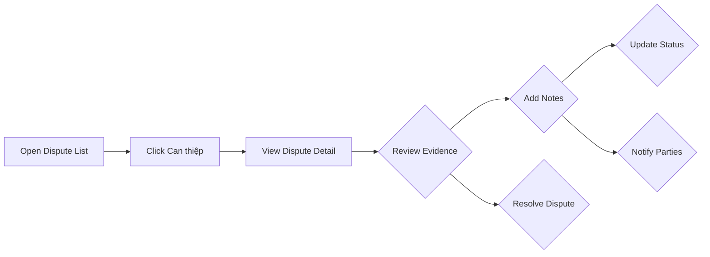

# Admin Dispute Intervention Implementation Plan

## Overview
Implement the "Can thiệp" (Intervene) action in the Admin Dispute Management page to allow admins to review and resolve disputes.

## Current State
- **admin_disputes.html** - Has dispute list with "Can thiệp" button
- **admin-disputes.js** - Handles data loading and filtering
- **AdminDashboardController** - Has REST API endpoints
- **DisputeService** - Has resolution methods
## Missing Components
1. **Admin Dispute Detail Page** - Dedicated page for viewing dispute details
2. **"Can thiệp" Button Handler** - Connect button to detail page
3. **Intervention Flow** - Complete workflow for admin
## Implementation Steps
### Step 1: Create Admin Dispute Detail Page
Create `admin_dispute_detail.html` with:
- Dispute information header
- Order details section
- Buyer/Seller information cards
- Evidence display sections
- Timeline component
- Admin action panel
### Step 2: Update admin-disputes.js
Add function to handle "Can thiệp" button:
```javascript
function handleIntervene(disputeId) {
    window.location.href = '/admin/disputes/' + disputeId;
}
```
### Step 3: Add Controller Endpoint
Add endpoint in AdminDashboardController:
```java
@GetMapping("/disputes/{id}")
public String viewDisputeDetail(@PathVariable Long id, Model model) {
    // Get dispute and add to model
    return "admin_dispute_detail";
}
```
### Step 4: Implement Resolution Actions
The detail page will have forms for:
- Resolving in buyer's favor (refund)
- Resolving in seller's favor (release payment)
- Adding admin notes
## Dispute Resolution Flow

## Files to Modify
1. `src/main/resources/templates/admin_dispute_detail.html` - NEW
2. `src/main/resources/static/js/admin-disputes.js` - MODIFY
3. `src/main/java/com/group3/accounttrade/controller/AdminDashboardController.java` - MODIFY

## Dispute Resolution Flow


## Files to Modify

1. `src/main/resources/templates/admin_dispute_detail.html` - NEW
2. `src/main/resources/static/js/admin-disputes.js` - MODIFY
3. `src/main/java/com/group3/accounttrade/controller/AdminDashboardController.java` - MODIFY
