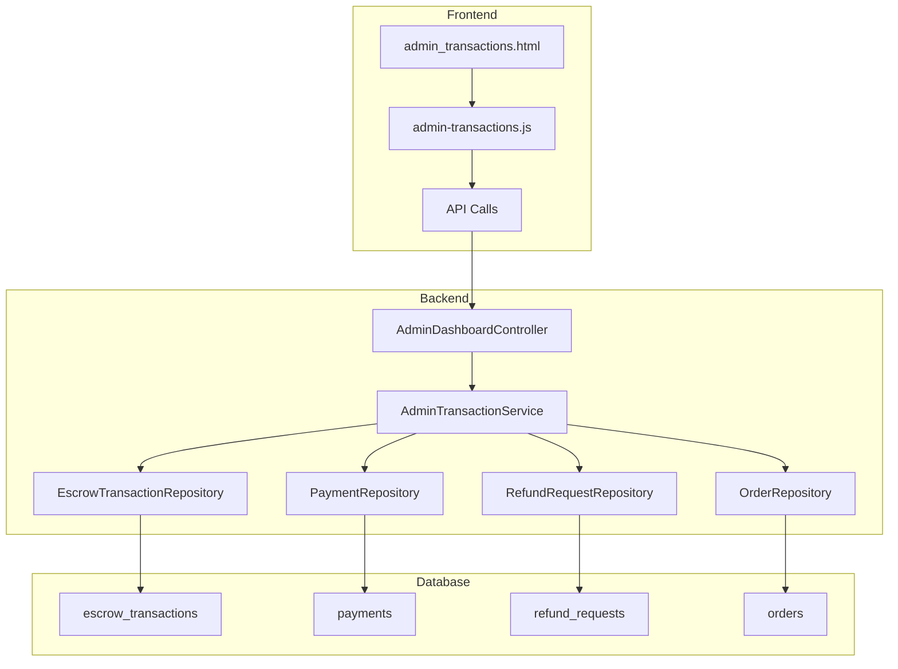

# Admin Transaction History Page Implementation Plan

## Overview

Implement a comprehensive "Lịch sử giao dịch" (Transaction History) page for the admin dashboard that displays all platform transactions including escrow transactions, payments, refunds, and order history.

## Current State Analysis

### Existing Files

- [`AdminController.java`](src/main/java/com/group3/accounttrade/controller/AdminController.java:33) - Has `/admin/transactions` route returning placeholder template
- [`admin_transactions.html`](src/main/resources/templates/admin_transactions.html) - Placeholder template (930 chars)
- [`EscrowTransaction.java`](src/main/java/com/group3/accounttrade/entity/EscrowTransaction.java) - Entity for escrow transaction records
- [`Payment.java`](src/main/java/com/group3/accounttrade/entity/Payment.java) - Entity for payment records
- [`RefundRequest.java`](src/main/java/com/group3/accounttrade/entity/RefundRequest.java) - Entity for refund requests
- [`Order.java`](src/main/java/com/group3/accounttrade/entity/Order.java) - Entity for orders

### Transaction Types to Display

1. **Escrow Transactions** - CREATED, RELEASED, REFUNDED, FROZEN, PARTIAL_RELEASE, PARTIAL_REFUND, UNFROZEN
2. **Payments** - VNPAY payment records with status
3. **Refunds** - Refund request records
4. **Orders** - Order transactions with status

## Architecture Design

### Data Flow Diagram



### API Endpoints Design

| Endpoint                         | Method | Description                             |
| -------------------------------- | ------ | --------------------------------------- |
| `/api/admin/transactions`        | GET    | Get paginated transactions with filters |
| `/api/admin/transactions/stats`  | GET    | Get transaction statistics              |
| `/api/admin/transactions/{id}`   | GET    | Get transaction detail                  |
| `/api/admin/transactions/export` | GET    | Export transactions to CSV              |

### Transaction DTO Design

```java
public record TransactionDTO(
    Long transactionId,
    String transactionNumber,
    String transactionType,
    String category,           // ESCROW, PAYMENT, REFUND, ORDER
    BigDecimal amount,
    String currency,
    String status,
    String description,
    UserInfo buyer,
    UserInfo seller,
    OrderInfo order,
    LocalDateTime createdAt,
    LocalDateTime processedAt
) {}
```

## Implementation Steps

### Phase 1: Backend Implementation

#### Step 1.1: Create Transaction DTOs

- [ ] Create `TransactionDTO.java` in dto package
- [ ] Create `TransactionStatsDTO.java` for statistics
- [ ] Create `TransactionFilterDTO.java` for filtering

#### Step 1.2: Create Transaction Service

- [ ] Create `AdminTransactionService.java` with methods:
  - `getAllTransactions(String type, String status, LocalDateTime from, LocalDateTime to, Pageable pageable)`
  - `getTransactionStats()`
  - `getTransactionDetail(Long id)`
  - `exportTransactions(String type, LocalDateTime from, LocalDateTime to)`

#### Step 1.3: Add Repository Methods

- [ ] Add custom queries to `EscrowTransactionRepository`
- [ ] Add custom queries to `PaymentRepository`
- [ ] Add custom queries to `RefundRequestRepository`

#### Step 1.4: Create Controller Endpoints

- [ ] Add endpoints to `AdminDashboardController.java`:
  - `GET /api/admin/transactions`
  - `GET /api/admin/transactions/stats`
  - `GET /api/admin/transactions/{id}`

### Phase 2: Frontend Implementation

#### Step 2.1: Create JavaScript Module

- [ ] Create `admin-transactions.js` with:
  - Transaction list loading with pagination
  - Filter functionality by type, status, date range
  - Search functionality
  - Statistics display
  - Export functionality

#### Step 2.2: Create HTML Template

- [ ] Update `admin_transactions.html` with:
  - Statistics cards at top
  - Filter panel
  - Transaction table with columns:
    - Mã GD (Transaction Number)
    - Loại (Type)
    - Số tiền (Amount)
    - Trạng thái (Status)
    - Người mua (Buyer)
    - Người bán (Seller)
    - Thời gian (Time)
    - Thao tác (Actions)
  - Pagination controls
  - Transaction detail modal

#### Step 2.3: Add Navigation

- [ ] Add "Giao dịch" link to admin sidebar in all admin templates

### Phase 3: Testing & Polish

#### Step 3.1: Testing

- [ ] Test all API endpoints
- [ ] Test pagination
- [ ] Test filtering
- [ ] Test search
- [ ] Test responsive design

#### Step 3.2: Polish

- [ ] Add loading states
- [ ] Add error handling
- [ ] Add empty states
- [ ] Add tooltips and help text

## UI Design

### Page Layout

```
+------------------------------------------------------------------+
| TrustBridge Admin | Dashboard | Users | Posts | Giao dịch | ...  |
+------------------------------------------------------------------+
|                                                                    |
| Lịch sử giao dịch                              [Export] [Refresh] |
|                                                                    |
| +--------------------------------------------------------------+ |
| | Thống kê                                                      | |
| | +--------+ +--------+ +--------+ +--------+ +--------+       | |
| | | Tổng GD | | Thành công| | Chờ xử lý| | Hoàn tiền| | Đóng băng|      | |
| | | 1,234  | | 1,100    | | 50      | | 84     | | 0       |       | |
| | +--------+ +--------+ +--------+ +--------+ +--------+       | |
| +--------------------------------------------------------------+ |
|                                                                    |
| +--------------------------------------------------------------+ |
| | Bộ lọc                                                        | |
| | Loại: [Tất cả ▼] Status: [Tất cả ▼] From: [Date] To: [Date] | |
| | Search: [________________] [Áp dụng] [Reset]                 | |
| +--------------------------------------------------------------+ |
|                                                                    |
| +--------------------------------------------------------------+ |
| | Bảng giao dịch                                                | |
| | +------+-------+--------+--------+------+-------+------+----+ | |
| | | Mã GD| Loại  | Số tiền| Status | Mua  | Bán   | Time  | #  | | |
| | +------+-------+--------+--------+------+-------+------+----+ | |
| | | TX001 | ESCROW| 100,000| SUCCESS| user1| seller1| 10:30| 👁️ | | |
| | | TX002 | PAYMENT| 50,000| PENDING| user2| seller2| 11:00| 👁️ | | |
| | | TX003 | REFUND| 75,000| APPROVED| user3| seller3| 12:15| 👁️ | | |
| | +------+-------+--------+--------+------+-------+------+----+ | |
| +--------------------------------------------------------------+ |
|                                                                    |
| < 1 2 3 ... 10 >                                                  |
+------------------------------------------------------------------+
```

### Transaction Type Colors

| Type            | Background    | Text            |
| --------------- | ------------- | --------------- |
| ESCROW_CREATED  | bg-blue-100   | text-blue-700   |
| ESCROW_RELEASED | bg-green-100  | text-green-700  |
| ESCROW_REFUNDED | bg-orange-100 | text-orange-700 |
| ESCROW_FROZEN   | bg-red-100    | text-red-700    |
| PAYMENT_SUCCESS | bg-green-100  | text-green-700  |
| PAYMENT_PENDING | bg-yellow-100 | text-yellow-700 |
| PAYMENT_FAILED  | bg-red-100    | text-red-700    |
| REFUND_APPROVED | bg-purple-100 | text-purple-700 |
| REFUND_PENDING  | bg-yellow-100 | text-yellow-700 |

## File Structure

```
src/main/java/com/group3/accounttrade/
├── controller/
│   └── AdminDashboardController.java  (add transaction endpoints)
├── dto/
│   ├── TransactionDTO.java            (new)
│   ├── TransactionStatsDTO.java       (new)
│   └── TransactionFilterDTO.java      (new)
├── service/
│   └── AdminTransactionService.java   (new)
└── repository/
    ├── EscrowTransactionRepository.java (add queries)
    ├── PaymentRepository.java          (add queries)
    └── RefundRequestRepository.java    (add queries)

src/main/resources/
├── templates/
│   └── admin_transactions.html        (update)
└── static/js/
    └── admin-transactions.js          (new)
```

## Dependencies

- Existing Spring Boot setup
- Existing Tailwind CSS setup
- Existing admin dashboard patterns

## Estimated Effort

- Backend: ~2-3 hours
- Frontend: ~2-3 hours
- Testing: ~1 hour
- Total: ~5-7 hours
