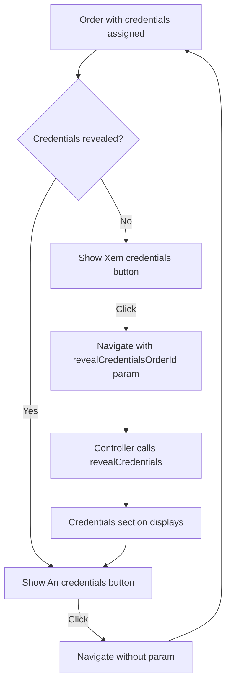
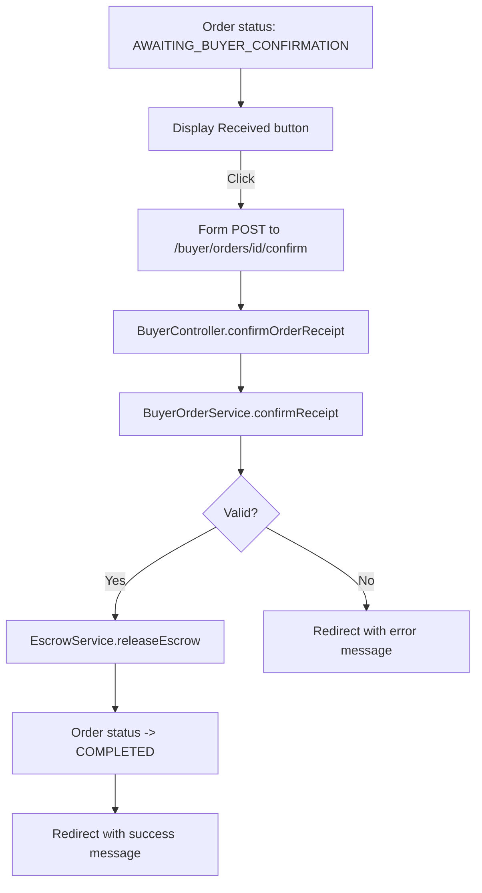

# Buyer Purchases Page Fix Plan

## Problem Summary

Two main issues on the Buyer Purchases page (`/buyer/purchases`):

1. **Credentials not displaying** when accessing URL with `revealCredentialsOrderId` parameter
2. **"Đã nhận hàng" (Received) button not working** - no status update, no confirmation, no UI change

---

## Issue Analysis

### Issue1: Credential Revealing Logic

**Location**: [`buyer_purchases.html`](src/main/resources/templates/buyer_purchases.html:246)

**Current Code**:
```html
<!-- View Credentials Button - Line 246-250 -->
<a th:if="${order.credentialAssignedAt != null}"
   th:href="@{/buyer/purchases(revealCredentialsOrderId=${order.orderId}, orderId=${order.orderId})}"
   class="...">
    <i class="ph ph-key"></i> Xem credentials
</a>
```

**Problem**: The "View credentials" button shows whenever `credentialAssignedAt != null`, regardless of whether credentials are currently revealed. This causes both "View" and "Hide" buttons to potentially show simultaneously.

**Root Cause**: Missing condition to check if credentials are already revealed for this order.

---

### Issue2: Received Button Form Structure

**Location**: [`buyer_purchases.html`](src/main/resources/templates/buyer_purchases.html:259)

**Current Code**:
```html
<form th:if="${order.orderStatus != null and order.orderStatus.statusName == 'AWAITING_BUYER_CONFIRMATION'}"
      th:action="@{/buyer/orders/{orderId}/confirm(orderId=${order.orderId})}"
      method="POST"
      class="inline-flex items-center gap-2 rounded-xl bg-success px-4 py-2.5 text-sm font-bold text-white hover:bg-green-700 transition-colors">
    <i class="ph ph-check-circle"></i>
    <input type="hidden" name="_csrf" th:value="${_csrf.token}"/>
    <button type="submit" class="bg-transparent border-0 p-0 m-0 text-white">
        Đã nhận hàng
    </button>
</form>
```

**Problems**:
1. The CSS classes are applied to the `<form>` element instead of the `<button>`
2. The icon `<i class="ph ph-check-circle"></i>` is outside the button
3. The button has `bg-transparent border-0 p-0 m-0` which makes it nearly invisible
4. Click events may not properly trigger form submission due to the unusual structure

---

## Backend Analysis

### Controller Logic - OK ✓

[`BuyerController.viewPurchases()`](src/main/java/com/group3/accounttrade/controller/BuyerController.java:160-199):
- Correctly reads `revealCredentialsOrderId` parameter
- Calls `buyerOrderService.revealCredentials()` when parameter is present
- Adds `revealedCredentials` to model

[`BuyerController.confirmOrderReceipt()`](src/main/java/com/group3/accounttrade/controller/BuyerController.java:201-220):
- Correctly handles POST to `/buyer/orders/{orderId}/confirm`
- Calls `buyerOrderService.confirmReceipt()`
- Redirects with success/error message

### Service Logic - OK ✓

[`BuyerOrderService.revealCredentials()`](src/main/java/com/group3/accounttrade/service/BuyerOrderService.java:76-105):
- Validates order ownership
- Checks `credentialAssignedAt != null`
- Returns `BuyerCredentialView` list with username/password

[`BuyerOrderService.confirmReceipt()`](src/main/java/com/group3/accounttrade/service/BuyerOrderService.java:108-122):
- Validates order status is `AWAITING_BUYER_CONFIRMATION`
- Calls `escrowService.releaseEscrow()`

---

## Fix Plan

### Fix1: Update View/Hide Credentials Button Logic

**File**: [`buyer_purchases.html`](src/main/resources/templates/buyer_purchases.html:246)

**Change**: Add condition to show "View credentials" only when credentials are NOT already revealed:

```html
<!-- View Credentials Button - Only show if credentials assigned AND not currently revealed -->
<a th:if="${order.credentialAssignedAt != null and (revealedCredentialsOrderId == null or revealedCredentialsOrderId != order.orderId)}"
   th:href="@{/buyer/purchases(revealCredentialsOrderId=${order.orderId}, orderId=${order.orderId})}"
   class="inline-flex items-center gap-2 rounded-xl bg-primary px-4 py-2.5 text-sm font-bold text-white hover:bg-blue-700 transition-colors">
    <i class="ph ph-key"></i> Xem credentials
</a>
```

### Fix2: Restructure Received Button Form

**File**: [`buyer_purchases.html`](src/main/resources/templates/buyer_purchases.html:259)

**Change**: Move styling from `<form>` to `<button>` and ensure proper structure:

```html
<!-- Confirm Receipt Button -->
<form th:if="${order.orderStatus != null and order.orderStatus.statusName == 'AWAITING_BUYER_CONFIRMATION'}"
      th:action="@{/buyer/orders/{orderId}/confirm(orderId=${order.orderId})}"
      method="POST"
      class="inline-block">
    <input type="hidden" name="_csrf" th:value="${_csrf.token}"/>
    <button type="submit" 
            class="inline-flex items-center gap-2 rounded-xl bg-success px-4 py-2.5 text-sm font-bold text-white hover:bg-green-700 transition-colors cursor-pointer">
        <i class="ph ph-check-circle"></i> Đã nhận hàng
    </button>
</form>
```

**Key Changes**:
1. Form has `class="inline-block"` for layout
2. Button has all the visual styling
3. Icon is inside the button
4. Added `cursor-pointer` for better UX
5. Button is clearly the clickable element

---

## Testing Checklist

After implementing fixes:

1. **Credential Revealing**:
   - [ ] Navigate to `/buyer/purchases` - no credentials shown initially
   - [ ] Click "Xem credentials" - URL changes to include `revealCredentialsOrderId`
   - [ ] Credentials section appears with username/password
   - [ ] "Xem credentials" button changes to "Ẩn credentials"
   - [ ] Click "Ẩn credentials" - credentials section hides
   - [ ] Direct URL access with `revealCredentialsOrderId=12&orderId=12` works

2. **Received Button**:
   - [ ] Button is visible and styled correctly for orders with status `AWAITING_BUYER_CONFIRMATION`
   - [ ] Click triggers form submission
   - [ ] Page redirects with success message
   - [ ] Order status changes to `COMPLETED`
   - [ ] Escrow is released to seller

---

## Files to Modify

| File | Changes |
|------|---------|
| [`src/main/resources/templates/buyer_purchases.html`](src/main/resources/templates/buyer_purchases.html) | Fix credential button conditions, restructure received button form |

---

## Diagram: Button State Flow



## Diagram: Received Button Flow


