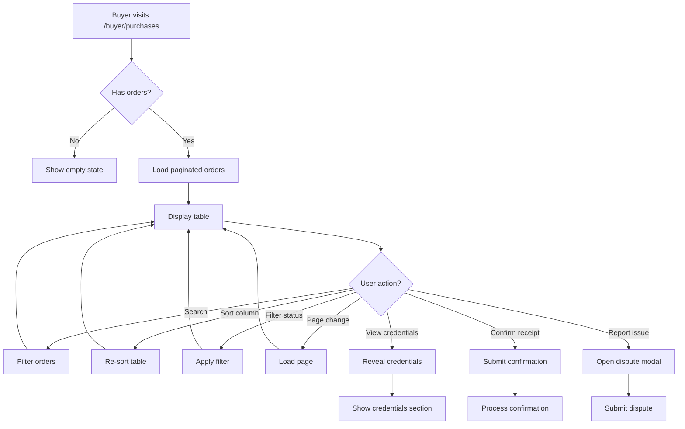

# Buyer Purchases Page Table Redesign Plan

## Overview

Redesign the Lịch sử giao dịch (Purchase History) page to use a table layout with pagination, filtering, sorting, and search capabilities.

## Requirements

### 1. Sidebar Update

- Remove the "Đơn hàng đang xử lý" link from the Buyer Sidebar
- Keep other sidebar items: Tổng quan, Lịch sử giao dịch, Ví & Thanh toán, Cài đặt tài khoản, Trung tâm khiếu nại

### 2. Table Layout Features

- **Pagination**: Server-side pagination with configurable page size
- **Column Filtering**: Filter by status, date range
- **Column Sorting**: Sort by date, amount, status
- **Search**: Search across order number, product title, seller name

### 3. Table Columns

| Column     | Sortable | Filterable       | Description     |
| ---------- | -------- | ---------------- | --------------- |
| Order #    | Yes      | Yes (search)     | Order number    |
| Sản phẩm   | Yes      | Yes (search)     | Product title   |
| Người bán  | Yes      | Yes (search)     | Seller username |
| Ngày tạo   | Yes      | Yes (date range) | Creation date   |
| Tổng tiền  | Yes      | No               | Total amount    |
| Trạng thái | Yes      | Yes (dropdown)   | Order status    |
| Thao tác   | No       | No               | Actions buttons |

### 4. UI Components

```
+------------------------------------------------------------------+
| Lịch sử mua hàng                                    [Quay lại] |
+------------------------------------------------------------------+
| [Search box...] [Status filter▼] [Date range] [Reset filters] |
+------------------------------------------------------------------+
| Order # | Sản phẩm | Người bán | Ngày tạo | Tiền | Status | Actions |
|---------|----------|-----------|----------|------|--------|---------|
| #12345 | Netflix | seller1 | 19/03/2026 | 50,000 ₫ | COMPLETED | [View] |
| #12344 | Spotify | seller2 | 18/03/2026 | 30,000 ₫ | PENDING | [View] [Confirm] |
+------------------------------------------------------------------+
| Showing 1-10 of 25 orders | [Prev] 1 2 3 [Next] | Per page: [10▼] |
+------------------------------------------------------------------+
```

## Technical Implementation

### Backend Changes

#### 1. BuyerController Updates

Add pagination parameters to `viewPurchases` method:

```java
@GetMapping("/purchases")
public String viewPurchases(
    @RequestParam(required = false) Long orderId,
    @RequestParam(required = false) Long revealCredentialsOrderId,
    @RequestParam(defaultValue = "0") int page,
    @RequestParam(defaultValue = "10") int size,
    @RequestParam(required = false) String search,
    @RequestParam(required = false) String status,
    @RequestParam(required = false) String sortBy,
    @RequestParam(defaultValue = "desc") String sortDir,
    HttpServletRequest request,
    Model model,
    RedirectAttributes redirectAttributes)
```

#### 2. BuyerOrderService Updates

Add pagination method:

```java
@Transactional(readOnly = true)
public Page<Order> getOrdersPaginated(
    User buyer,
    int page,
    int size,
    String search,
    String status,
    String sortBy,
    String sortDir)
```

#### 3. OrderRepository Updates

Add pagination and filtering methods:

```java
Page<Order> findByBuyer(User buyer, Pageable pageable);

@Query("SELECT o FROM Order o WHERE o.buyer = :buyer AND " +
       "(:search IS NULL OR o.orderNumber LIKE %:search% OR " +
       "EXISTS (SELECT 1 FROM OrderItem oi WHERE oi.order = o AND oi.postTitleSnapshot LIKE %:search%))")
Page<Order> findByBuyerWithSearch(@Param("buyer") User buyer,
                                   @Param("search") String search,
                                   Pageable pageable);
```

### Frontend Changes

#### 1. HTML Template Structure

- Replace card-based layout with table layout
- Add search input and filter controls
- Add pagination controls
- Add sorting indicators on column headers

#### 2. JavaScript Functionality

- Client-side search debounce
- Filter form handling
- Sort column click handling
- Pagination navigation

#### 3. CSS Styling

- Responsive table design
- Sticky headers
- Status badges
- Action buttons layout

## Implementation Steps

### Step 1: Update Sidebar

Remove "Đơn hàng đang xử lý" link from sidebar navigation.

### Step 2: Update OrderRepository

Add pagination and search methods.

### Step 3: Update BuyerOrderService

Add paginated query method with filtering and sorting.

### Step 4: Update BuyerController

Add pagination parameters and handle search/filter/sort.

### Step 5: Update buyer_purchases.html

- Replace card layout with table
- Add search box and filter controls
- Add pagination controls
- Add sorting on column headers

### Step 6: Add JavaScript

- Search functionality
- Filter handling
- Sort handling
- Pagination handling

### Step 7: Style Updates

- Responsive table styles
- Status badges
- Action button styling

## File Changes

| File                     | Change Type  | Description             |
| ------------------------ | ------------ | ----------------------- |
| `buyer_purchases.html`   | Major Update | Convert to table layout |
| `BuyerController.java`   | Modify       | Add pagination params   |
| `BuyerOrderService.java` | Modify       | Add pagination method   |
| `OrderRepository.java`   | Modify       | Add pagination queries  |

## Preserved Functionality

- Credential reveal toggle (will be in expanded row or modal)
- Confirm receipt action
- Report issue/dispute action
- Order status indicators
- Alert messages
- Empty state display

## Responsive Design

- Desktop: Full table with all columns visible
- Tablet: Horizontal scroll for table
- Mobile: Card-style layout or horizontal scroll

## Mermaid Diagram



## Testing Checklist

- [ ] Sidebar updated - no "Đơn hàng đang xử lý" link
- [ ] Table displays orders correctly
- [ ] Pagination works correctly
- [ ] Search filters orders by order number, product, seller
- [ ] Status filter works
- [ ] Date range filter works
- [ ] Column sorting works
- [ ] Credential reveal still works
- [ ] Confirm receipt action works
- [ ] Dispute action works
- [ ] Responsive design works on mobile/tablet
- [ ] Empty state displays when no orders
