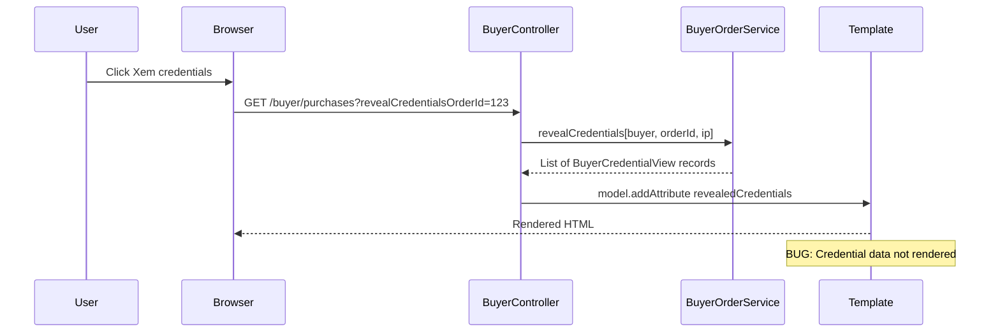

# Credential Display Toggle Fix Plan

## Problem Summary

In the TrustBridge order details interface (`buyer_purchases.html`), the credential display toggle button text successfully changes from "Xem credentials" to "Ẩn credentials" upon clicking, indicating the state is changing correctly. However, the actual credential data (username/password) fails to appear on the screen.

## Root Cause Analysis

### Data Flow Analysis



### Identified Issue

The `BuyerCredentialView` is defined as a **Java Record** in [`BuyerOrderService.java:158-172`](../src/main/java/com/group3/accounttrade/service/BuyerOrderService.java:158):

```java
@Builder
public record BuyerCredentialView(
    Long assignmentId,
    Long orderItemId,
    String postTitle,
    String assignmentStatus,
    java.time.LocalDateTime assignedAt,
    java.time.LocalDateTime deliveredAt,
    java.time.LocalDateTime firstViewedAt,
    Integer viewCount,
    String accountUsername,    // <-- Username field
    String accountPassword,    // <-- Password field
    String securityNotes
) {}
```

**The Problem**: Java Records generate accessor methods that match the field names exactly:

- `accountUsername()` instead of `getAccountUsername()`
- `accountPassword()` instead of `getAccountPassword()`

In the Thymeleaf template [`buyer_purchases.html:347-351`](../src/main/resources/templates/buyer_purchases.html:347), the code uses:

```html
<p th:text="${credentialView.accountUsername}">username</p>
<p th:text="${credentialView.accountPassword}">password</p>
```

Thymeleaf's property resolver uses standard JavaBean convention, expecting `getAccountUsername()` and `getAccountPassword()`. While Spring Framework 6+ includes support for record accessors, this support may not be fully functional depending on the specific versions and configuration.

## Solution Options

### Option 1: Convert Record to Class with Lombok [Recommended]

Convert `BuyerCredentialView` from a record to a regular class with `@Getter` annotation, which generates standard JavaBean getters.

**Pros:**

- Guarantees compatibility with Thymeleaf
- Minimal code changes
- Standard JavaBean convention

**Cons:**

- Slightly more verbose than records
- Loses record-specific features like automatic equals/hashCode/toString

### Option 2: Use Explicit Method Calls in Template

Modify the Thymeleaf template to call the accessor methods directly:

```html
<p th:text="${credentialView.accountUsername()}">username</p>
<p th:text="${credentialView.accountPassword()}">password</p>
```

**Pros:**

- No Java code changes
- Preserves record benefits

**Cons:**

- Non-standard Thymeleaf syntax
- May not work in all Thymeleaf versions
- Less readable

### Option 3: Add Getter Methods to Record

Java records cannot have traditional getter methods added, but we can create a wrapper class or use an interface.

**Not recommended** due to complexity.

## Recommended Solution: Option 1

### Implementation Steps

#### Step 1: Modify BuyerCredentialView

**File:** [`src/main/java/com/group3/accounttrade/service/BuyerOrderService.java`](../src/main/java/com/group3/accounttrade/service/BuyerOrderService.java)

Change the `BuyerCredentialView` from a record to a class:

```java
@Builder
@Getter
@Setter
@AllArgsConstructor
@NoArgsConstructor
public static class BuyerCredentialView {
    private Long assignmentId;
    private Long orderItemId;
    private String postTitle;
    private String assignmentStatus;
    private java.time.LocalDateTime assignedAt;
    private java.time.LocalDateTime deliveredAt;
    private java.time.LocalDateTime firstViewedAt;
    private Integer viewCount;
    private String accountUsername;
    private String accountPassword;
    private String securityNotes;
}
```

Required import:

```java
import lombok.Getter;
import lombok.Setter;
import lombok.AllArgsConstructor;
import lombok.NoArgsConstructor;
```

#### Step 2: Verify Template Bindings

**File:** [`src/main/resources/templates/buyer_purchases.html`](../src/main/resources/templates/buyer_purchases.html)

The existing template code should work correctly after the Java change:

```html
<!-- Lines 344-353 -->
<div class="mt-4 grid gap-4 md:grid-cols-2">
  <div class="rounded-xl bg-gray-50 p-4">
    <p class="text-xs font-semibold uppercase tracking-wider text-gray-500">
      Username / Email
    </p>
    <p
      class="mt-2 break-all text-base font-bold text-gray-900"
      th:text="${credentialView.accountUsername}"
    >
      username
    </p>
  </div>
  <div class="rounded-xl bg-gray-50 p-4">
    <p class="text-xs font-semibold uppercase tracking-wider text-gray-500">
      Password / Key
    </p>
    <p
      class="mt-2 break-all font-mono text-base font-bold text-gray-900"
      th:text="${credentialView.accountPassword}"
    >
      password
    </p>
  </div>
</div>
```

#### Step 3: Add Debugging [Optional]

Add temporary debug logging to verify data is being returned:

```java
// In BuyerController.java viewPurchases method
if (revealCredentialsOrderId != null) {
    try {
        List<BuyerCredentialView> creds = buyerOrderService.revealCredentials(
            user, revealCredentialsOrderId, request.getRemoteAddr());
        log.info("[DEBUG] Revealed credentials count: {}", creds.size());
        creds.forEach(c -> log.info("[DEBUG] Credential: username={}, password={}",
            c.getAccountUsername(),
            c.getAccountPassword() != null ? "***" : "null"));
        model.addAttribute("revealedCredentials", creds);
    } catch (IllegalArgumentException | IllegalStateException e) {
        // ... existing error handling
    }
}
```

## Testing Plan

### Unit Tests

1. Verify `BuyerCredentialView` class generates correct getters
2. Test `revealCredentials()` method returns populated credentials

### Integration Tests

1. Login as buyer
2. Navigate to purchases page
3. Click "Xem credentials" button
4. Verify credential section appears with username/password visible
5. Click "Ẩn credentials" button
6. Verify credential section is hidden

### Manual Testing Checklist

- [ ] Button text changes from "Xem credentials" to "Ẩn credentials"
- [ ] Credential section container appears [border, background]
- [ ] Username/email field displays actual value
- [ ] Password/key field displays actual value
- [ ] Security notes display if present
- [ ] View count and timestamps display correctly
- [ ] Toggle back to hidden state works correctly

## Files to Modify

| File                                                                   | Change Type | Description                                   |
| ---------------------------------------------------------------------- | ----------- | --------------------------------------------- |
| `src/main/java/com/group3/accounttrade/service/BuyerOrderService.java` | Modify      | Convert `BuyerCredentialView` record to class |
| `src/main/resources/templates/buyer_purchases.html`                    | Verify      | Confirm template bindings are correct         |

## Risk Assessment

| Risk                   | Likelihood | Impact | Mitigation                                |
| ---------------------- | ---------- | ------ | ----------------------------------------- |
| Breaking existing code | Low        | Medium | Run full test suite after changes         |
| Performance impact     | Very Low   | Low    | Class vs record has negligible difference |
| Lombok not available   | Very Low   | High   | Verify Lombok is in pom.xml - confirmed   |

## Alternative Quick Fix

If immediate fix is needed without Java changes, modify the template to use explicit method calls:

**File:** `src/main/resources/templates/buyer_purchases.html`

```html
<!-- Line 347 -->
<p
  class="mt-2 break-all text-base font-bold text-gray-900"
  th:text="${credentialView.accountUsername()}"
>
  username
</p>

<!-- Line 351 -->
<p
  class="mt-2 break-all font-mono text-base font-bold text-gray-900"
  th:text="${credentialView.accountPassword()}"
>
  password
</p>
```

This is a temporary workaround while the proper fix is implemented.

## Conclusion

The root cause is the incompatibility between Java Record accessor methods and Thymeleaf's JavaBean property resolver. The recommended solution is to convert the `BuyerCredentialView` record to a standard class with Lombok annotations, ensuring standard getter methods are generated for Thymeleaf to access.
