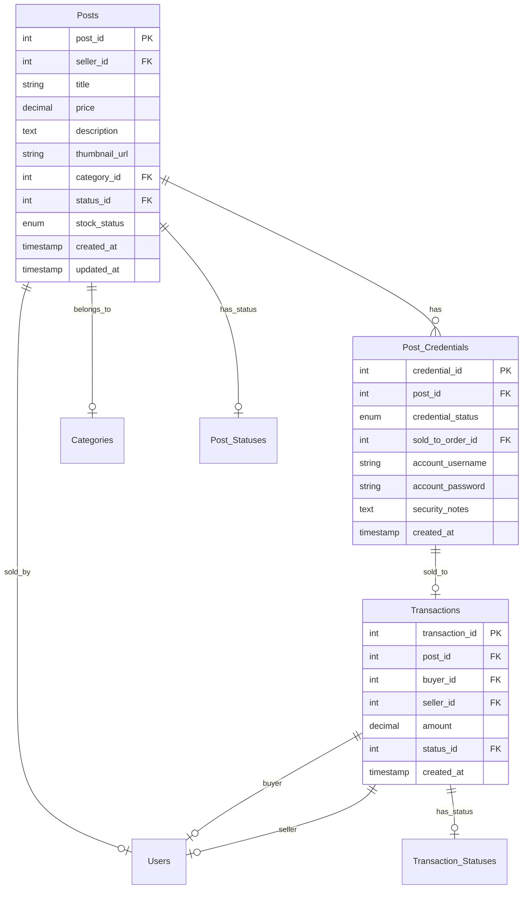
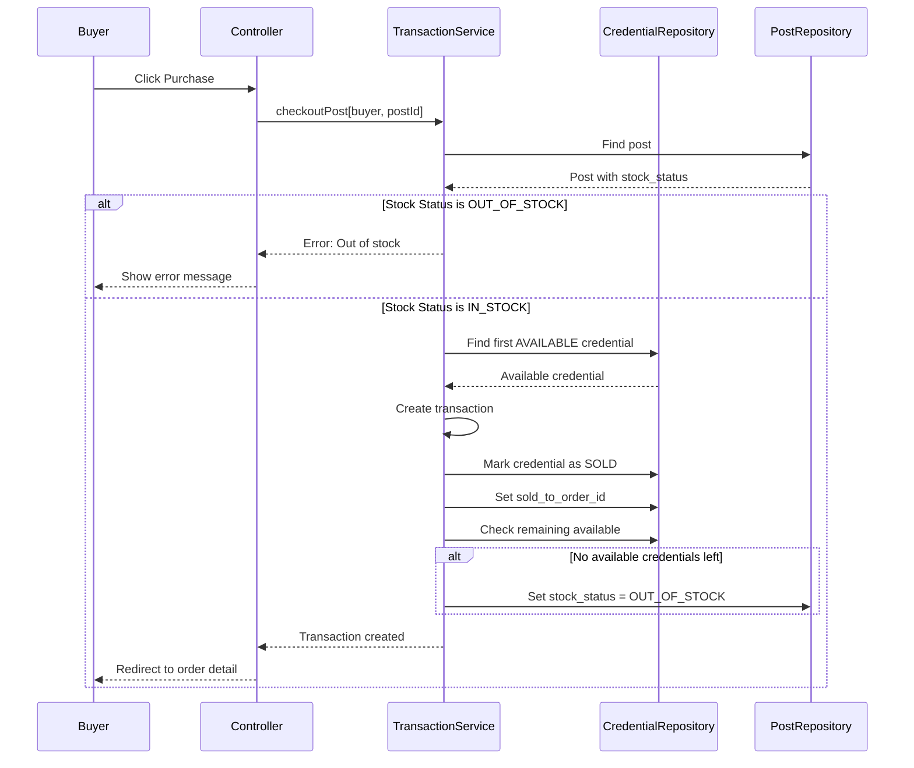
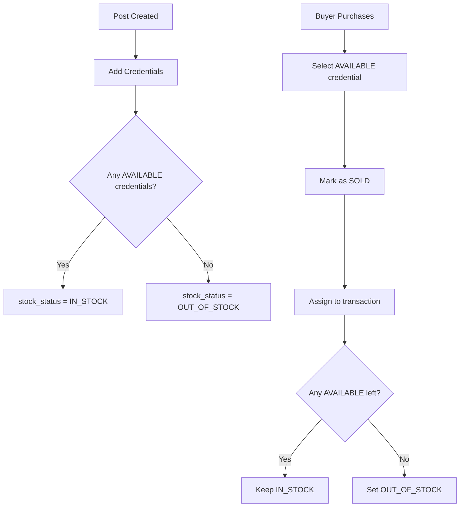

# Credential-Based Inventory Refactoring Plan

## Overview

This plan refactors the inventory system from a quantity-based approach to a credential-based approach where:
- **Posts** table stores only general listing information
- **Post_Credentials** table stores individual sellable accounts (the real inventory)
- Stock is calculated dynamically from available credentials

## Current vs Target Architecture

### Current State
```
Posts
├── post_id
├── remaining_quantity (to be removed)
└── OneToOne → PostCredential (single credential)

Post_Credentials
├── post_id (unique constraint - only one credential per post)
├── account_username
├── account_password
└── security_notes
```

### Target State
```
Posts
├── post_id
├── stock_status ENUM('IN_STOCK', 'OUT_OF_STOCK')
└── OneToMany → PostCredential (multiple credentials)

Post_Credentials
├── post_id (non-unique - many credentials per post)
├── credential_status ENUM('AVAILABLE', 'SOLD')
├── sold_to_order_id (nullable FK to Transactions)
├── account_username
├── account_password
├── security_notes
└── created_at
```

---

## Database Schema Changes

### SQL Migration Script

```sql
-- =====================================================
-- MIGRATION: Credential-Based Inventory System
-- =====================================================

-- Step 1: Add stock_status column to Posts
ALTER TABLE Posts 
ADD COLUMN stock_status ENUM('IN_STOCK', 'OUT_OF_STOCK') 
DEFAULT 'IN_STOCK' 
COMMENT 'Derived from available credentials count';

-- Step 2: Remove remaining_quantity column from Posts
ALTER TABLE Posts DROP COLUMN remaining_quantity;

-- Step 3: Modify Post_Credentials table
-- Remove unique constraint from post_id
ALTER TABLE Post_Credentials DROP INDEX post_id;

-- Add new columns
ALTER TABLE Post_Credentials 
ADD COLUMN credential_status ENUM('AVAILABLE', 'SOLD') 
DEFAULT 'AVAILABLE' 
AFTER post_id;

ALTER TABLE Post_Credentials 
ADD COLUMN sold_to_order_id INT NULL 
AFTER credential_status;

ALTER TABLE Post_Credentials 
ADD COLUMN created_at TIMESTAMP DEFAULT CURRENT_TIMESTAMP 
AFTER security_notes;

-- Add foreign key for sold_to_order_id
ALTER TABLE Post_Credentials 
ADD CONSTRAINT fk_credential_order 
FOREIGN KEY (sold_to_order_id) REFERENCES Transactions(transaction_id);

-- Add index for faster queries
CREATE INDEX idx_credential_post_status 
ON Post_Credentials(post_id, credential_status);

-- Step 4: Migrate existing data
-- Existing credentials should be set as AVAILABLE
UPDATE Post_Credentials SET credential_status = 'AVAILABLE' WHERE credential_status IS NULL;

-- Update Posts stock_status based on existing credentials
UPDATE Posts p 
SET stock_status = CASE 
    WHEN EXISTS (SELECT 1 FROM Post_Credentials pc WHERE pc.post_id = p.post_id) 
    THEN 'IN_STOCK' 
    ELSE 'OUT_OF_STOCK' 
END;

-- Step 5: Add order_id column to Transactions for linking
-- (if not already present - check schema first)
-- ALTER TABLE Transactions ADD COLUMN order_id VARCHAR(50) NULL;
```

---

## Entity Changes

### 1. Create StockStatus Enum

**File:** `src/main/java/com/group3/accounttrade/entity/StockStatus.java`

```java
package com.group3.accounttrade.entity;

public enum StockStatus {
    IN_STOCK,
    OUT_OF_STOCK
}
```

### 2. Create CredentialStatus Enum

**File:** `src/main/java/com/group3/accounttrade/entity/CredentialStatus.java`

```java
package com.group3.accounttrade.entity;

public enum CredentialStatus {
    AVAILABLE,
    SOLD
}
```

### 3. Update Post Entity

**File:** `src/main/java/com/group3/accounttrade/entity/Post.java`

Changes:
- Remove `remainingQuantity` field
- Remove `@OneToOne` credential field
- Add `stockStatus` enum field
- Add `@OneToMany` credentials list
- Update `isInStock()` method to check `stockStatus`

```java
// Remove these:
// private Integer remainingQuantity;
// private PostCredential credential;

// Add these:
@Enumerated(EnumType.STRING)
@Column(name = "stock_status", length = 20)
@Builder.Default
private StockStatus stockStatus = StockStatus.IN_STOCK;

@OneToMany(mappedBy = "post", cascade = CascadeType.ALL, orphanRemoval = true)
@Builder.Default
private List<PostCredential> credentials = new ArrayList<>();

@Transient
public boolean isInStock() {
    return stockStatus == StockStatus.IN_STOCK;
}

@Transient
public long getAvailableCredentialCount() {
    if (credentials == null) return 0;
    return credentials.stream()
        .filter(c -> c.getCredentialStatus() == CredentialStatus.AVAILABLE)
        .count();
}
```

### 4. Update PostCredential Entity

**File:** `src/main/java/com/group3/accounttrade/entity/PostCredential.java`

Changes:
- Change `@OneToOne` to `@ManyToOne` for post relationship
- Add `credentialStatus` enum field
- Add `soldToOrder` relationship to Transaction
- Add `createdAt` timestamp

```java
// Change from @OneToOne to @ManyToOne
@ManyToOne(fetch = FetchType.LAZY)
@JoinColumn(name = "post_id", nullable = false)
private Post post;

// Add new fields
@Enumerated(EnumType.STRING)
@Column(name = "credential_status", length = 20)
@Builder.Default
private CredentialStatus credentialStatus = CredentialStatus.AVAILABLE;

@ManyToOne(fetch = FetchType.LAZY)
@JoinColumn(name = "sold_to_order_id")
private Transaction soldToOrder;

@CreationTimestamp
@Column(name = "created_at", updatable = false)
private LocalDateTime createdAt;
```

---

## Repository Changes

### Update PostCredentialRepository

**File:** `src/main/java/com/group3/accounttrade/repository/PostCredentialRepository.java`

```java
@Repository
public interface PostCredentialRepository extends JpaRepository<PostCredential, Integer> {

    // Find all credentials for a post
    List<PostCredential> findByPost_PostId(Integer postId);
    
    // Find available credentials for a post
    List<PostCredential> findByPost_PostIdAndCredentialStatus(
        Integer postId, 
        CredentialStatus status
    );
    
    // Count available credentials for a post
    long countByPost_PostIdAndCredentialStatus(
        Integer postId, 
        CredentialStatus status
    );
    
    // Find first available credential for assignment
    Optional<PostCredential> findFirstByPost_PostIdAndCredentialStatusOrderByCreatedAtAsc(
        Integer postId, 
        CredentialStatus status
    );
    
    // Find credential sold to a specific transaction
    Optional<PostCredential> findBySoldToOrder_TransactionId(Integer transactionId);
    
    // Check if any available credentials exist
    boolean existsByPost_PostIdAndCredentialStatus(Integer postId, CredentialStatus status);
    
    // Delete all credentials for a post
    void deleteByPost_PostId(Integer postId);
}
```

---

## Service Changes

### 1. Update PostService

**File:** `src/main/java/com/group3/accounttrade/service/PostService.java`

Key changes:
- Remove quantity-based logic
- Add credential management methods
- Add stock status update method

```java
// New methods to add:

/**
 * Add a credential to a post
 */
public PostCredential addCredential(Integer postId, String username, String password, String notes) {
    Post post = postRepository.findById(postId)
        .orElseThrow(() -> new IllegalArgumentException("Post not found"));
    
    PostCredential credential = PostCredential.builder()
        .post(post)
        .accountUsername(username)
        .accountPassword(password)
        .securityNotes(notes)
        .credentialStatus(CredentialStatus.AVAILABLE)
        .build();
    
    PostCredential saved = postCredentialRepository.save(credential);
    updateStockStatus(postId);
    return saved;
}

/**
 * Add multiple credentials at once
 */
public List<PostCredential> addCredentials(Integer postId, List<CredentialInput> inputs) {
    Post post = postRepository.findById(postId)
        .orElseThrow(() -> new IllegalArgumentException("Post not found"));
    
    List<PostCredential> credentials = inputs.stream()
        .map(input -> PostCredential.builder()
            .post(post)
            .accountUsername(input.getUsername())
            .accountPassword(input.getPassword())
            .securityNotes(input.getNotes())
            .credentialStatus(CredentialStatus.AVAILABLE)
            .build())
        .collect(Collectors.toList());
    
    List<PostCredential> saved = postCredentialRepository.saveAll(credentials);
    updateStockStatus(postId);
    return saved;
}

/**
 * Update stock status based on available credentials
 */
public void updateStockStatus(Integer postId) {
    Post post = postRepository.findById(postId)
        .orElseThrow(() -> new IllegalArgumentException("Post not found"));
    
    boolean hasAvailable = postCredentialRepository.existsByPost_PostIdAndCredentialStatus(
        postId, CredentialStatus.AVAILABLE
    );
    
    post.setStockStatus(hasAvailable ? StockStatus.IN_STOCK : StockStatus.OUT_OF_STOCK);
    postRepository.save(post);
}

/**
 * Get credential statistics for a post
 */
public CredentialStats getCredentialStats(Integer postId) {
    long total = postCredentialRepository.countByPost_PostId(postId);
    long available = postCredentialRepository.countByPost_PostIdAndCredentialStatus(
        postId, CredentialStatus.AVAILABLE
    );
    long sold = postCredentialRepository.countByPost_PostIdAndCredentialStatus(
        postId, CredentialStatus.SOLD
    );
    
    return new CredentialStats(total, available, sold);
}
```

### 2. Update BuyerTransactionService

**File:** `src/main/java/com/group3/accounttrade/service/BuyerTransactionService.java`

Key changes:
- Check stock status instead of quantity
- Assign available credential on purchase
- Mark credential as SOLD
- Update post stock status

```java
@Transactional
public Transaction checkoutPost(User buyer, Integer postId) {
    Post post = postRepository.findById(postId)
        .orElseThrow(() -> new IllegalArgumentException("Post not found"));

    // Validate buyer is not seller
    if (post.getSeller() != null && post.getSeller().getUserId().equals(buyer.getUserId())) {
        throw new IllegalArgumentException("You cannot purchase your own post");
    }

    // Check stock status
    if (post.getStockStatus() != StockStatus.IN_STOCK) {
        throw new IllegalStateException("Product is out of stock");
    }

    // Find an available credential
    PostCredential credential = postCredentialRepository
        .findFirstByPost_PostIdAndCredentialStatusOrderByCreatedAtAsc(postId, CredentialStatus.AVAILABLE)
        .orElseThrow(() -> new IllegalStateException("No available credentials"));
    
    // Create transaction
    TransactionStatus completedStatus = transactionStatusRepository.findByStatusName("Completed")
        .orElseThrow(() -> new IllegalStateException("Completed status not found"));
    
    Transaction transaction = Transaction.builder()
        .post(post)
        .buyer(buyer)
        .seller(post.getSeller())
        .amount(post.getPrice())
        .fee(BigDecimal.ZERO)
        .status(completedStatus)
        .build();
    
    transaction = transactionRepository.save(transaction);
    
    // Assign credential to transaction
    credential.setCredentialStatus(CredentialStatus.SOLD);
    credential.setSoldToOrder(transaction);
    postCredentialRepository.save(credential);
    
    // Update post stock status
    boolean stillHasStock = postCredentialRepository.existsByPost_PostIdAndCredentialStatus(
        postId, CredentialStatus.AVAILABLE
    );
    if (!stillHasStock) {
        post.setStockStatus(StockStatus.OUT_OF_STOCK);
        postRepository.save(post);
    }
    
    // Remove from cart if present
    cartRepository.findByUserAndPost(buyer, post).ifPresent(cartRepository::delete);
    
    return transaction;
}

/**
 * Get the credential for a purchased transaction
 */
public PostCredential getPurchasedCredential(User buyer, Integer transactionId) {
    Transaction transaction = transactionRepository.findById(transactionId)
        .orElseThrow(() -> new IllegalArgumentException("Transaction not found"));
    
    // Verify the buyer owns this transaction
    if (!transaction.getBuyer().getUserId().equals(buyer.getUserId())) {
        throw new IllegalArgumentException("You do not have access to this order");
    }
    
    return postCredentialRepository.findBySoldToOrder_TransactionId(transactionId)
        .orElseThrow(() -> new IllegalStateException("No credential found for this order"));
}
```

---

## Controller Changes

### Update SellerController

**File:** `src/main/java/com/group3/accounttrade/controller/SellerController.java`

Add new endpoints for credential management:

```java
// Show credential management page for a post
@GetMapping("/posts/{postId}/credentials")
public String manageCredentials(@PathVariable Integer postId, Model model, Principal principal) {
    // ... implementation
}

// Add single credential
@PostMapping("/posts/{postId}/credentials")
public String addCredential(@PathVariable Integer postId, @ModelAttribute CredentialForm form) {
    // ... implementation
}

// Add multiple credentials
@PostMapping("/posts/{postId}/credentials/bulk")
public String addCredentialsBulk(@PathVariable Integer postId, @RequestBody List<CredentialForm> forms) {
    // ... implementation
}

// Delete credential
@PostMapping("/credentials/{credentialId}/delete")
public String deleteCredential(@PathVariable Integer credentialId) {
    // ... implementation
}
```

---

## View Changes

### 1. Update seller_create_post.html

- Add section for adding multiple credentials
- Use dynamic form to add/remove credential rows
- Each row has: username, password, notes

### 2. Update seller_edit_post.html

- Show credential statistics (total, available, sold)
- Add credential management section
- Allow adding new credentials
- Show list of existing credentials with status

### 3. Create seller_post_credentials.html (new)

Dedicated page for managing credentials:
- Table showing all credentials
- Status badges (AVAILABLE/SOLD)
- Add credential form
- Bulk import option
- Delete available credentials

### 4. Update buyer_order_detail.html

- Show the specific credential assigned to the order
- Display: username, password, notes
- Only show for completed transactions

### 5. Update marketplace_detail.html

- Show available stock count (from credentials)
- Show "Out of Stock" badge when stock_status = OUT_OF_STOCK
- Disable purchase button for out of stock items

---

## Implementation Order

1. **Phase 1: Database & Entities**
   - Create enum classes (StockStatus, CredentialStatus)
   - Update Post entity
   - Update PostCredential entity
   - Update PostCredentialRepository

2. **Phase 2: Service Layer**
   - Update PostService with credential management
   - Update BuyerTransactionService with credential assignment

3. **Phase 3: Controller Layer**
   - Update SellerController with credential endpoints
   - Update BuyerController for credential retrieval

4. **Phase 4: Views**
   - Update seller_create_post.html
   - Update seller_edit_post.html
   - Create seller_post_credentials.html
   - Update buyer_order_detail.html
   - Update marketplace_detail.html

5. **Phase 5: Testing**
   - Verify credential creation
   - Verify stock calculation
   - Verify purchase flow
   - Verify credential assignment

---

## Mermaid Diagrams

### Entity Relationship Diagram



### Purchase Flow Sequence



### Stock Calculation Flow



---

## Key Points to Remember

1. **Never store quantity in Posts** - Always calculate from credentials
2. **One credential per transaction** - Each buyer gets one unique credential
3. **Credential status tracking** - AVAILABLE or SOLD, never reuse
4. **Stock status is cached** - Updated after each credential change
5. **Security** - Credentials only visible to buyer after purchase
