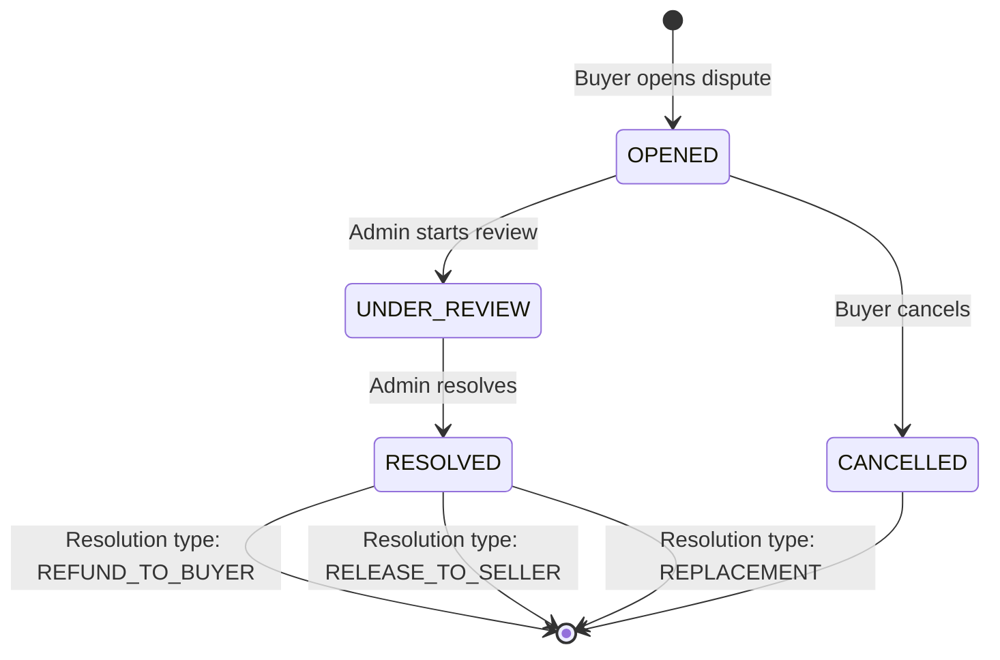

# Dispute Functionality Implementation Plan

## Executive Summary

This plan outlines the implementation of the complete dispute resolution workflow for the AccountTrade platform, covering Buyer, Seller, and Admin roles. The implementation follows the transaction workflow defined in [`transaction-workflow-plan.md`](transaction-workflow-plan.md).

---

## Current State Analysis

### Already Implemented

| Component                                                                                                                               | Status          | Location                                  |
| --------------------------------------------------------------------------------------------------------------------------------------- | --------------- | ----------------------------------------- |
| [`Dispute`](../src/main/java/com/group3/accounttrade/entity/Dispute.java) entity                                                        | ✅ Complete     | Entity with all required fields           |
| [`DisputeStatus`](../src/main/java/com/group3/accounttrade/entity/DisputeStatus.java) entity                                            | ✅ Complete     | OPENED, UNDER_REVIEW, RESOLVED, CANCELLED |
| [`DisputeMessage`](../src/main/java/com/group3/accounttrade/entity/DisputeMessage.java) entity                                          | ✅ Complete     | Message thread with attachments           |
| [`DisputeService`](../src/main/java/com/group3/accounttrade/service/DisputeService.java)                                                | ✅ Core methods | openDispute, resolve, cancel, addMessage  |
| [`BuyerController.openOrderDispute()`](../src/main/java/com/group3/accounttrade/controller/BuyerController.java:234)                    | ✅ Basic        | POST endpoint to open dispute             |
| [`AdminDashboardController.getPendingDisputes()`](../src/main/java/com/group3/accounttrade/controller/AdminDashboardController.java:61) | ✅ Basic        | GET endpoint for dispute list             |
| [`admin_disputes.html`](../src/main/resources/templates/admin_disputes.html)                                                            | ⚠️ Partial      | List view only, no detail/actions         |
| [`admin-disputes.js`](../src/main/resources/static/js/admin-disputes.js)                                                                | ⚠️ Partial      | List rendering only                       |

### Missing Components

| Component                  | Priority | Description                                 |
| -------------------------- | -------- | ------------------------------------------- |
| Buyer dispute detail view  | HIGH     | View dispute status, messages, add evidence |
| Buyer dispute cancellation | MEDIUM   | Allow buyer to cancel dispute               |
| Seller dispute list        | HIGH     | View all disputes on seller orders          |
| Seller dispute response    | HIGH     | Respond to disputes with evidence           |
| Admin dispute detail view  | HIGH     | Full dispute review interface               |
| Admin resolution actions   | HIGH     | Resolve in buyer/seller favor               |
| Dispute message thread UI  | HIGH     | Real-time message display for all roles     |

---

## Implementation Architecture

### Dispute State Flow



### API Endpoint Structure

```
Buyer Endpoints:
  GET  /buyer/disputes                    - List buyer disputes
  GET  /buyer/disputes/{id}               - View dispute detail
  POST /buyer/disputes/{id}/messages      - Add message to dispute
  POST /buyer/disputes/{id}/cancel        - Cancel dispute

Seller Endpoints:
  GET  /seller/disputes                   - List seller disputes
  GET  /seller/disputes/{id}              - View dispute detail
  POST /seller/disputes/{id}/response     - Submit seller response
  POST /seller/disputes/{id}/messages     - Add message to dispute

Admin Endpoints:
  GET  /api/admin/disputes                - List all disputes - exists
  GET  /api/admin/disputes/{id}           - Get dispute detail
  POST /api/admin/disputes/{id}/assign    - Assign admin to dispute
  POST /api/admin/disputes/{id}/review    - Start admin review
  POST /api/admin/disputes/{id}/resolve   - Resolve dispute
```

---

## Detailed Implementation Tasks

### Phase 1: Buyer Dispute Features

#### 1.1 Backend - BuyerController Enhancement

**File:** [`src/main/java/com/group3/accounttrade/controller/BuyerController.java`](../src/main/java/com/group3/accounttrade/controller/BuyerController.java)

Add endpoints:

```java
// List all disputes for current buyer
@GetMapping("/disputes")
public String listBuyerDisputes(Model model)

// View specific dispute detail
@GetMapping("/disputes/{disputeId}")
public String viewDisputeDetail(@PathVariable Long disputeId, Model model)

// Add message to dispute
@PostMapping("/disputes/{disputeId}/messages")
public String addDisputeMessage(@PathVariable Long disputeId,
                                @RequestParam String message,
                                @RequestParam(required=false) String attachmentUrl,
                                RedirectAttributes redirectAttributes)

// Cancel dispute
@PostMapping("/disputes/{disputeId}/cancel")
public String cancelDispute(@PathVariable Long disputeId,
                           @RequestParam String reason,
                           RedirectAttributes redirectAttributes)
```

#### 1.2 Frontend - Buyer Templates

**New File:** `src/main/resources/templates/buyer_disputes.html`

- List all buyer disputes with status badges
- Filter by status: OPENED, UNDER_REVIEW, RESOLVED, CANCELLED
- Show order info, dispute reason, timeline
- Link to detail view

**New File:** `src/main/resources/templates/buyer_dispute_detail.html`

- Dispute header with status badge
- Order information panel
- Message thread with timestamps
- Add message form with attachment support
- Cancel dispute button - only if OPENED status
- Timeline of dispute events

#### 1.3 JavaScript Module

**New File:** `src/main/resources/static/js/buyer-disputes.js`

```javascript
const BuyerDisputes = {
  init() {},
  loadDisputes() {},
  loadDisputeDetail(disputeId) {},
  submitMessage(disputeId, message, attachment) {},
  cancelDispute(disputeId, reason) {},
  refreshMessages() {},
};
```

---

### Phase 2: Seller Dispute Features

#### 2.1 Backend - SellerController Enhancement

**File:** [`src/main/java/com/group3/accounttrade/controller/SellerController.java`](../src/main/java/com/group3/accounttrade/controller/SellerController.java)

Add endpoints:

```java
// List all disputes involving seller orders
@GetMapping("/disputes")
public String listSellerDisputes(
    @RequestParam(required=false) String status,
    @RequestParam(defaultValue="0") int page,
    @RequestParam(defaultValue="10") int size,
    Authentication authentication,
    Model model)

// View dispute detail
@GetMapping("/disputes/{disputeId}")
public String viewSellerDisputeDetail(@PathVariable Long disputeId,
                                      Authentication authentication,
                                      Model model)

// Submit seller response with evidence
@PostMapping("/disputes/{disputeId}/response")
public String submitSellerResponse(@PathVariable Long disputeId,
                                  @RequestParam String response,
                                  @RequestParam(required=false) String evidence,
                                  Authentication authentication,
                                  RedirectAttributes redirectAttributes)

// Add message to dispute thread
@PostMapping("/disputes/{disputeId}/messages")
public String addSellerMessage(@PathVariable Long disputeId,
                              @RequestParam String message,
                              Authentication authentication,
                              RedirectAttributes redirectAttributes)
```

#### 2.2 Frontend - Seller Templates

**New File:** `src/main/resources/templates/seller_disputes.html`

- List disputes on seller orders
- Status indicators and response deadlines
- Filter by status
- Show buyer info, order details, dispute reason

**New File:** `src/main/resources/templates/seller_dispute_detail.html`

- Dispute information panel
- Buyer claim details
- Response form with evidence upload
- Message thread
- Response deadline countdown
- Status timeline

#### 2.3 JavaScript Module

**New File:** `src/main/resources/static/js/seller-disputes.js`

```javascript
const SellerDisputes = {
  init() {},
  loadDisputes(status, page, size) {},
  loadDisputeDetail(disputeId) {},
  submitResponse(disputeId, response, evidence) {},
  addMessage(disputeId, message) {},
  updateDeadlineCountdown() {},
};
```

---

### Phase 3: Admin Dispute Features

#### 3.1 Backend - AdminDashboardController Enhancement

**File:** [`src/main/java/com/group3/accounttrade/controller/AdminDashboardController.java`](../src/main/java/com/group3/accounttrade/controller/AdminDashboardController.java)

Add endpoints:

```java
// Get detailed dispute information
@GetMapping("/disputes/{disputeId}")
public ResponseEntity<DisputeDetailDTO> getDisputeDetail(@PathVariable Long disputeId)

// Assign admin to dispute
@PostMapping("/disputes/{disputeId}/assign")
public ResponseEntity<Map<String,Object>> assignDispute(
    @PathVariable Long disputeId,
    @RequestParam Integer adminId)

// Start formal review - changes status to UNDER_REVIEW
@PostMapping("/disputes/{disputeId}/review")
public ResponseEntity<Map<String,Object>> startReview(@PathVariable Long disputeId)

// Resolve dispute
@PostMapping("/disputes/{disputeId}/resolve")
public ResponseEntity<Map<String,Object>> resolveDispute(
    @PathVariable Long disputeId,
    @RequestParam String resolutionType,  // REFUND_TO_BUYER, RELEASE_TO_SELLER, REPLACEMENT
    @RequestParam String resolutionNotes,
    @RequestParam(required=false) BigDecimal refundAmount)

// Add internal admin note
@PostMapping("/disputes/{disputeId}/notes")
public ResponseEntity<Map<String,Object>> addAdminNote(
    @PathVariable Long disputeId,
    @RequestParam String notes)
```

#### 3.2 New DTOs

**File:** `src/main/java/com/group3/accounttrade/dto/DisputeDetailDTO.java`

```java
public record DisputeDetailDTO(
    Long disputeId,
    String disputeNumber,
    String status,
    String disputeType,
    String reason,
    String buyerEvidence,
    String sellerResponse,
    String sellerEvidence,
    String resolutionType,
    String resolutionNotes,
    LocalDateTime openedAt,
    LocalDateTime sellerRespondedAt,
    LocalDateTime resolvedAt,
    OrderInfo order,
    UserInfo buyer,
    UserInfo seller,
    UserSummary assignedAdmin,
    UserSummary resolvedBy,
    List<DisputeMessageDTO> messages,
    List<DisputeEventDTO> timeline
) {}
```

#### 3.3 Frontend - Admin Templates

**Update:** [`src/main/resources/templates/admin_disputes.html`](../src/main/resources/templates/admin_disputes.html)

Enhance with:

- Click to view detail modal or page
- Status filter improvements
- Bulk actions if needed

**New File:** `src/main/resources/templates/admin_dispute_detail.html`

- Full dispute overview
- Order and credential information
- Buyer claim panel with evidence
- Seller response panel with evidence
- Message thread - all participants
- Admin action panel:
  - Assign to admin
  - Start review button
  - Resolution form:
    - Resolution type selector
    - Notes textarea
    - Partial refund amount input
  - Internal notes section
- Timeline of all events
- Related disputes/orders panel

#### 3.4 JavaScript Module Enhancement

**Update:** [`src/main/resources/static/js/admin-disputes.js`](../src/main/resources/static/js/admin-disputes.js)

Add functions:

```javascript
// Add to existing module
loadDisputeDetail(disputeId) {},
showResolutionModal(disputeId) {},
resolveDispute(disputeId, resolutionType, notes, refundAmount) {},
assignAdmin(disputeId, adminId) {},
startReview(disputeId) {},
addInternalNote(disputeId, notes) {},
refreshTimeline(disputeId) {}
```

---

### Phase 4: DisputeService Enhancements

#### 4.1 Additional Service Methods

**File:** [`src/main/java/com/group3/accounttrade/service/DisputeService.java`](../src/main/java/com/group3/accounttrade/service/DisputeService.java)

Add/enhance methods:

```java
// Get dispute with full details for DTO mapping
public DisputeDetailDTO getDisputeDetail(Long disputeId)

// Get paginated disputes for buyer
public Page<Dispute> getDisputesByBuyer(Integer buyerId, String status, Pageable pageable)

// Get paginated disputes for seller
public Page<Dispute> getDisputesBySeller(Integer sellerId, String status, Pageable pageable)

// Submit seller response
public void submitSellerResponse(Long disputeId, Integer sellerId,
                                 String response, String evidence)

// Assign admin to dispute
public void assignAdmin(Long disputeId, Integer adminId)

// Start admin review - change status to UNDER_REVIEW
public void startReview(Long disputeId, Integer adminId)

// Add admin internal note
public void addAdminNote(Long disputeId, Integer adminId, String notes)

// Get dispute timeline/events
public List<DisputeEventDTO> getDisputeTimeline(Long disputeId)
```

#### 4.2 Repository Enhancements

**File:** [`src/main/java/com/group3/accounttrade/repository/DisputeRepository.java`](../src/main/java/com/group3/accounttrade/repository/DisputeRepository.java)

Add queries:

```java
Page<Dispute> findByOpenedByOrderByOpenedAtDesc(User buyer, Pageable pageable);

Page<Dispute> findByRespondentOrderByOpenedAtDesc(User seller, Pageable pageable);

@Query("SELECT d FROM Dispute d WHERE d.openedBy = :buyer " +
       "AND (:status IS NULL OR d.disputeStatus.statusName = :status)")
Page<Dispute> findByBuyerWithStatus(@Param("buyer") User buyer,
                                    @Param("status") String status,
                                    Pageable pageable);

@Query("SELECT d FROM Dispute d WHERE d.respondent = :seller " +
       "AND (:status IS NULL OR d.disputeStatus.statusName = :status)")
Page<Dispute> findBySellerWithStatus(@Param("seller") User seller,
                                     @Param("status") String status,
                                     Pageable pageable);

@Query("SELECT COUNT(d) FROM Dispute d WHERE d.disputeStatus.statusName IN :statuses")
long countByStatusIn(@Param("statuses") List<String> statuses);
```

---

### Phase 5: UI Components and Styling

#### 5.1 Common Dispute UI Components

**Status Badges:**

```html
<!-- OPENED -->
<span class="bg-red-100 text-red-700 px-2 py-1 rounded-full text-xs font-bold">
  <i class="ph-fill ph-warning-circle"></i> Chờ xử lý
</span>

<!-- UNDER_REVIEW -->
<span
  class="bg-orange-100 text-orange-700 px-2 py-1 rounded-full text-xs font-bold"
>
  <i class="ph-fill ph-magnifying-glass"></i> Đang điều tra
</span>

<!-- RESOLVED -->
<span
  class="bg-green-100 text-green-700 px-2 py-1 rounded-full text-xs font-bold"
>
  <i class="ph-fill ph-check-circle"></i> Đã giải quyết
</span>

<!-- CANCELLED -->
<span
  class="bg-gray-100 text-gray-700 px-2 py-1 rounded-full text-xs font-bold"
>
  <i class="ph-fill ph-x-circle"></i> Đã hủy
</span>
```

**Dispute Type Labels:**

- INVALID_CREDENTIAL: "Thông tin đăng nhập không hợp lệ"
- CREDENTIAL_USED: "Tài khoản đã bị sử dụng"
- CREDENTIAL_EXPIRED: "Tài khoản đã hết hạn"
- DESCRIPTION_MISMATCH: "Không đúng mô tả"
- NON_DELIVERY: "Không nhận được tài khoản"
- OTHER: "Lý do khác"

**Resolution Type Labels:**

- REFUND_TO_BUYER: "Hoàn tiền cho người mua"
- RELEASE_TO_SELLER: "Giải ngân cho người bán"
- REPLACEMENT: "Cung cấp tài khoản thay thế"
- PARTIAL_REFUND: "Hoàn tiền một phần"
- NO_ACTION: "Không có hành động"

#### 5.2 Message Thread Component

```html
<div class="space-y-4">
  <div
    th:each="message : ${messages}"
    th:class="${message.senderRole == 'BUYER'} ? 'ml-0 mr-auto' : 
                    ${message.senderRole == 'SELLER'} ? 'ml-auto mr-0' : 'mx-auto'"
  >
    <div
      class="max-w-lg p-4 rounded-xl"
      th:class="${message.senderRole == 'BUYER'} ? 'bg-blue-50 border border-blue-100' :
                        ${message.senderRole == 'SELLER'} ? 'bg-green-50 border border-green-100' :
                        'bg-gray-50 border border-gray-100'"
    >
      <div class="flex items-center gap-2 mb-2">
        <span
          class="font-bold text-sm"
          th:text="${message.sender.username}"
        ></span>
        <span
          class="text-xs text-gray-500"
          th:text="${message.senderRole}"
        ></span>
        <span
          class="text-xs text-gray-400"
          th:text="${#temporals.format(message.createdAt, 'dd/MM HH:mm')}"
        ></span>
      </div>
      <p class="text-sm text-gray-700" th:text="${message.content}"></p>
      <div th:if="${message.hasAttachment}" class="mt-2">
        <a
          th:href="${message.attachmentPath}"
          class="text-primary text-sm hover:underline"
        >
          <i class="ph ph-paperclip"></i> Xem đính kèm
        </a>
      </div>
    </div>
  </div>
</div>
```

---

## Implementation Order

### Recommended Sequence

1. **Backend Foundation** - Phase 4
   - Enhance DisputeService with new methods
   - Add repository queries
   - Create DTOs

2. **Admin Features** - Phase 3
   - Admin can view and resolve disputes
   - Critical for dispute flow completion

3. **Buyer Features** - Phase 1
   - Buyers can view and interact with disputes
   - Cancel dispute functionality

4. **Seller Features** - Phase 2
   - Sellers can respond to disputes
   - Evidence submission

5. **UI Polish** - Phase 5
   - Common components
   - Consistent styling
   - Mobile responsiveness

---

## Testing Checklist

### Buyer Dispute Flow

- [ ] Buyer can view list of their disputes
- [ ] Buyer can view dispute detail with messages
- [ ] Buyer can add messages to dispute
- [ ] Buyer can cancel OPENED dispute
- [ ] Buyer cannot cancel UNDER_REVIEW or RESOLVED dispute
- [ ] Status badges display correctly

### Seller Dispute Flow

- [ ] Seller can view list of disputes on their orders
- [ ] Seller can view dispute detail
- [ ] Seller can submit response with evidence
- [ ] Seller can add messages to dispute thread
- [ ] Response deadline displays correctly

### Admin Dispute Flow

- [ ] Admin can view all disputes
- [ ] Admin can filter by status
- [ ] Admin can view dispute detail with all information
- [ ] Admin can assign dispute to admin
- [ ] Admin can start review - status changes to UNDER_REVIEW
- [ ] Admin can resolve in buyer favor - refund processed
- [ ] Admin can resolve in seller favor - escrow released
- [ ] Admin can add internal notes
- [ ] Resolution updates order and escrow status correctly

### State Transitions

- [ ] OPENED → UNDER_REVIEW valid
- [ ] OPENED → CANCELLED valid
- [ ] UNDER_REVIEW → RESOLVED valid
- [ ] Invalid transitions blocked
- [ ] Audit logs created for all actions

---

## Files to Create/Modify Summary

### New Files

| File                         | Purpose                          |
| ---------------------------- | -------------------------------- |
| `buyer_disputes.html`        | Buyer dispute list page          |
| `buyer_dispute_detail.html`  | Buyer dispute detail page        |
| `seller_disputes.html`       | Seller dispute list page         |
| `seller_dispute_detail.html` | Seller dispute detail page       |
| `admin_dispute_detail.html`  | Admin dispute detail page        |
| `buyer-disputes.js`          | Buyer dispute JavaScript module  |
| `seller-disputes.js`         | Seller dispute JavaScript module |
| `DisputeDetailDTO.java`      | Detailed dispute DTO             |
| `DisputeMessageDTO.java`     | Dispute message DTO              |
| `DisputeEventDTO.java`       | Dispute timeline event DTO       |

### Modified Files

| File                            | Changes                                               |
| ------------------------------- | ----------------------------------------------------- |
| `BuyerController.java`          | Add dispute list, detail, message, cancel endpoints   |
| `SellerController.java`         | Add dispute list, detail, response, message endpoints |
| `AdminDashboardController.java` | Add detail, assign, review, resolve endpoints         |
| `DisputeService.java`           | Add new service methods                               |
| `DisputeRepository.java`        | Add new queries                                       |
| `admin_disputes.html`           | Enhance with detail links                             |
| `admin-disputes.js`             | Add resolution functions                              |
| `buyer_purchases.html`          | Add dispute status indicator                          |

---

## Dependencies and Integration Points

### Service Dependencies

- [`EscrowService`](../src/main/java/com/group3/accounttrade/service/EscrowService.java) - freeze, unfreeze, release, refund
- [`CredentialService`](../src/main/java/com/group3/accounttrade/service/CredentialService.java) - mark disputed, revoke
- [`NotificationRepository`](../src/main/java/com/group3/accounttrade/repository/NotificationRepository.java) - notify parties
- [`AuditLogRepository`](../src/main/java/com/group3/accounttrade/repository/AuditLogRepository.java) - log actions

### Status Entity Dependencies

- [`DisputeStatus`](../src/main/java/com/group3/accounttrade/entity/DisputeStatus.java) - lookup by status name
- [`OrderStatus`](../src/main/java/com/group3/accounttrade/entity/OrderStatus.java) - update order on dispute
- [`EscrowStatus`](../src/main/java/com/group3/accounttrade/entity/EscrowStatus.java) - freeze/release escrow

---

## Notes

1. **Security**: All endpoints must verify user authorization - buyer/seller can only access their own disputes, admin can access all.

2. **Audit Trail**: Every dispute action must create an AuditLog entry for compliance and dispute resolution tracking.

3. **Notifications**: Users must be notified of dispute status changes via the Notification system.

4. **File Uploads**: Evidence/attachment uploads should use the existing CloudinaryService for storage.

5. **Responsive Design**: All dispute pages must be mobile-friendly using the existing Tailwind CSS framework.

6. **Internationalization**: Use Vietnamese labels consistent with existing UI.
