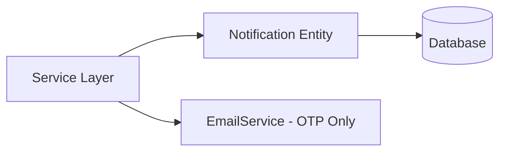
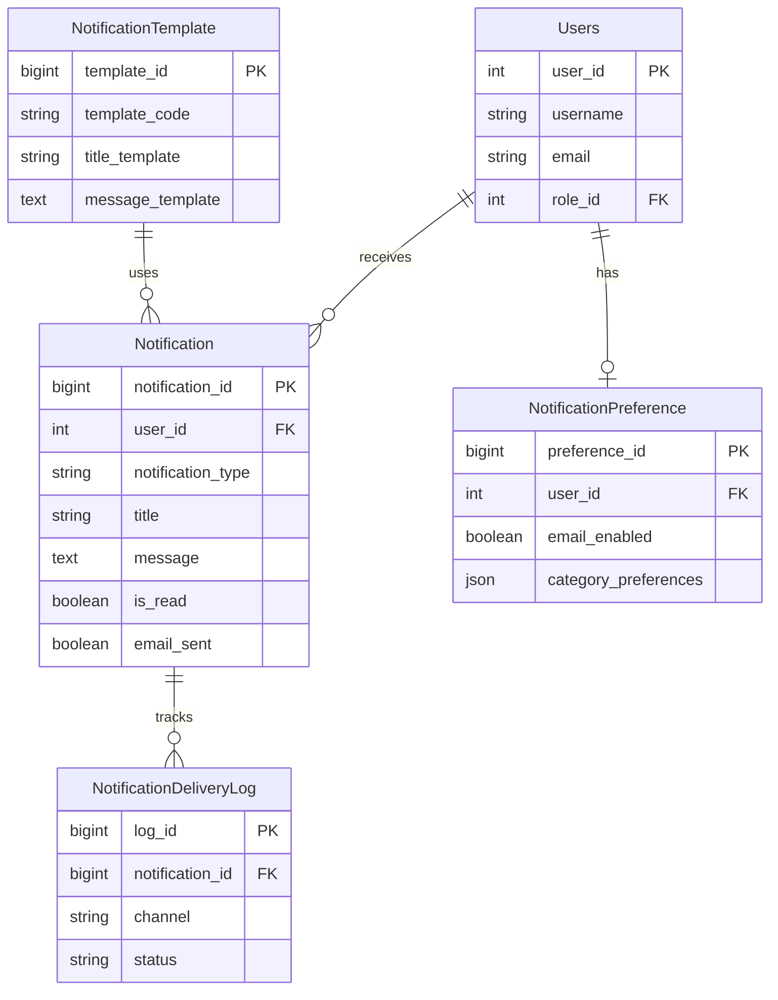
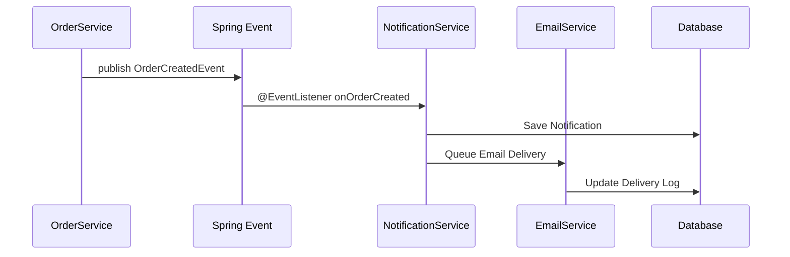
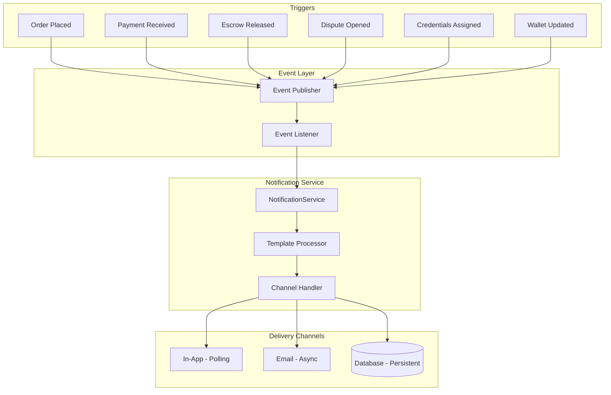
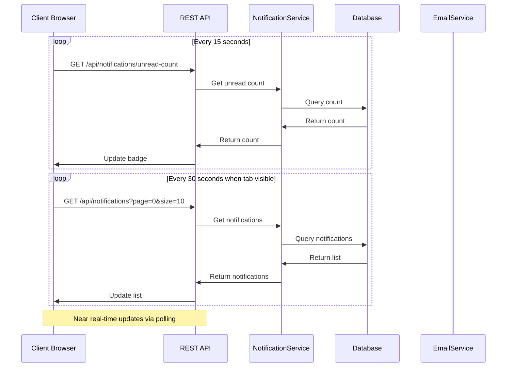
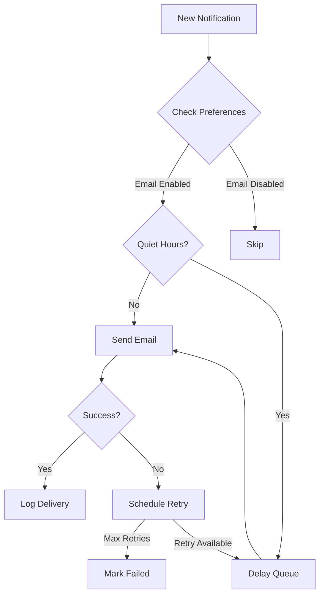
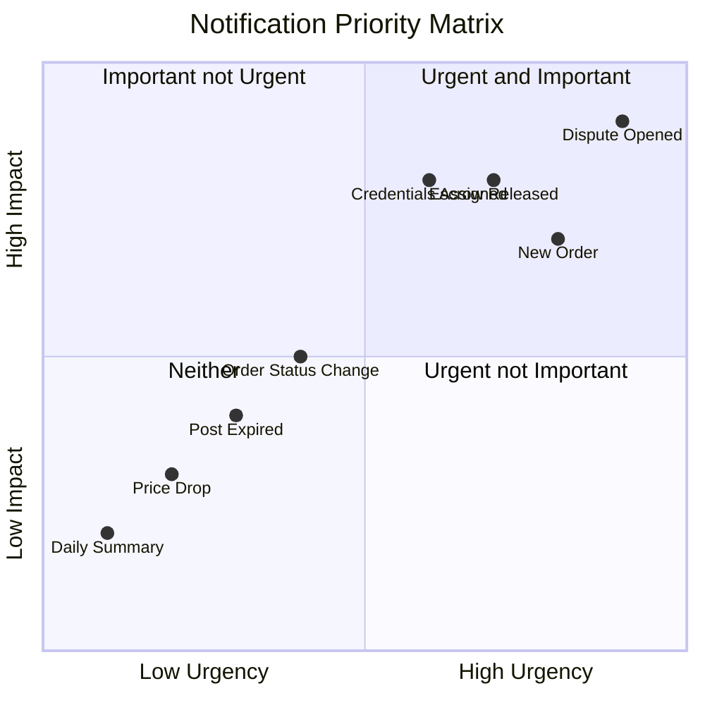

# Comprehensive Notification System Design

## Executive Summary

This document outlines the technical specification for a scalable, multi-channel notification system for the AccountTrade multi-vendor e-commerce platform. The system supports three user roles (Admin, Buyer, Seller) with **polling-based in-app notifications** and external email alerts.

---

## Table of Contents

1. [Current State Analysis](#1-current-state-analysis)
2. [Database Schema Design](#2-database-schema-design)
3. [Event-Driven Architecture](#3-event-driven-architecture)
4. [API Endpoint Structure](#4-api-endpoint-structure)
5. [Polling-Based Real-Time Updates](#5-polling-based-real-time-updates)
6. [Email Delivery System](#6-email-delivery-system)
7. [Notification Scenarios by Role](#7-notification-scenarios-by-role)
8. [Preference Management](#8-preference-management)
9. [Implementation Plan](#9-implementation-plan)

---

## 1. Current State Analysis

### Existing Components

| Component               | File                                                                                                             | Status                      |
| ----------------------- | ---------------------------------------------------------------------------------------------------------------- | --------------------------- |
| Notification Entity     | [`Notification.java`](../src/main/java/com/group3/accounttrade/entity/Notification.java)                         | Basic implementation exists |
| Notification Repository | [`NotificationRepository.java`](../src/main/java/com/group3/accounttrade/repository/NotificationRepository.java) | Basic CRUD operations       |
| Email Service           | [`EmailService.java`](../src/main/java/com/group3/accounttrade/service/EmailService.java)                        | OTP-only, needs expansion   |
| Async Config            | [`AsyncConfig.java`](../src/main/java/com/group3/accounttrade/config/AsyncConfig.java)                           | Email executor exists       |

### Current Notification Flow



### Gaps Identified

1. **No centralized notification service** - Each service creates notifications directly
2. **No user preference management** - Users cannot control notification delivery
3. **Limited email templates** - Only OTP emails supported
4. **No notification templates** - Hardcoded messages in service layer
5. **No batch processing** - Individual notification creation only
6. **No read status tracking UI** - Backend support exists but no frontend

---

## 2. Database Schema Design

### 2.1 Enhanced Notification Table

```sql
-- Enhanced notifications table
CREATE TABLE notifications (
    notification_id BIGINT PRIMARY KEY AUTO_INCREMENT,
    user_id INT NOT NULL,

    -- Classification
    notification_type VARCHAR(50) NOT NULL,
    notification_category VARCHAR(50),
    priority INT DEFAULT 2,

    -- Content
    title VARCHAR(200) NOT NULL,
    message TEXT NOT NULL,
    template_code VARCHAR(100),
    template_variables JSON,

    -- Related Entity
    related_entity_type VARCHAR(50),
    related_entity_id BIGINT,
    action_url VARCHAR(500),

    -- Delivery Status
    is_read BOOLEAN DEFAULT FALSE,
    read_at DATETIME,
    is_archived BOOLEAN DEFAULT FALSE,
    archived_at DATETIME,

    -- Multi-Channel Delivery
    in_app_sent BOOLEAN DEFAULT TRUE,
    in_app_sent_at DATETIME DEFAULT CURRENT_TIMESTAMP,
    email_sent BOOLEAN DEFAULT FALSE,
    email_sent_at DATETIME,
    email_error TEXT,

    -- Metadata
    created_at DATETIME NOT NULL DEFAULT CURRENT_TIMESTAMP,
    updated_at DATETIME ON UPDATE CURRENT_TIMESTAMP,
    expires_at DATETIME,

    INDEX idx_user_unread (user_id, is_read, created_at),
    INDEX idx_user_type (user_id, notification_type),
    INDEX idx_entity (related_entity_type, related_entity_id),
    INDEX idx_email_pending (email_sent, priority, created_at),
    INDEX idx_expiration (expires_at),

    FOREIGN KEY (user_id) REFERENCES Users(user_id)
);
```

### 2.2 User Notification Preferences Table

```sql
-- User notification preferences
CREATE TABLE notification_preferences (
    preference_id BIGINT PRIMARY KEY AUTO_INCREMENT,
    user_id INT NOT NULL UNIQUE,

    -- Global Settings
    email_enabled BOOLEAN DEFAULT TRUE,
    digest_enabled BOOLEAN DEFAULT FALSE,
    digest_frequency VARCHAR(20) DEFAULT 'INSTANT', -- INSTANT, HOURLY, DAILY, WEEKLY

    -- Category Preferences - stored as JSON for flexibility
    category_preferences JSON,
    -- Example: {"ORDER": {"email": true, "in_app": true}, "DISPUTE": {"email": true, "in_app": true}}

    -- Quiet Hours
    quiet_hours_enabled BOOLEAN DEFAULT FALSE,
    quiet_hours_start TIME DEFAULT '22:00',
    quiet_hours_end TIME DEFAULT '08:00',
    quiet_hours_timezone VARCHAR(50) DEFAULT 'Asia/Saigon',

    -- Metadata
    created_at DATETIME NOT NULL DEFAULT CURRENT_TIMESTAMP,
    updated_at DATETIME ON UPDATE CURRENT_TIMESTAMP,

    FOREIGN KEY (user_id) REFERENCES Users(user_id)
);
```

### 2.3 Notification Templates Table

```sql
-- Notification templates for consistent messaging
CREATE TABLE notification_templates (
    template_id BIGINT PRIMARY KEY AUTO_INCREMENT,
    template_code VARCHAR(100) NOT NULL UNIQUE,

    -- Classification
    notification_type VARCHAR(50) NOT NULL,
    notification_category VARCHAR(50),

    -- Content Templates
    title_template VARCHAR(200) NOT NULL,
    message_template TEXT NOT NULL,
    email_subject_template VARCHAR(200),
    email_body_template TEXT,

    -- Default Settings
    default_priority INT DEFAULT 2,
    default_action_url_template VARCHAR(500),

    -- Metadata
    is_active BOOLEAN DEFAULT TRUE,
    created_at DATETIME NOT NULL DEFAULT CURRENT_TIMESTAMP,
    updated_at DATETIME ON UPDATE CURRENT_TIMESTAMP,

    INDEX idx_type (notification_type),
    INDEX idx_code (template_code)
);
```

### 2.4 Notification Delivery Log Table

```sql
-- Track all delivery attempts for auditing and retry
CREATE TABLE notification_delivery_log (
    log_id BIGINT PRIMARY KEY AUTO_INCREMENT,
    notification_id BIGINT NOT NULL,

    -- Delivery Channel
    channel VARCHAR(20) NOT NULL, -- IN_APP, EMAIL

    -- Status
    status VARCHAR(20) NOT NULL, -- PENDING, SENT, DELIVERED, FAILED, RETRY
    attempt_count INT DEFAULT 1,

    -- Details
    provider_response TEXT,
    error_message TEXT,

    -- Timestamps
    attempted_at DATETIME NOT NULL DEFAULT CURRENT_TIMESTAMP,
    delivered_at DATETIME,
    next_retry_at DATETIME,

    INDEX idx_notification (notification_id),
    INDEX idx_status (status, next_retry_at),

    FOREIGN KEY (notification_id) REFERENCES notifications(notification_id)
);
```

### 2.5 Entity Relationships



---

## 3. Event-Driven Architecture

### 3.1 Spring Events for Notification Triggers



### 3.2 Event Classes

```java
// Base notification event
public abstract class NotificationEvent extends ApplicationEvent {
    private final String eventType;
    private final User recipient;
    private final Map<String, Object> payload;
    private final LocalDateTime timestamp;
}

// Concrete events
public class OrderCreatedEvent extends NotificationEvent { }
public class OrderStatusChangedEvent extends NotificationEvent { }
public class PaymentReceivedEvent extends NotificationEvent { }
public class EscrowReleasedEvent extends NotificationEvent { }
public class DisputeOpenedEvent extends NotificationEvent { }
public class DisputeResolvedEvent extends NotificationEvent { }
public class CredentialAssignedEvent extends NotificationEvent { }
public class NewSellerOrderEvent extends NotificationEvent { }
public class SystemAlertEvent extends NotificationEvent { }
```

### 3.3 Event Publisher Integration Points

| Service                                                                                              | Event Trigger        | Event Type             | Recipients            |
| ---------------------------------------------------------------------------------------------------- | -------------------- | ---------------------- | --------------------- |
| [`OrderCheckoutService`](../src/main/java/com/group3/accounttrade/service/OrderCheckoutService.java) | Order placed         | `ORDER_CREATED`        | Buyer, Seller         |
| [`BuyerOrderService`](../src/main/java/com/group3/accounttrade/service/BuyerOrderService.java)       | Status change        | `ORDER_STATUS_CHANGED` | Buyer                 |
| [`EscrowService`](../src/main/java/com/group3/accounttrade/service/EscrowService.java)               | Escrow created       | `ESCROW_CREATED`       | Buyer, Seller         |
| [`EscrowService`](../src/main/java/com/group3/accounttrade/service/EscrowService.java)               | Escrow released      | `ESCROW_RELEASED`      | Seller                |
| [`EscrowService`](../src/main/java/com/group3/accounttrade/service/EscrowService.java)               | Escrow refunded      | `ESCROW_REFUNDED`      | Buyer                 |
| [`DisputeService`](../src/main/java/com/group3/accounttrade/service/DisputeService.java)             | Dispute opened       | `DISPUTE_OPENED`       | Buyer, Seller, Admins |
| [`DisputeService`](../src/main/java/com/group3/accounttrade/service/DisputeService.java)             | Dispute resolved     | `DISPUTE_RESOLVED`     | Buyer, Seller         |
| [`CredentialService`](../src/main/java/com/group3/accounttrade/service/CredentialService.java)       | Credentials assigned | `CREDENTIAL_ASSIGNED`  | Buyer                 |
| [`VnpayPaymentService`](../src/main/java/com/group3/accounttrade/service/VnpayPaymentService.java)   | Payment success      | `PAYMENT_RECEIVED`     | Buyer                 |
| [`WalletService`](../src/main/java/com/group3/accounttrade/service/WalletService.java)               | Wallet credited      | `WALLET_CREDITED`      | User                  |

### 3.4 Event Flow Diagram



---

## 4. API Endpoint Structure

### 4.1 REST API Endpoints

#### Notification Management

```yaml
# Get all notifications for current user
GET /api/notifications
  Parameters:
    - page: int (default: 0)
    - size: int (default: 20)
    - type: string (optional filter)
    - unreadOnly: boolean (default: false)
  Response:
    - content: Notification[]
    - totalElements: long
    - unreadCount: long

# Get unread count (for polling)
GET /api/notifications/unread-count
  Response:
    - count: long
    - byType: Map<String, Long>

# Get single notification
GET /api/notifications/{id}
  Response:
    - notification: Notification

# Mark as read
PUT /api/notifications/{id}/read
  Response:
    - success: boolean

# Mark all as read
PUT /api/notifications/read-all
  Parameters:
    - type: string (optional)
  Response:
    - updatedCount: int

# Archive notification
PUT /api/notifications/{id}/archive
  Response:
    - success: boolean

# Delete notification
DELETE /api/notifications/{id}
  Response:
    - success: boolean
```

#### Preference Management

```yaml
# Get user preferences
GET /api/notifications/preferences
  Response:
    - preferences: NotificationPreference

# Update user preferences
PUT /api/notifications/preferences
  Body:
    - emailEnabled: boolean
    - categoryPreferences: Map
    - quietHoursEnabled: boolean
    - quietHoursStart: time
    - quietHoursEnd: time
  Response:
    - preferences: NotificationPreference

# Reset to defaults
POST /api/notifications/preferences/reset
  Response:
    - preferences: NotificationPreference
```

#### Admin Endpoints

```yaml
# Get notification statistics
GET /api/admin/notifications/stats
  Response:
    - totalSent: long
    - byType: Map<String, Long>
    - byChannel: Map<String, Long>
    - failedCount: long
    - pendingEmailCount: long

# Retry failed notifications
POST /api/admin/notifications/retry-failed
  Response:
    - retriedCount: int

# Send system-wide notification
POST /api/admin/notifications/broadcast
  Body:
    - title: string
    - message: string
    - type: string
    - priority: int
    - targetRoles: string[] (ADMIN, BUYER, SELLER, ALL)
  Response:
    - sentCount: int
```

### 4.2 API Response DTOs

```java
// Notification response DTO
public record NotificationDTO(
    Long notificationId,
    String notificationType,
    String notificationCategory,
    int priority,
    String title,
    String message,
    String relatedEntityType,
    Long relatedEntityId,
    String actionUrl,
    boolean isRead,
    LocalDateTime readAt,
    LocalDateTime createdAt,
    boolean emailSent
) {}

// Unread count response
public record UnreadCountResponse(
    long totalCount,
    Map<String, Long> countByType
) {}

// Notification preference DTO
public record NotificationPreferenceDTO(
    boolean emailEnabled,
    boolean digestEnabled,
    String digestFrequency,
    Map<String, ChannelPreference> categoryPreferences,
    boolean quietHoursEnabled,
    LocalTime quietHoursStart,
    LocalTime quietHoursEnd,
    String quietHoursTimezone
) {}

public record ChannelPreference(
    boolean email,
    boolean inApp
) {}
```

---

## 5. Polling-Based Real-Time Updates

### 5.1 Polling Strategy

Instead of WebSocket, the system uses a lightweight polling approach for near real-time updates. This is simpler to implement and maintain while still providing timely notifications.

**Polling Configuration:**

- **Polling Interval**: 30 seconds (configurable)
- **Unread Count Polling**: 15 seconds
- **Background Polling**: 60 seconds (when tab is hidden)

### 5.2 Polling Flow



### 5.3 Backend Polling Support

```java
@Service
@RequiredArgsConstructor
public class NotificationPollingService {

    private final NotificationRepository notificationRepository;

    /**
     * Get unread count for user - optimized for frequent polling
     */
    @Cacheable(value = "unread-counts", key = "#userId", unless = "#result == null")
    public UnreadCountResponse getUnreadCount(Integer userId) {
        long totalCount = notificationRepository.countUnreadByUserId(userId);
        Map<String, Long> countByType = notificationRepository.countUnreadByTypeAndUserId(userId);
        return new UnreadCountResponse(totalCount, countByType);
    }

    /**
     * Clear cache when notification is created/read
     */
    @CacheEvict(value = "unread-counts", key = "#userId")
    public void evictUnreadCountCache(Integer userId) {
        // Cache evicted automatically
    }
}
```

### 5.4 Frontend Polling Client

```javascript
// Simple polling implementation
class NotificationPoller {
  constructor(options = {}) {
    this.pollInterval = options.pollInterval || 30000; // 30 seconds
    this.unreadInterval = options.unreadInterval || 15000; // 15 seconds
    this.isRunning = false;
    this.isVisible = true;

    // Handle visibility changes
    document.addEventListener("visibilitychange", () => {
      this.isVisible = !document.hidden;
      if (this.isVisible) {
        this.fetchUnreadCount();
        this.fetchNotifications();
      }
    });
  }

  start() {
    if (this.isRunning) return;
    this.isRunning = true;

    // Start unread count polling
    this.unreadTimer = setInterval(() => {
      if (this.isVisible) {
        this.fetchUnreadCount();
      }
    }, this.unreadInterval);

    // Start notification list polling
    this.notificationTimer = setInterval(() => {
      if (this.isVisible) {
        this.fetchNotifications();
      }
    }, this.pollInterval);

    // Initial fetch
    this.fetchUnreadCount();
    this.fetchNotifications();
  }

  stop() {
    this.isRunning = false;
    clearInterval(this.unreadTimer);
    clearInterval(this.notificationTimer);
  }

  async fetchUnreadCount() {
    try {
      const response = await fetch("/api/notifications/unread-count");
      const data = await response.json();
      this.updateBadge(data.count);
    } catch (error) {
      console.error("Failed to fetch unread count:", error);
    }
  }

  async fetchNotifications() {
    try {
      const response = await fetch("/api/notifications?page=0&size=10");
      const data = await response.json();
      this.updateNotificationList(data.content);
    } catch (error) {
      console.error("Failed to fetch notifications:", error);
    }
  }

  updateBadge(count) {
    const badge = document.querySelector(".notification-badge");
    if (badge) {
      badge.textContent = count > 99 ? "99+" : count;
      badge.style.display = count > 0 ? "block" : "none";
    }
  }

  updateNotificationList(notifications) {
    const list = document.querySelector(".notification-list");
    if (list) {
      list.innerHTML = notifications
        .map((n) => this.renderNotification(n))
        .join("");
    }
  }

  renderNotification(notification) {
    const readClass = notification.read ? "read" : "unread";
    return `
            <div class="notification-item ${readClass}" data-id="${notification.notificationId}">
                <span class="notification-title">${notification.title}</span>
                <span class="notification-message">${notification.message}</span>
                <span class="notification-time">${this.formatTime(notification.createdAt)}</span>
            </div>
        `;
  }

  formatTime(timestamp) {
    const date = new Date(timestamp);
    const now = new Date();
    const diff = Math.floor((now - date) / 1000);

    if (diff < 60) return "Just now";
    if (diff < 3600) return `${Math.floor(diff / 60)} minutes ago`;
    if (diff < 86400) return `${Math.floor(diff / 3600)} hours ago`;
    return date.toLocaleDateString();
  }
}

// Initialize on page load
document.addEventListener("DOMContentLoaded", () => {
  const poller = new NotificationPoller({
    pollInterval: 30000,
    unreadInterval: 15000,
  });
  poller.start();
});
```

### 5.5 Polling API Endpoints Summary

| Endpoint                          | Method | Purpose                       | Poll Frequency |
| --------------------------------- | ------ | ----------------------------- | -------------- |
| `/api/notifications/unread-count` | GET    | Get unread notification count | 15 seconds     |
| `/api/notifications`              | GET    | Get paginated notifications   | 30 seconds     |
| `/api/notifications/{id}/read`    | PUT    | Mark notification as read     | On user action |
| `/api/notifications/read-all`     | PUT    | Mark all as read              | On user action |

---

## 6. Email Delivery System

### 6.1 Enhanced Email Service

```java
@Service
@RequiredArgsConstructor
public class NotificationEmailService {

    private final JavaMailSender mailSender;
    private final TemplateEngine templateEngine;
    private final NotificationPreferenceRepository preferenceRepository;
    private final NotificationDeliveryLogRepository deliveryLogRepository;

    @Async("emailTaskExecutor")
    public CompletableFuture<Void> sendNotificationEmail(
            Notification notification,
            User recipient) {

        // Check user preferences
        if (!isEmailEnabled(recipient, notification)) {
            return CompletableFuture.completedFuture(null);
        }

        // Check quiet hours
        if (isInQuietHours(recipient)) {
            scheduleForLater(notification, recipient);
            return CompletableFuture.completedFuture(null);
        }

        try {
            MimeMessage message = buildEmailMessage(notification, recipient);
            mailSender.send(message);

            logDeliverySuccess(notification, "EMAIL");
            updateNotificationEmailStatus(notification);

        } catch (Exception e) {
            logDeliveryFailure(notification, "EMAIL", e.getMessage());
            scheduleRetry(notification, recipient);
        }

        return CompletableFuture.completedFuture(null);
    }
}
```

### 6.2 Email Templates

**Order Confirmation Email:**

```html
<!DOCTYPE html>
<html xmlns:th="http://www.thymeleaf.org">
  <body>
    <div class="email-container">
      <h1>Order Confirmed</h1>
      <p>Dear <span th:text="${username}">User</span>,</p>
      <p>
        Your order <strong th:text="${orderNumber}">#ORD-001</strong> has been
        confirmed.
      </p>

      <div class="order-details">
        <h2>Order Details</h2>
        <table>
          <tr th:each="item : ${items}">
            <td th:text="${item.name}">Item</td>
            <td th:text="${item.price}">$0.00</td>
          </tr>
        </table>
        <p class="total">Total: <span th:text="${total}">$0.00</span></p>
      </div>

      <a th:href="${actionUrl}" class="button">View Order</a>
    </div>
  </body>
</html>
```

### 6.3 Email Queue and Retry Strategy



### 6.4 Retry Configuration

```yaml
notification:
  email:
    retry:
      max-attempts: 3
      initial-delay: 5m
      multiplier: 2
      max-delay: 1h
    batch-size: 50
    rate-limit: 100/hour
```

---

## 7. Notification Scenarios by Role

### 7.1 Buyer Notifications

| Scenario                     | Type       | Priority | Email | Template Code           |
| ---------------------------- | ---------- | -------- | ----- | ----------------------- |
| Order placed successfully    | ORDER      | NORMAL   | Yes   | `ORDER_CREATED`         |
| Payment received             | PAYMENT    | NORMAL   | Yes   | `PAYMENT_RECEIVED`      |
| Order status changed         | ORDER      | NORMAL   | No    | `ORDER_STATUS_CHANGED`  |
| Credentials assigned         | CREDENTIAL | HIGH     | Yes   | `CREDENTIAL_ASSIGNED`   |
| Escrow released confirmation | ESCROW     | NORMAL   | Yes   | `ESCROW_RELEASED_BUYER` |
| Refund processed             | ESCROW     | HIGH     | Yes   | `REFUND_PROCESSED`      |
| Dispute opened confirmation  | DISPUTE    | HIGH     | Yes   | `DISPUTE_OPENED_BUYER`  |
| Dispute resolved             | DISPUTE    | HIGH     | Yes   | `DISPUTE_RESOLVED`      |
| Dispute response from seller | DISPUTE    | NORMAL   | No    | `DISPUTE_RESPONSE`      |
| Wallet topped up             | WALLET     | NORMAL   | No    | `WALLET_CREDITED`       |
| Price drop alert             | PROMO      | LOW      | Yes   | `PRICE_DROP`            |
| Verification reminder        | SYSTEM     | HIGH     | Yes   | `VERIFICATION_REMINDER` |

### 7.2 Seller Notifications

| Scenario                           | Type    | Priority | Email | Template Code               |
| ---------------------------------- | ------- | -------- | ----- | --------------------------- |
| New order received                 | ORDER   | HIGH     | Yes   | `NEW_SELLER_ORDER`          |
| Order item sold                    | ORDER   | NORMAL   | No    | `ITEM_SOLD`                 |
| Payment held in escrow             | ESCROW  | NORMAL   | Yes   | `ESCROW_CREATED_SELLER`     |
| Escrow released - payment received | ESCROW  | HIGH     | Yes   | `ESCROW_RELEASED_SELLER`    |
| Dispute opened against sale        | DISPUTE | URGENT   | Yes   | `DISPUTE_OPENED_SELLER`     |
| Dispute response required          | DISPUTE | HIGH     | Yes   | `DISPUTE_RESPONSE_REQUIRED` |
| Dispute resolved                   | DISPUTE | HIGH     | Yes   | `DISPUTE_RESOLVED_SELLER`   |
| Post approved                      | POST    | NORMAL   | No    | `POST_APPROVED`             |
| Post rejected                      | POST    | HIGH     | Yes   | `POST_REJECTED`             |
| Post expired                       | POST    | LOW      | Yes   | `POST_EXPIRED`              |
| Low stock alert                    | SYSTEM  | NORMAL   | No    | `LOW_STOCK`                 |
| Wallet earnings credited           | WALLET  | NORMAL   | No    | `SELLER_EARNING`            |
| New review received                | REVIEW  | NORMAL   | No    | `NEW_REVIEW`                |

### 7.3 Admin Notifications

| Scenario                    | Type    | Priority | Email | Template Code             |
| --------------------------- | ------- | -------- | ----- | ------------------------- |
| New dispute requires review | DISPUTE | HIGH     | Yes   | `ADMIN_DISPUTE_REVIEW`    |
| Dispute escalated           | DISPUTE | URGENT   | Yes   | `ADMIN_DISPUTE_ESCALATED` |
| New seller registration     | USER    | NORMAL   | No    | `NEW_SELLER_REGISTRATION` |
| Post pending approval       | POST    | NORMAL   | No    | `POST_PENDING_APPROVAL`   |
| High-value transaction      | ORDER   | NORMAL   | Yes   | `HIGH_VALUE_TRANSACTION`  |
| System error                | SYSTEM  | URGENT   | Yes   | `SYSTEM_ERROR`            |
| Security alert              | SYSTEM  | URGENT   | Yes   | `SECURITY_ALERT`          |
| Daily summary               | SYSTEM  | LOW      | Yes   | `DAILY_SUMMARY`           |
| Refund request              | ESCROW  | HIGH     | Yes   | `REFUND_REQUEST`          |
| Platform milestone          | SYSTEM  | LOW      | No    | `PLATFORM_MILESTONE`      |

### 7.4 Notification Priority Matrix



---

## 8. Preference Management

### 8.1 Default Preferences by Role

```java
public class DefaultPreferenceFactory {

    public static NotificationPreference createBuyerDefaults(User user) {
        Map<String, ChannelPreference> categories = new HashMap<>();
        categories.put("ORDER", new ChannelPreference(true, true));
        categories.put("PAYMENT", new ChannelPreference(true, true));
        categories.put("ESCROW", new ChannelPreference(true, true));
        categories.put("CREDENTIAL", new ChannelPreference(true, true));
        categories.put("DISPUTE", new ChannelPreference(true, true));
        categories.put("PROMO", new ChannelPreference(true, true));
        categories.put("SYSTEM", new ChannelPreference(true, true));

        return NotificationPreference.builder()
                .user(user)
                .emailEnabled(true)
                .categoryPreferences(categories)
                .digestFrequency("INSTANT")
                .quietHoursEnabled(true)
                .build();
    }

    public static NotificationPreference createSellerDefaults(User user) {
        Map<String, ChannelPreference> categories = new HashMap<>();
        categories.put("ORDER", new ChannelPreference(true, true));
        categories.put("ESCROW", new ChannelPreference(true, true));
        categories.put("DISPUTE", new ChannelPreference(true, true));
        categories.put("POST", new ChannelPreference(true, true));
        categories.put("WALLET", new ChannelPreference(false, true));
        categories.put("REVIEW", new ChannelPreference(false, true));

        return NotificationPreference.builder()
                .user(user)
                .emailEnabled(true)
                .categoryPreferences(categories)
                .build();
    }

    public static NotificationPreference createAdminDefaults(User user) {
        Map<String, ChannelPreference> categories = new HashMap<>();
        categories.put("DISPUTE", new ChannelPreference(true, true));
        categories.put("USER", new ChannelPreference(true, true));
        categories.put("POST", new ChannelPreference(false, true));
        categories.put("SYSTEM", new ChannelPreference(true, true));

        return NotificationPreference.builder()
                .user(user)
                .emailEnabled(true)
                .digestEnabled(true)
                .digestFrequency("DAILY")
                .build();
    }
}
```

### 8.2 Preference UI Structure

```
Notification Settings
├── Delivery Channels
│   ├── [ ] Email notifications
│   └── [ ] In-app notifications
│
├── Notification Categories
│   ├── Orders
│   │   ├── [ ] Email  [ ] In-app
│   ├── Payments & Escrow
│   │   ├── [ ] Email  [ ] In-app
│   ├── Disputes
│   │   ├── [ ] Email  [ ] In-app
│   └── Promotions
│       ├── [ ] Email  [ ] In-app
│
├── Quiet Hours
│   ├── [ ] Enable quiet hours
│   ├── Start: [22:00]
│   └── End: [08:00]
│
└── Email Digest (Admin only)
    ├── [ ] Enable digest
    └── Frequency: [Daily ▼]
```

---

## 9. Implementation Plan

### Phase 1: Core Infrastructure

#### 1.1 Database Schema Updates

- [ ] Create migration script for enhanced notifications table
- [ ] Create notification_preferences table
- [ ] Create notification_templates table
- [ ] Create notification_delivery_log table
- [ ] Add indexes for performance

#### 1.2 Entity Classes

- [ ] Update [`Notification.java`](../src/main/java/com/group3/accounttrade/entity/Notification.java) with new fields
- [ ] Create `NotificationPreference.java` entity
- [ ] Create `NotificationTemplate.java` entity
- [ ] Create `NotificationDeliveryLog.java` entity

#### 1.3 Repository Layer

- [ ] Update [`NotificationRepository.java`](../src/main/java/com/group3/accounttrade/repository/NotificationRepository.java)
- [ ] Create `NotificationPreferenceRepository.java`
- [ ] Create `NotificationTemplateRepository.java`
- [ ] Create `NotificationDeliveryLogRepository.java`

### Phase 2: Service Layer

#### 2.1 Core Notification Service

- [ ] Create `NotificationService.java` - centralized notification management
- [ ] Create `NotificationEventPublisher.java` - Spring event publisher
- [ ] Create `NotificationEventListener.java` - async event processor
- [ ] Create `TemplateProcessor.java` - template variable substitution

#### 2.2 Channel Services

- [ ] Create `InAppNotificationService.java` - database persistence
- [ ] Enhance `EmailService.java` - template-based emails
- [ ] Create `NotificationDeliveryService.java` - multi-channel orchestration

#### 2.3 Preference Service

- [ ] Create `NotificationPreferenceService.java` - CRUD operations
- [ ] Create `QuietHoursService.java` - time-based filtering
- [ ] Create default preference initialization in `DataInitializer.java`

### Phase 3: API Layer

#### 3.1 REST Controllers

- [ ] Create `NotificationApiController.java` - CRUD endpoints
- [ ] Create `NotificationPreferenceApiController.java` - preference endpoints
- [ ] Create `AdminNotificationApiController.java` - admin endpoints

#### 3.2 DTOs

- [ ] Create `NotificationDTO.java`
- [ ] Create `NotificationPreferenceDTO.java`
- [ ] Create request/response DTOs

### Phase 4: Event Integration

#### 4.1 Service Modifications

- [ ] Update [`OrderCheckoutService.java`](../src/main/java/com/group3/accounttrade/service/OrderCheckoutService.java) - publish events
- [ ] Update [`EscrowService.java`](../src/main/java/com/group3/accounttrade/service/EscrowService.java) - publish events
- [ ] Update [`DisputeService.java`](../src/main/java/com/group3/accounttrade/service/DisputeService.java) - publish events
- [ ] Update [`CredentialService.java`](../src/main/java/com/group3/accounttrade/service/CredentialService.java) - publish events
- [ ] Update [`WalletService.java`](../src/main/java/com/group3/accounttrade/service/WalletService.java) - publish events

#### 4.2 Remove Direct Notification Creation

- [ ] Refactor notification creation to use events only
- [ ] Ensure backward compatibility

### Phase 5: Email Templates

#### 5.1 Template Files

- [ ] Create Thymeleaf email templates for all notification types
- [ ] Create email layout and styling
- [ ] Create plain-text fallbacks

#### 5.2 Template Seeding

- [ ] Add notification templates to `DataInitializer.java`
- [ ] Create admin UI for template management (optional)

### Phase 6: Frontend Integration

#### 6.1 Notification UI

- [ ] Create notification bell icon with unread count
- [ ] Create notification dropdown panel
- [ ] Create notification list page
- [ ] Create notification detail view
- [ ] Create preference settings page

#### 6.2 Polling Client

- [ ] Implement JavaScript polling client
- [ ] Handle visibility changes for background optimization
- [ ] Implement toast notifications for new alerts

### Phase 7: Testing and Monitoring

#### 7.1 Unit Tests

- [ ] Test notification service methods
- [ ] Test event publishing/listening
- [ ] Test preference management
- [ ] Test template processing

#### 7.2 Integration Tests

- [ ] Test polling endpoints
- [ ] Test email delivery
- [ ] Test end-to-end notification flow

#### 7.3 Monitoring

- [ ] Add metrics for notification delivery
- [ ] Add logging for debugging
- [ ] Create admin dashboard for notification stats

---

## Appendix A: File Structure

```
src/main/java/com/group3/accounttrade/
├── config/
│   └── AsyncConfig.java (enhanced)
├── controller/
│   ├── api/
│   │   ├── NotificationApiController.java
│   │   ├── NotificationPreferenceApiController.java
│   │   └── AdminNotificationApiController.java
├── dto/
│   ├── notification/
│   │   ├── NotificationDTO.java
│   │   ├── NotificationPreferenceDTO.java
│   │   └── UnreadCountResponse.java
├── entity/
│   ├── Notification.java (enhanced)
│   ├── NotificationPreference.java
│   ├── NotificationTemplate.java
│   └── NotificationDeliveryLog.java
├── event/
│   ├── NotificationEvent.java
│   ├── OrderCreatedEvent.java
│   ├── OrderStatusChangedEvent.java
│   ├── PaymentReceivedEvent.java
│   ├── EscrowEvent.java
│   ├── DisputeEvent.java
│   └── CredentialEvent.java
├── repository/
│   ├── NotificationRepository.java (enhanced)
│   ├── NotificationPreferenceRepository.java
│   ├── NotificationTemplateRepository.java
│   └── NotificationDeliveryLogRepository.java
├── service/
│   ├── notification/
│   │   ├── NotificationService.java
│   │   ├── NotificationEventPublisher.java
│   │   ├── NotificationEventListener.java
│   │   ├── NotificationPreferenceService.java
│   │   ├── NotificationDeliveryService.java
│   │   ├── TemplateProcessor.java
│   │   ├── InAppNotificationService.java
│   │   ├── NotificationEmailService.java
│   │   └── QuietHoursService.java

src/main/resources/
├── templates/
│   └── email/
│       ├── layout.html
│       ├── order-created.html
│       ├── payment-received.html
│       ├── escrow-released.html
│       ├── dispute-opened.html
│       └── ...
├── db/migration/
│   ├── V015__create_notification_preferences.sql
│   ├── V016__create_notification_templates.sql
│   ├── V017__create_notification_delivery_log.sql
│   └── V018__enhance_notifications_table.sql
```

---

## Appendix B: Dependencies

No additional dependencies required. The system uses:

- Spring Boot Web (existing)
- Spring Data JPA (existing)
- Spring Mail (existing)
- Thymeleaf (existing)

---

## Appendix C: Configuration Properties

Add to [`application.properties`](../src/main/resources/application.properties):

```properties
# Notification Settings
notification.email.enabled=true
notification.email.retry.max-attempts=3
notification.email.retry.initial-delay=5m
notification.email.batch-size=50
notification.polling.unread-interval-ms=15000
notification.polling.list-interval-ms=30000
notification.expiration-days=30

# Email Settings (existing)
spring.mail.host=smtp.example.com
spring.mail.port=587
spring.mail.username=${MAIL_USERNAME}
spring.mail.password=${MAIL_PASSWORD}
```

---

## Document Information

- **Version**: 1.1
- **Created**: 2026-03-26
- **Author**: Architecture Team
- **Status**: Draft for Review
- **Changes**: Simplified to polling-based approach instead of WebSocket
