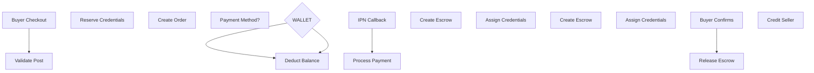

# Security Audit: Buyer Purchase Order Workflow

## Executive Summary

This security audit examines the buyer purchase order workflow in the TrustBridge (AccountTrade) platform, focusing on:
- Race conditions leading to double payments
- SQL injection vectors
- Logical flaws and integrity issues compromising transaction security

---

## 1. Race Condition Vulnerabilities

### 1.1 CRITICAL: Credential Reservation Race Condition

**Location:** [`CredentialService.reserveCredentials()`](src/main/java/com/group3/accounttrade/service/CredentialService.java:70-111)

**Severity:** HIGH

**Description:**
The credential reservation process is vulnerable to race conditions that could result in:
- Double-selling the same credential to multiple buyers
- Overselling credentials that don't exist

**Vulnerable Code:**
```java
@Transactional
public List<PostCredential> reserveCredentials(Post post, int quantity, OrderItem orderItem) {
    CredentialStatus availableStatus = credentialStatusRepository.findByStatusName(STATUS_AVAILABLE)
            .orElseThrow(() -> new IllegalStateException("Available status not found"));

    List<PostCredential> availableCredentials = new ArrayList<>();
    for (int i = 0; i < quantity; i++) {
        Optional<PostCredential> credentialOpt = postCredentialRepository
                .findFirstByPost_PostIdAndCredentialStatusOrderByCreatedAtAsc(post.getPostId(), availableStatus);
  // VULNERABILITY: No locking on this query
        if (credentialOpt.isEmpty()) {
            releaseCredentialsReservation(availableCredentials);
            throw new IllegalStateException(...);
        }
        availableCredentials.add(credentialOpt.get());
    }
    // ... status updates without atomicity
}
```

**Attack Vector:**
1. Two concurrent requests for the same post arrive at the same time
2. Both threads read the same "available" credential
3. Both pass the availability check
4. Both threads proceed to mark it credential as "Holding"
5. If one thread fails after marking, the credential is status is still "Available" in the database
 but the second thread sees it it as "Holding" (race condition)
6. Result: Same credential assigned to two different orders

**Recommended Fix:**
```java
@Lock(LockModeType.PESSIMISTIC_WRITE)
@Query("SELECT pc FROM PostCredential pc WHERE pc.post.postId = :postId AND pc.credentialStatus.statusName = :statusName ORDER BY pc.createdAt ASC LIMIT 1")
Optional<PostCredential> findFirstAvailableForUpdate(@Param("postId") Integer postId, @Param("statusName") String statusName);
```

Or use database-level atomic update:
```sql
UPDATE post_credentials 
SET credential_status_id = (SELECT status_id FROM credential_statuses WHERE status_name = 'Holding')
WHERE credential_id = :id AND credential_status_id = (SELECT status_id FROM credential_statuses WHERE status_name = 'Available')
```

---

### 1.2 HIGH: Wallet Balance Race Condition (Double-Spend)

**Location:** [`WalletService.deductBalance()`](src/main/java/com/group3/accounttrade/service/WalletService.java:69-89)

**Severity:** HIGH

**Description:**
The wallet deduction operation uses pessimistic locking but the timing window between balance check and deduction creates a vulnerability.

**Vulnerable Code:**
```java
@Transactional
public WalletTransaction deductBalance(User user, BigDecimal amount, String referenceId) {
    Wallet wallet = getOrCreateWalletForUpdate(user);  // PESSIMISTIC_WRITE lock
    if (wallet.getBalance().compareTo(amount) < 0) {  // Check
        throw new InsufficientBalanceException(...);
    }
    wallet.setBalance(wallet.getBalance().subtract(amount));  // Update
    walletRepository.save(wallet);
    // ... transaction recording
}
```

**Attack Vector:**
1. User has 100,000 VND balance
2. User initiates two purchases of 80,000 VND each simultaneously
3. Thread A reads balance (100,000), passes check
4. Thread B reads balance (100,000), passes check
5. Both threads deduct 80,000 VND
6. Final balance: -60,000 VND (should be 20,000)

**Mitigating Factors:**
- PESSIMISTIC_WRITE lock on [`WalletRepository.findByUserForUpdate()`](src/main/java/com/group3/accounttrade/repository/WalletRepository.java:19-21) prevents most race conditions
- The lock is acquired at the start of the transaction

**Residual Risk:**
The lock is effective, but for absolute safety, consider adding a database constraint:
```sql
ALTER TABLE wallets ADD CONSTRAINT chk_non_negative_balance CHECK (balance >= 0);
```

---

### 1.3 MEDIUM: Order Creation Race Condition

**Location:** [`OrderCheckoutService.initiateCheckout()`](src/main/java/com/group3/accounttrade/service/OrderCheckoutService.java:52-116)

**Severity:** MEDIUM

**Description:**
Multiple concurrent checkouts for the same post could result in:
- Multiple orders created for the same buyer
- Credential inventory mismatch

**Vulnerable Code:**
```java
@Transactional
public CheckoutSession initiateCheckout(User buyer, Integer postId, HttpServletRequest request) {
    Post post = validatePostForCheckout(buyer, postId);  // No synchronization
    // ... order creation
    List<PostCredential> reservedCredentials = credentialService.reserveCredentials(post, DEFAULT_QUANTITY, orderItem);
    // ...
}
```

**Attack Vector:**
1. Buyer rapidly clicks "Purchase" button multiple times
2. Multiple orders created before first payment completes
3. Credentials reserved multiple times for same buyer

**Recommended Fix:**
Add idempotency check:
```java
// Check for existing pending order for same post and buyer
Optional<Order> existingOrder = orderRepository.findByBuyerAndPostAndStatusIn(
    buyer, postId, List.of("AWAITING_PAYMENT", "PAID"));
if (existingOrder.isPresent()) {
    throw new IllegalStateException("Pending order already exists for this post");
}
```

---

## 2. Payment Processing Vulnerabilities

### 2.2 CRITICAL: VNPAY IPN/Return Callback Race Condition

**Location:** [`VnpayPaymentService.processIpnCallback()`](src/main/java/com/group3/accounttrade/service/VnpayPaymentService.java:124-246)

**Severity:** HIGH

**Description:**
The idempotency check for duplicate IPN processing has a race condition window.

**Vulnerable Code:**
```java
@Transactional
public Map<String, String> processIpnCallback(Map<String, String> params, HttpServletRequest request) {
    // ...
    Payment payment = paymentOpt.get();
    
    // 5. Check for duplicate processing (idempotency)
    if (payment.getPaidAt() != null ||
        payment.getPaymentStatus().getStatusName().equals(PaymentStatus.PAID)) {
        log.info("IPN callback: Payment already processed: {}", txnRef);
        // Return success for idempotency
        response.put("RspCode", "00");
        response.put("Message", "Confirm Success");
        return response;
    }
    // RACE CONDITION WINDOW HERE
    // Between the check above and the status update below,
    // another thread could also pass the check and process the same payment
    
    // 6. Update payment with VNPAY transaction details
    payment.setVnpayTransactionNo(vnpTransactionNo);
    // ... more updates
    // 7. Process based on response code
    if (VnpayConfig.RESPONSE_SUCCESS.equals(responseCode) && ...) {
        handlePaymentSuccess(payment, callback);
    }
}
```

**Attack Vector:**
1. VNPAY sends duplicate IPN callbacks (network retry)
2. Two threads simultaneously check `payment.getPaidAt() != null` - both see null
3. Both threads proceed to process the payment
4. Escrow created twice, credentials assigned twice

**Recommended Fix:**
Use optimistic locking with `@Version` annotation (already present on Payment entity):

```java
// In processIpnCallback, wrap status update in optimistic lock check
try {
    payment = paymentRepository.save(payment);  // Will throw OptimisticLockingFailureException
 // if version mismatch
} catch (OptimisticLockingFailureException e) {
    log.info("Payment already processed by another transaction: {}", txnRef);
    response.put("RspCode", "00");
    response.put("Message", "Confirm Success");
    return response;
}
```

Or use pessimistic locking:
```java
@Lock(LockModeType.PESSIMISTIC_WRITE)
@Query("SELECT p FROM Payment p WHERE p.vnpayTxnRef = :txnRef")
Optional<Payment> findByVnpayTxnRefForUpdate(@Param("txnRef") String txnRef);
```

---

### 2.2 MEDIUM: Return URL Can Be Manipulated

**Location:** [`PaymentController.handleVnpayReturn()`](src/main/java/com/group3/accounttrade/controller/PaymentController.java:85-114)

**Severity:** MEDIUM

**Description:**
The return URL callback is processed similarly to IPN but should not be trusted for order completion. The code correctly documents this but still processes top-ups.

**Code Analysis:**
```java
@GetMapping("/vnpay/return")
public ModelAndView handleVnpayReturn(HttpServletRequest request) {
    // ...
    if (txnRef != null && txnRef.startsWith("TU-")) {
        // ...
        try {
            walletService.confirmTopUp(txnRef, vnpayTransactionNo);  // Processing in return callback
            // ...
        }
    }
    // ...
}
```

**Recommendation:**
- Move all state-changing operations to IPN handler only
- Return URL should only display status based on database state, not process payments

---

## 3. SQL Injection Analysis

### 3.1 LOW RISK: JPA Repository Methods

**Status:** All repository methods use JPA named queries or Spring Data JPA projections, which automatically parameterize inputs.

**Analysis:**
- All custom queries use `@Param` annotations with named parameters
- No native SQL string concatenation detected
- No raw SQL execution found

**Example from [`PostCredentialRepository`](src/main/java/com/group3/accounttrade/repository/PostCredentialRepository.java:44-64):**
```java
@Query(value = """
    select pc
    from PostCredential pc
    join fetch pc.credentialStatus cs
    where pc.post.postId = :postId
    and (:statusName is null or cs.statusName = :statusName)
    and (:keyword is null or lower(pc.accountUsername) like lower(concat('%', :keyword, '%')))
    """)
```

This is safe - parameters are bound, not concatenated.

---

### 3.2 LOW RISK: Controller Input Handling

**Status:** Controllers use `@RequestParam` and `@PathVariable` which Spring binds safely.

**Potential Concerns:**
Some inputs are used directly in business logic without explicit validation:

**Locations:**
- [`BuyerController.processCheckout()`](src/main/java/com/group3/accounttrade/controller/BuyerController.java:190-258) - `paymentMethod` parameter
- [`BuyerController.openOrderDispute()`](src/main/java/com/group3/accounttrade/controller/BuyerController.java:367-425) - `reason`, `description` parameters

**Recommendation:**
Add explicit input validation:
```java
@Pattern(regexp = "^[a-zA-Z0-9 ]+$") 
private String paymentMethod;

@Size(max = 500)
private String reason;

@Size(max = 2000)
private String description;
```

---

## 4. Transaction Integrity Issues

### 4.1 HIGH: Missing Escrow for Wallet Checkout

**Location:** [`OrderCheckoutService.initiateWalletCheckout()`](src/main/java/com/group3/accounttrade/service/OrderCheckoutService.java:137-210)

**Severity:** HIGH

**Description:**
The escrow creation happens AFTER wallet deduction, creating a risk of deducted funds without escrow if the subsequent step fails.

**Vulnerable Code:**
```java
@Transactional
public Order initiateWalletCheckout(User buyer, Integer postId) {
    // ...
    walletService.deductBalance(buyer, post.getPrice(), orderNumber);  // Money deducted HERE
    // ...
    escrowService.createEscrow(order);  // Escrow created HERE - could fail
    credentialService.assignCredentialsToBuyer(order);  // Could also fail
    // ...
}
```

**Risk:**
If `escrowService.createEscrow()` or `credentialService.assignCredentialsToBuyer()` fails:
- Buyer's money is deducted
- No escrow created
- Transaction rolls back (good)
- But money is gone from wallet, needs manual reconciliation

**Recommended Fix:**
Restructure to ensure atomicity:
```java
@Transactional
public Order initiateWalletCheckout(User buyer, Integer postId) {
    // ... validation ...
    
    // Reserve credentials FIRST (can be released if fails)
    List<PostCredential> reservedCredentials = credentialService.reserveCredentials(post, DEFAULT_QUANTITY, orderItem);
    
    try {
        // Deduct balance
        walletService.deductBalance(buyer, post.getPrice(), orderNumber);
        
        // Create escrow
        escrowService.createEscrow(order);
        
        // Assign credentials
        credentialService.assignCredentialsToBuyer(order);
        
    } catch (Exception e) {
        // Release reserved credentials on failure
        credentialService.releaseCredentialsReservation(reservedCredentials);
        throw e;
    }
    return order;
}
```

---

### 4.2 MEDIUM: Escrow Auto-Release Race Condition

**Location:** [`EscrowService.autoReleaseEscrows()`](src/main/java/com/group3/accounttrade/service/EscrowService.java:384-402)

**Severity:** MEDIUM

**Description:**
The scheduled auto-release task could process the same escrow twice if the database query and scheduled job overlap.

**Vulnerable Code:**
```java
@Scheduled(fixedRate = 3600000) // Every hour
@Transactional
public void autoReleaseEscrows() {
    List<Escrow> escrowsToRelease = escrowRepository.findExpiredEscrows(STATUS_HOLDING, LocalDateTime.now());
    
    for (Escrow escrow : escrowsToRelease) {
        try {
            releaseEscrow(escrow.getOrder().getOrderId(), "Auto-release after buyer verification timeout", null);
        } catch (Exception e) {
            log.error("Failed to auto-release escrow...", e);
        }
    }
}
```

**Risk:**
If scheduled job runs while another transaction is releasing the same escrow:
- Both could attempt to release
- Double-payment to seller

**Mitigating Factors:**
- The `releaseEscrow()` method checks escrow status before releasing
- `@Version` on Escrow entity provides optimistic locking

**Recommended Fix:**
Add distributed lock or use database-level atomic update:
```java
@Modifying
@Query("UPDATE escrow SET escrow_status_id = :releasedStatusId, released_at = :now " +
    "WHERE escrow_id = :escrowId AND escrow_status_id = :holdingStatusId")
int releaseEscrowAtomic(Long escrowId, Integer releasedStatusId, Integer holdingStatusId, LocalDateTime now);
```

---

## 5. Input Validation Vulnerabilities

### 5.1 MEDIUM: Dispute Reason/Description Validation

**Location:** [`BuyerController.openOrderDispute()`](src/main/java/com/group3/accounttrade/controller/BuyerController.java:367-425)

**Severity:** MEDIUM

**Description:**
Dispute reason and description are accepted without size limits or validation.

**Vulnerable Code:**
```java
@PostMapping("/orders/{orderId}/disputes")
public String openOrderDispute(@PathVariable Long orderId,
                                   @RequestParam String reason,
                                   @RequestParam(required = false) String description,
                                   @RequestParam(required = false) MultipartFile[] evidenceImages,
                                   RedirectAttributes redirectAttributes) {
    // No validation on reason or description length or content
    Dispute dispute = disputeService.openDispute(orderId, user.getUserId(), reason, description, imageUrls);
    // ...
}
```

**Risk:**
- Very long descriptions could cause database storage issues
- Malformed input could cause issues in dispute processing

**Recommended Fix:**
```java
@Size(max = 100) private String reason;

@Size(max = 2000) private String description;

// Or use DTO validation
public record DisputeRequest(
    @NotBlank @Size(max = 100) String reason,
    @Size(max = 2000) String description,
    @Empty List<MultipartFile> evidenceImages
) {}
```

---

### 5.2 LOW: Payment Method Validation

**Location:** [`BuyerController.processCheckout()`](src/main/java/com/group3/accounttrade/controller/BuyerController.java:190-258)

**Severity:** LOW

**Description:**
Payment method is validated using string comparison but not enum validation.

**Vulnerable Code:**
```java
@PostMapping("/checkout")
public String processCheckout(@RequestParam String postId,
                                  @RequestParam(defaultValue = "VNPAY") String paymentMethod,
                                  ...) {
    if ("WALLET".equalsIgnoreCase(paymentMethod)) {
        // wallet checkout
    } else if ("VNPAY".equalsIgnoreCase(paymentMethod)) {
        // VNPAY checkout
    } else {
        // What if paymentMethod is "BITCOIN"?
        redirectAttributes.addFlashAttribute("errorMessage", "Invalid payment method");
        return "redirect:/marketplace";
    }
    // ...
}
```

**Recommended Fix:**
```java
public enum PaymentMethod { WALLET, VNPAY }

@PostMapping("/checkout")
public String processCheckout(@RequestParam String postId,
                                  @RequestParam PaymentMethod paymentMethod,
                                  ...) {
    // ...
}
```

---

## 6. Security Configuration Review

### 6.1 CSRF Protection

**Status:** CSRF protection is properly implemented in [`SecurityConfig`](src/main/java/com/group3/accounttrade/config/SecurityConfig.java).

### 6.2 Authentication and Authorization

**Status:** Authentication and proper implemented with role-based access control on [`SecurityConfig`](src/main/java/com/group3/accounttrade/config/SecurityConfig.java)

### 6.3 Session Management

**Status:** Spring Session with JDBC is used for session management. This is acceptable for this application type.

---

## 7. Summary of Recommendations

### Critical Priority (Immediate Action Required)

1. **Add pessimistic locking to credential reservation query**
2. **Add database constraint for non-negative wallet balance**
3. **Add idempotency check for duplicate orders creation**

### High Priority (Should Be Done Soon)

1. **Implement pessimistic locking in VnpayPaymentService for IPN processing**
2. **Restructure wallet checkout for ensure atomicity (deduct → escrow → credentials)**
3. **Add distributed lock or atomic update for escrow auto-release**

### Medium Priority (Should Be Planned)

1. **Add input validation annotations for dispute fields**
2. **Move top-up confirmation from return URL to IPN handler only**
3. **Add enum for payment method validation**

### Low Priority (Can Be Addressed Later)

1. **Add rate limiting for checkout endpoint**
2. **Add audit logging for security events detection**
3. **Review error handling for information leakage**

---

## 8. Architecture Diagram: Purchase Flow



---

## 9. Files Reviewed

| File | Purpose |
|-----|---------|
| [`BuyerController.java`](src/main/java/com/group3/accounttrade/controller/BuyerController.java) | Checkout, dispute, confirmation endpoints |
| [`PaymentController.java`](src/main/java/com/group3/accounttrade/controller/PaymentController.java) | VNPAY callback handling |
| [`CartController.java`](src/main/java/com/group3/accounttrade/controller/CartController.java) | Cart management API |
| [`OrderCheckoutService.java`](src/main/java/com/group3/accounttrade/service/OrderCheckoutService.java) | Checkout logic, order creation |
| [`VnpayPaymentService.java`](src/main/java/com/group3/accounttrade/service/VnpayPaymentService.java) | Payment processing, IPN handling |
| [`WalletService.java`](src/main/java/com/group3/accounttrade/service/WalletService.java) | Wallet balance operations |
| [`CredentialService.java`](src/main/java/com/group3/accounttrade/service/CredentialService.java) | Credential reservation and assignment |
| [`EscrowService.java`](src/main/java/com/group3/accounttrade/service/EscrowService.java) | Escrow management, auto-release |
| [`WalletRepository.java`](src/main/java/com/group3/accounttrade/repository/WalletRepository.java) | Wallet data access with pessimistic lock |
| [`PostCredentialRepository.java`](src/main/java/com/group3/accounttrade/repository/PostCredentialRepository.java) | Credential queries |
| [`PaymentRepository.java`](src/main/java/com/group3/accounttrade/repository/PaymentRepository.java) | Payment data access |
| [`SecurityConfig.java`](src/main/java/com/group3/accounttrade/config/SecurityConfig.java) | Security configuration |

---

## 10. Appendix: Code Snippets for Fixes

### A. Credential Reservation with Pessimistic Lock

```java
// In PostCredentialRepository.java
@Lock(LockModeType.PESSIMISTIC_WRITE)
@Query("SELECT pc FROM PostCredential pc WHERE pc.post.postId = :postId " +
       "AND pc.credentialStatus.statusName = :statusName ORDER BY pc.createdAt ASC LIMIT 1")
Optional<PostCredential> findFirstAvailableForUpdate(@Param("postId") Integer postId, 
                                                        @Param("statusName") String statusName);

// In CredentialService.java
@Transactional
public List<PostCredential> reserveCredentials(Post post, int quantity, OrderItem orderItem) {
    CredentialStatus availableStatus = credentialStatusRepository.findByStatusName(STATUS_AVAILABLE)
            .orElseThrow(() -> new IllegalStateException("Available status not found"));
    CredentialStatus holdingStatus = credentialStatusRepository.findByStatusName(STATUS_HOLDING)
            .orElseThrow(() -> new IllegalStateException("Holding status not found"));

    List<PostCredential> reservedCredentials = new ArrayList<>();
    
    for (int i = 0; i < quantity; i++) {
        Optional<PostCredential> credentialOpt = postCredentialRepository
                .findFirstAvailableForUpdate(post.getPostId(), STATUS_AVAILABLE);
        if (credentialOpt.isEmpty()) {
            releaseCredentialsReservation(reservedCredentials);
            throw new IllegalStateException("Not enough credentials available");
        }
        PostCredential credential = credentialOpt.get();
        credential.setCredentialStatus(holdingStatus);
        postCredentialRepository.save(credential);
        reservedCredentials.add(credential);
    }
    
    syncPostStockStatus(post);
    return reservedCredentials;
}
```

### B. Wallet Balance Constraint

```sql
-- Add to database migration
ALTER TABLE wallets ADD CONSTRAINT chk_non_negative_balance CHECK (balance >= 0);
```

### C. IPN Processing with Pessimistic Lock

```java
// In PaymentRepository.java
@Lock(LockModeType.PESSIMISTIC_WRITE)
@Query("SELECT p FROM Payment p WHERE p.vnpayTxnRef = :txnRef")
Optional<Payment> findByVnpayTxnRefForUpdate(@Param("txnRef") String txnRef);

// In VnpayPaymentService.java
@Transactional
public Map<String, String> processIpnCallback(Map<String, String> params, HttpServletRequest request) {
    // ... validation ...
    
    // Use pessimistic lock
    Optional<Payment> paymentOpt = paymentRepository.findByVnpayTxnRefForUpdate(txnRef);
    if (paymentOpt.isEmpty()) {
        // ... handle not found
    }
    
    Payment payment = paymentOpt.get();
    
    // Double-check idempotency with lock held
    if (payment.getPaidAt() != null || payment.getPaymentStatus().getStatusName().equals(PaymentStatus.PAID)) {
        response.put("RspCode", "00");
        response.put("Message", "Confirm Success");
        return response;
    }
    
    // ... process payment
}
```

### D. Order Idempotency Check

```java
// In OrderRepository.java
@Query("SELECT o FROM Order o WHERE o.buyer = :buyer AND EXISTS " +
       "(SELECT 1 FROM OrderItem oi WHERE oi.order = o AND oi.post.postId = :postId) " +
       "AND o.orderStatus.statusName IN :statusNames")
Optional<Order> findByBuyerAndPostAndStatusIn(@Param("buyer") User buyer, 
                                              @Param("postId") Integer postId, 
                                              @Param("statusNames") List<String> statusNames);

// In OrderCheckoutService.java
public CheckoutSession initiateCheckout(User buyer, Integer postId, HttpServletRequest request) {
    // Check for existing pending order
    Optional<Order> existingOrder = orderRepository.findByBuyerAndPostAndStatusIn(
            buyer, postId, List.of(OrderStatus.AWAITING_PAYMENT, OrderStatus.PAID));
    if (existingOrder.isPresent()) {
        throw new IllegalStateException("You already have a pending order for this post");
    }
    // ... continue with checkout
}
```
