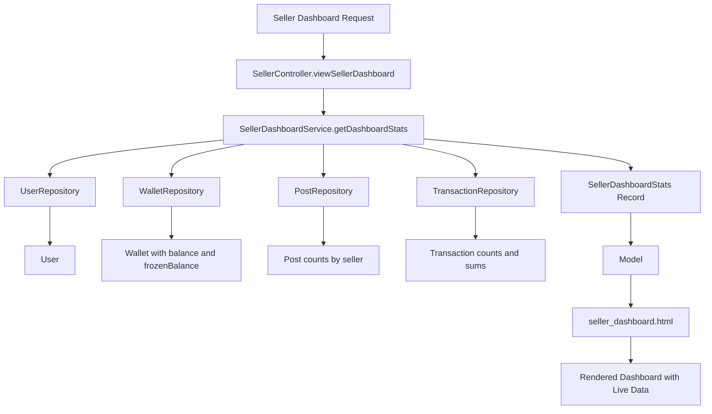

# Seller Dashboard Refactoring Plan

## Overview

The Seller Dashboard currently displays hardcoded data in the template. This plan outlines the steps to refactor the controller and template to display live data from the database.

## Current State Analysis

### Hardcoded Data in `seller_dashboard.html`

| Section             | Hardcoded Value                      | Description                    |
| ------------------- | ------------------------------------ | ------------------------------ |
| User Info           | ProSeller99, PRO avatar              | Seller display name and avatar |
| Wallet Balance      | 86.250.000 ₫                         | Available balance              |
| Escrow Balance      | 31.250.000 ₫                         | Frozen/escrow balance          |
| Escrow Orders       | 5 Đơn                                | Number of orders in escrow     |
| Total Revenue       | 363.000.000 ₫                        | Historical total revenue       |
| Total Orders        | 125 Đơn                              | Total completed orders         |
| Active Orders Table | 2 sample orders                      | Orders requiring seller action |
| Revenue Chart       | [1200, 2450, 1800, 3900, 2600, 4050] | 6-month revenue data           |

### Current Controller

```java
@GetMapping("/dashboard")
public String viewSellerDashboard() {
    return "seller_dashboard";
}
```

The controller simply returns the view without any model data.

## Required Changes

### 1. Add Repository Methods

#### TransactionRepository.java

Add methods to query transactions by seller:

```java
// Find transactions for a seller
List<Transaction> findBySellerOrderByCreatedAtDesc(User seller);

// Find transactions by seller and status
List<Transaction> findBySellerAndStatus(User seller, TransactionStatus status);

// Count transactions by seller and status
long countBySellerAndStatus(User seller, TransactionStatus status);

// Sum revenue for a seller with completed status
@Query("SELECT SUM(t.amount) FROM Transaction t WHERE t.seller = :seller AND t.status.statusName = :statusName")
BigDecimal sumRevenueBySellerAndStatus(@Param("seller") User seller, @Param("statusName") String statusName);
```

#### WalletRepository.java (if not exists)

Create or ensure exists:

```java
Optional<Wallet> findByUser(User user);
Optional<Wallet> findByUser_Username(String username);
```

### 2. Create Dashboard Service or Extend Existing

Create a new `SellerDashboardService.java`:

```java
@Service
@RequiredArgsConstructor
public class SellerDashboardService {

    private final TransactionRepository transactionRepository;
    private final PostRepository postRepository;
    private final WalletRepository walletRepository;
    private final UserRepository userRepository;
    private final TransactionStatusRepository transactionStatusRepository;

    public SellerDashboardStats getDashboardStats(String username) {
        User seller = userRepository.findByUsername(username)
                .orElseThrow(() -> new IllegalArgumentException("User not found"));

        // Get wallet info
        Wallet wallet = walletRepository.findByUser(seller).orElse(null);

        // Get post counts
        long totalPosts = postRepository.countBySeller_Username(username);
        long activePosts = postRepository.countBySeller_UsernameAndStockStatus(username, StockStatus.IN_STOCK);

        // Get transaction stats
        TransactionStatus pendingStatus = transactionStatusRepository.findByStatusName("PENDING").orElse(null);
        TransactionStatus completedStatus = transactionStatusRepository.findByStatusName("COMPLETED").orElse(null);

        long pendingOrders = pendingStatus != null ?
                transactionRepository.countBySellerAndStatus(seller, pendingStatus) : 0;
        long completedOrders = completedStatus != null ?
                transactionRepository.countBySellerAndStatus(seller, completedStatus) : 0;

        BigDecimal totalRevenue = transactionRepository.sumRevenueBySellerAndStatus(seller, "COMPLETED");

        return new SellerDashboardStats(
            wallet != null ? wallet.getBalance() : BigDecimal.ZERO,
            wallet != null ? wallet.getFrozenBalance() : BigDecimal.ZERO,
            totalPosts,
            activePosts,
            pendingOrders,
            completedOrders,
            totalRevenue != null ? totalRevenue : BigDecimal.ZERO
        );
    }

    public List<Transaction> getPendingOrders(String username, int limit) {
        User seller = userRepository.findByUsername(username)
                .orElseThrow(() -> new IllegalArgumentException("User not found"));
        TransactionStatus pendingStatus = transactionStatusRepository.findByStatusName("PENDING")
                .orElse(null);

        if (pendingStatus == null) return List.of();

        return transactionRepository.findBySellerAndStatusOrderByCreatedAtDesc(
                seller, pendingStatus, PageRequest.of(0, limit));
    }

    public record SellerDashboardStats(
        BigDecimal availableBalance,
        BigDecimal escrowBalance,
        long totalPosts,
        long activePosts,
        long pendingOrders,
        long completedOrders,
        BigDecimal totalRevenue
    ) {}
}
```

### 3. Update SellerController

```java
@GetMapping("/dashboard")
public String viewSellerDashboard(Authentication authentication, Model model) {
    String username = authentication.getName();

    // Get dashboard statistics
    SellerDashboardStats stats = sellerDashboardService.getDashboardStats(username);
    model.addAttribute("stats", stats);

    // Get pending orders requiring action
    List<Transaction> pendingOrders = sellerDashboardService.getPendingOrders(username, 5);
    model.addAttribute("pendingOrders", pendingOrders);

    // Get user info
    User user = userRepository.findByUsername(username).orElse(null);
    model.addAttribute("user", user);

    // Get wallet
    Wallet wallet = walletRepository.findByUser_Username(username).orElse(null);
    model.addAttribute("wallet", wallet);

    return "seller_dashboard";
}
```

### 4. Update Template

Replace hardcoded values with Thymeleaf expressions:

```html
<!-- User Info -->
<div
  class="text-sm font-bold text-gray-900 leading-tight"
  th:text="${user.username}"
>
  Username
</div>

<!-- Wallet Balance -->
<div
  class="text-4xl font-bold mb-6 relative z-10 tracking-tight"
  th:text="${#numbers.formatDecimal(stats.availableBalance, 1, 'DEFAULT', 0, 'DEFAULT')} + '₫'"
>
  86.250.000 ₫
</div>

<!-- Escrow Balance -->
<div
  class="text-3xl font-bold text-gray-900"
  th:text="${#numbers.formatDecimal(stats.escrowBalance, 1, 'DEFAULT', 0, 'DEFAULT')} + '₫'"
>
  31.250.000 ₫
</div>
<span th:text="${stats.pendingOrders} + ' Đơn'">5 Đơn</span>

<!-- Total Revenue -->
<div
  class="text-3xl font-bold text-gray-900"
  th:text="${#numbers.formatDecimal(stats.totalRevenue, 1, 'DEFAULT', 0, 'DEFAULT')} + '₫'"
>
  363.000.000 ₫
</div>
<span th:text="${stats.completedOrders} + ' Đơn'">125 Đơn</span>

<!-- Active Orders Table -->
<tbody class="divide-y divide-gray-100">
  <tr
    th:each="order : ${pendingOrders}"
    class="hover:bg-gray-50 transition-colors group"
  >
    <td
      class="py-4 px-4 font-mono text-sm text-gray-600"
      th:text="'#TRX-' + ${order.transactionId}"
    >
      #TRX-8921
    </td>
    <td class="py-4 px-4">
      <div
        class="font-bold text-gray-900 text-sm"
        th:text="${order.post.title}"
      >
        Product Name
      </div>
      <div class="text-xs text-gray-500 mt-1 flex items-center gap-1">
        <i class="ph-fill ph-user text-gray-400"></i>
        <span th:text="${order.buyer.username}">BuyerName</span>
      </div>
    </td>
    <td
      class="py-4 px-4 font-bold text-gray-900"
      th:text="${#numbers.formatDecimal(order.amount, 1, 'DEFAULT', 0, 'DEFAULT')} + '₫'"
    >
      11.250.000 ₫
    </td>
    <td class="py-4 px-4">
      <span
        class="inline-flex items-center gap-1.5 px-3 py-1 rounded-full text-xs font-bold"
        th:classappend="${order.status.statusName == 'PENDING'} ? 'bg-blue-100 text-blue-700 border border-blue-200' : 'bg-orange-100 text-orange-700 border border-orange-200'"
        th:text="${order.status.statusName}"
        >Status</span
      >
    </td>
    <td class="py-4 px-4 text-right">
      <a
        th:href="@{/seller/orders/{id}(id=${order.transactionId})}"
        class="text-xs font-bold btn-primary px-3 py-2 shadow-sm"
        >Xử lý</a
      >
    </td>
  </tr>
  <tr th:if="${pendingOrders.isEmpty()}">
    <td colspan="5" class="py-8 text-center text-gray-500">
      Không có đơn hàng nào cần xử lý
    </td>
  </tr>
</tbody>
```

## Implementation Order

1. **Phase 1: Repository Layer**
   - Add methods to `TransactionRepository`
   - Create `WalletRepository` if not exists
   - Add post count methods to `PostRepository`

2. **Phase 2: Service Layer**
   - Create `SellerDashboardService`
   - Implement statistics gathering methods
   - Implement pending orders query

3. **Phase 3: Controller Layer**
   - Update `SellerController.viewSellerDashboard()`
   - Add necessary dependencies

4. **Phase 4: Template Layer**
   - Replace hardcoded user info
   - Replace hardcoded wallet/escrow balances
   - Replace hardcoded order counts
   - Replace hardcoded orders table
   - Handle empty states

5. **Phase 5: Testing**
   - Verify dashboard loads with real data
   - Test with no orders scenario
   - Test with no wallet scenario

## Files to Modify

| File                          | Changes                               |
| ----------------------------- | ------------------------------------- |
| `TransactionRepository.java`  | Add seller query methods              |
| `PostRepository.java`         | Add count methods                     |
| `WalletRepository.java`       | Create or verify exists               |
| `SellerDashboardService.java` | Create new service                    |
| `SellerController.java`       | Update dashboard method               |
| `seller_dashboard.html`       | Replace hardcoded data with Thymeleaf |

## Data Flow Diagram



## Notes

- The revenue chart data requires monthly aggregation which may need additional query complexity
- Consider caching dashboard stats for performance
- Handle cases where wallet or user data is missing gracefully
- The current template uses Vietnamese Dong formatting - ensure consistent locale handling
