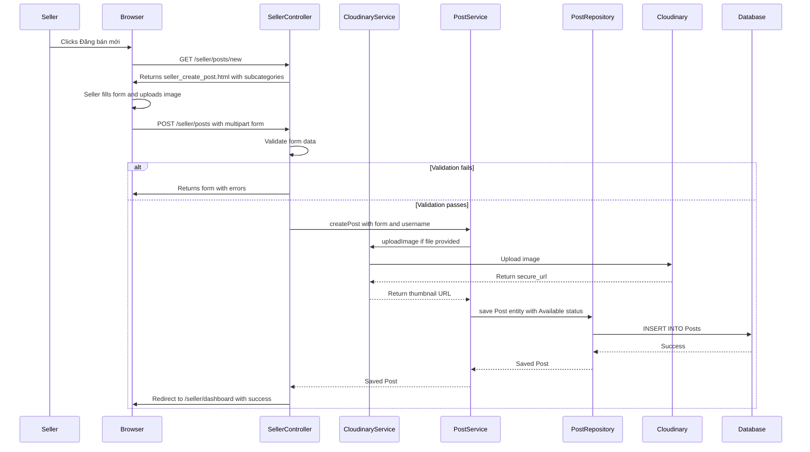

# Seller Post Account Product Feature - Implementation Plan

## Overview
This plan outlines the implementation of the "seller posts account product" feature, allowing sellers to create new account product posts in the TrustBridge Market platform.

### Confirmed Requirements
- **Image Storage**: Cloudinary for uploaded images
- **Initial Status**: Default to "Available" (status_id = 1)
- **Rich Text Editor**: Quill.js
- **Category Selection**: Only subcategories (leaf nodes) can be selected

---

## Current Architecture Analysis

### Existing Patterns
- **Framework**: Spring Boot with Thymeleaf
- **ORM**: JPA/Hibernate with Spring Data JPA
- **Styling**: Tailwind CSS
- **Language**: Vietnamese for UI
- **Dependency Injection**: Constructor injection using `@RequiredArgsConstructor` or `@Autowired`
- **Entities**: Use Lombok annotations (`@Data`, `@Builder`, `@NoArgsConstructor`, `@AllArgsConstructor`)
- **Repositories**: Extend `JpaRepository`
- **Services**: Annotated with `@Service`, use `@Transactional` for database operations

### Existing Entities
- [`Post.java`](src/main/java/com/group3/accounttrade/entity/Post.java) - Already exists with all required fields
- [`Category.java`](src/main/java/com/group3/accounttrade/entity/Category.java) - Already exists
- [`PostStatus.java`](src/main/java/com/group3/accounttrade/entity/PostStatus.java) - Already exists
- [`User.java`](src/main/java/com/group3/accounttrade/entity/User.java) - Already exists

### Existing Repositories
- [`PostRepository.java`](src/main/java/com/group3/accounttrade/repository/PostRepository.java) - Already exists
- [`CategoryRepository.java`](src/main/java/com/group3/accounttrade/repository/CategoryRepository.java) - Already exists
- [`PostStatusRepository.java`](src/main/java/com/group3/accounttrade/repository/PostStatusRepository.java) - Already exists
- [`UserRepository.java`](src/main/java/com/group3/accounttrade/repository/UserRepository.java) - Already exists

---

## Implementation Steps

### Step 1: Add Cloudinary Dependencies
**File**: `pom.xml`

Add Cloudinary dependency:
```xml
<dependency>
    <groupId>com.cloudinary</groupId>
    <artifactId>cloudinary-http44</artifactId>
    <version>1.36.0</version>
</dependency>
```

### Step 2: Configure Cloudinary
**File**: `src/main/resources/application.properties`

Add Cloudinary configuration:
```properties
# Cloudinary Configuration
cloudinary.cloud-name=your-cloud-name
cloudinary.api-key=your-api-key
cloudinary.api-secret=your-api-secret
```

### Step 3: Create CloudinaryService
**File**: `src/main/java/com/group3/accounttrade/service/CloudinaryService.java`

```java
package com.group3.accounttrade.service;

import com.cloudinary.Cloudinary;
import com.cloudinary.utils.ObjectUtils;
import lombok.RequiredArgsConstructor;
import org.springframework.beans.factory.annotation.Value;
import org.springframework.stereotype.Service;
import org.springframework.web.multipart.MultipartFile;

import java.io.IOException;
import java.util.Map;

@Service
@RequiredArgsConstructor
public class CloudinaryService {

    private final Cloudinary cloudinary;

    public String uploadImage(MultipartFile file) throws IOException {
        Map<?, ?> uploadResult = cloudinary.uploader().upload(file.getBytes(), 
            ObjectUtils.asMap("folder", "account-trade/posts"));
        return uploadResult.get("secure_url").toString();
    }
}
```

### Step 4: Create CloudinaryConfig
**File**: `src/main/java/com/group3/accounttrade/config/CloudinaryConfig.java`

```java
package com.group3.accounttrade.config;

import com.cloudinary.Cloudinary;
import org.springframework.beans.factory.annotation.Value;
import org.springframework.context.annotation.Bean;
import org.springframework.context.annotation.Configuration;

import java.util.HashMap;
import java.util.Map;

@Configuration
public class CloudinaryConfig {

    @Value("${cloudinary.cloud-name}")
    private String cloudName;

    @Value("${cloudinary.api-key}")
    private String apiKey;

    @Value("${cloudinary.api-secret}")
    private String apiSecret;

    @Bean
    public Cloudinary cloudinary() {
        Map<String, String> config = new HashMap<>();
        config.put("cloud_name", cloudName);
        config.put("api_key", apiKey);
        config.put("api_secret", apiSecret);
        return new Cloudinary(config);
    }
}
```

### Step 5: Create PostForm DTO
**File**: `src/main/java/com/group3/accounttrade/dto/PostForm.java`

```java
package com.group3.accounttrade.dto;

import jakarta.validation.constraints.*;
import lombok.*;
import org.springframework.web.multipart.MultipartFile;

import java.math.BigDecimal;

@Data
@NoArgsConstructor
@AllArgsConstructor
@Builder
public class PostForm {
    
    @NotBlank(message = "Tiêu đề không được để trống")
    @Size(max = 255, message = "Tiêu đề không được vượt quá 255 ký tự")
    private String title;
    
    @NotNull(message = "Giá không được để trống")
    @DecimalMin(value = "0.01", message = "Giá phải lớn hơn 0")
    private BigDecimal price;
    
    private String description;  // Rich text content (HTML from Quill.js)
    
    private MultipartFile thumbnailFile;  // For Cloudinary upload
    
    @NotNull(message = "Vui lòng chọn danh mục")
    private Integer categoryId;
    
    // statusId removed - will default to "Available"
}
```

### Step 6: Update CategoryRepository
**File**: `src/main/java/com/group3/accounttrade/repository/CategoryRepository.java`

Add method to find only subcategories (leaf nodes):
```java
@Query("SELECT c FROM Category c WHERE c.parent IS NOT NULL ORDER BY c.parent.displayOrder, c.displayOrder")
List<Category> findAllSubcategories();
```

### Step 7: Create PostService
**File**: `src/main/java/com/group3/accounttrade/service/PostService.java`

```java
package com.group3.accounttrade.service;

import com.group3.accounttrade.dto.PostForm;
import com.group3.accounttrade.entity.*;
import com.group3.accounttrade.repository.*;
import lombok.RequiredArgsConstructor;
import org.springframework.stereotype.Service;
import org.springframework.transaction.annotation.Transactional;
import org.springframework.web.multipart.MultipartFile;

import java.io.IOException;

@Service
@RequiredArgsConstructor
public class PostService {

    private final PostRepository postRepository;
    private final CategoryRepository categoryRepository;
    private final PostStatusRepository postStatusRepository;
    private final UserRepository userRepository;
    private final CloudinaryService cloudinaryService;

    @Transactional
    public Post createPost(PostForm form, String username) throws IOException {
        // Get the seller (current authenticated user)
        User seller = userRepository.findByUsername(username)
                .orElseThrow(() -> new IllegalArgumentException("Người dùng không tồn tại"));

        // Get category (must be a subcategory)
        Category category = categoryRepository.findById(form.getCategoryId())
                .orElseThrow(() -> new IllegalArgumentException("Danh mục không tồn tại"));

        if (category.getParent() == null) {
            throw new IllegalArgumentException("Vui lòng chọn danh mục con");
        }

        // Get "Available" status (default for new posts)
        PostStatus availableStatus = postStatusRepository.findByStatusName("Available")
                .orElseThrow(() -> new IllegalArgumentException("Trạng thái không hợp lệ"));

        // Upload thumbnail to Cloudinary if provided
        String thumbnailUrl = null;
        if (form.getThumbnailFile() != null && !form.getThumbnailFile().isEmpty()) {
            thumbnailUrl = cloudinaryService.uploadImage(form.getThumbnailFile());
        }

        // Create the post
        Post post = Post.builder()
                .seller(seller)
                .title(form.getTitle())
                .price(form.getPrice())
                .description(form.getDescription())
                .thumbnailUrl(thumbnailUrl)
                .category(category)
                .status(availableStatus)
                .build();

        return postRepository.save(post);
    }
}
```

### Step 8: Update SellerController
**File**: `src/main/java/com/group3/accounttrade/controller/SellerController.java`

```java
package com.group3.accounttrade.controller;

import com.group3.accounttrade.dto.PostForm;
import com.group3.accounttrade.entity.Category;
import com.group3.accounttrade.repository.CategoryRepository;
import com.group3.accounttrade.service.PostService;
import jakarta.validation.Valid;
import lombok.RequiredArgsConstructor;
import org.springframework.security.core.Authentication;
import org.springframework.stereotype.Controller;
import org.springframework.ui.Model;
import org.springframework.validation.BindingResult;
import org.springframework.web.bind.annotation.*;
import org.springframework.web.servlet.mvc.support.RedirectAttributes;

import java.util.List;
import java.util.Map;
import java.util.stream.Collectors;

@Controller
@RequestMapping("/seller")
@RequiredArgsConstructor
public class SellerController {

    private final CategoryRepository categoryRepository;
    private final PostService postService;

    @GetMapping("/dashboard")
    public String viewSellerDashboard() {
        return "seller_dashboard";
    }

    @GetMapping("/posts/new")
    public String showCreatePostForm(Model model) {
        model.addAttribute("postForm", new PostForm());
        
        // Get only subcategories grouped by parent
        List<Category> subcategories = categoryRepository.findAllSubcategories();
        Map<String, List<Category>> categoriesByParent = subcategories.stream()
                .collect(Collectors.groupingBy(c -> c.getParent().getCategoryName()));
        model.addAttribute("categoriesByParent", categoriesByParent);
        
        return "seller_create_post";
    }

    @PostMapping("/posts")
    public String createPost(
            @Valid @ModelAttribute("postForm") PostForm postForm,
            BindingResult bindingResult,
            Authentication authentication,
            Model model,
            RedirectAttributes redirectAttributes) {
        
        if (bindingResult.hasErrors()) {
            List<Category> subcategories = categoryRepository.findAllSubcategories();
            Map<String, List<Category>> categoriesByParent = subcategories.stream()
                    .collect(Collectors.groupingBy(c -> c.getParent().getCategoryName()));
            model.addAttribute("categoriesByParent", categoriesByParent);
            return "seller_create_post";
        }

        try {
            String username = authentication.getName();
            postService.createPost(postForm, username);
            redirectAttributes.addFlashAttribute("success", "Đăng bài thành công!");
            return "redirect:/seller/dashboard";
        } catch (Exception e) {
            model.addAttribute("error", e.getMessage());
            List<Category> subcategories = categoryRepository.findAllSubcategories();
            Map<String, List<Category>> categoriesByParent = subcategories.stream()
                    .collect(Collectors.groupingBy(c -> c.getParent().getCategoryName()));
            model.addAttribute("categoriesByParent", categoriesByParent);
            return "seller_create_post";
        }
    }
}
```

### Step 9: Create Thymeleaf Template with Quill.js
**File**: `src/main/resources/templates/seller_create_post.html`

Key features:
- Quill.js rich text editor for description
- Cloudinary image upload for thumbnail
- Category dropdown with grouped subcategories
- Form validation with error messages
- Tailwind CSS styling consistent with existing templates
- Vietnamese language UI
- Multipart form for file upload

```html
<!DOCTYPE html>
<html lang="vi" xmlns:th="http://www.thymeleaf.org">
<head>
    <meta charset="UTF-8">
    <meta name="viewport" content="width=device-width, initial-scale=1.0">
    <title>TrustBridge Market | Đăng bán sản phẩm</title>
    <!-- Google Fonts, Tailwind CSS, Phosphor Icons -->
    <link href="https://cdn.quilljs.com/1.3.7/quill.snow.css" rel="stylesheet">
    <style>
        /* Quill editor custom height */
        .ql-container { min-height: 200px; }
        .ql-editor { min-height: 200px; }
    </style>
</head>
<body>
    <!-- Navigation same as seller_dashboard.html -->
    
    <main>
        <form th:action="@{/seller/posts}" th:object="${postForm}" method="POST" 
              enctype="multipart/form-data">
            
            <!-- Title input with validation -->
            <input type="text" th:field="*{title}" />
            <p th:if="${#fields.hasErrors('title')}" th:errors="*{title}"></p>
            
            <!-- Price input -->
            <input type="number" th:field="*{price}" step="0.01" />
            <p th:if="${#fields.hasErrors('price')}" th:errors="*{price}"></p>
            
            <!-- Description with Quill editor -->
            <div id="editor-container"></div>
            <input type="hidden" name="description" id="description" />
            
            <!-- Thumbnail file upload for Cloudinary -->
            <input type="file" th:field="*{thumbnailFile}" accept="image/*" />
            
            <!-- Category dropdown with grouped subcategories -->
            <select th:field="*{categoryId}">
                <option value="">Chọn danh mục</option>
                <optgroup th:each="entry : ${categoriesByParent}" 
                          th:label="${entry.key}">
                    <option th:each="cat : ${entry.value}" 
                            th:value="${cat.categoryId}" 
                            th:text="${cat.categoryName}"></option>
                </optgroup>
            </select>
            <p th:if="${#fields.hasErrors('categoryId')}" th:errors="*{categoryId}"></p>
            
            <button type="submit">Đăng bán</button>
        </form>
    </main>

    <script src="https://cdn.quilljs.com/1.3.7/quill.min.js"></script>
    <script>
        var quill = new Quill('#editor-container', {
            theme: 'snow',
            modules: {
                toolbar: [
                    [{ 'header': [1, 2, 3, false] }],
                    ['bold', 'italic', 'underline', 'strike'],
                    [{ 'color': [] }, { 'background': [] }],
                    [{ 'list': 'ordered'}, { 'list': 'bullet' }],
                    ['link', 'image'],
                    ['clean']
                ]
            }
        });
        
        // Sync Quill content to hidden input before submit
        document.querySelector('form').addEventListener('submit', function() {
            document.getElementById('description').value = quill.root.innerHTML;
        });
    </script>
</body>
</html>
```

### Step 10: Update "Đăng bán mới" Button
**File**: `src/main/resources/templates/seller_dashboard.html`

Change line 172-173 from button to link:
```html
<a th:href="@{/seller/posts/new}" class="btn-primary flex items-center gap-2">
    <i class="ph-bold ph-plus"></i> Đăng bán mới
</a>
```

---

## Data Flow Diagram



---

## Files to Create/Modify

| File | Action | Description |
|------|--------|-------------|
| `pom.xml` | MODIFY | Add Cloudinary dependency |
| `src/main/resources/application.properties` | MODIFY | Add Cloudinary configuration |
| `src/main/java/com/group3/accounttrade/config/CloudinaryConfig.java` | CREATE | Cloudinary bean configuration |
| `src/main/java/com/group3/accounttrade/service/CloudinaryService.java` | CREATE | Service for image upload |
| `src/main/java/com/group3/accounttrade/dto/PostForm.java` | CREATE | DTO for form binding and validation |
| `src/main/java/com/group3/accounttrade/repository/CategoryRepository.java` | MODIFY | Add findAllSubcategories method |
| `src/main/java/com/group3/accounttrade/service/PostService.java` | CREATE | Service for post operations |
| `src/main/java/com/group3/accounttrade/controller/SellerController.java` | MODIFY | Add GET/POST endpoints for post creation |
| `src/main/resources/templates/seller_create_post.html` | CREATE | Thymeleaf template with Quill.js editor |
| `src/main/resources/templates/seller_dashboard.html` | MODIFY | Update button to link to post creation |

---

## Validation Rules Summary

| Field | Validation |
|-------|------------|
| title | Required, max 255 characters |
| price | Required, must be > 0 |
| description | Optional, supports HTML from Quill.js |
| thumbnailFile | Optional, image file for Cloudinary upload |
| category_id | Required, must be a subcategory (leaf node) |
| status_id | Auto-set to "Available" (status_id = 1) |
| seller_id | Automatically set from authenticated user |

---

## Security Considerations

1. **Authentication**: Only authenticated users with Seller role can access `/seller/posts/new`
2. **Authorization**: Spring Security already configured in [`SecurityConfig.java`](src/main/java/com/group3/accounttrade/config/SecurityConfig.java)
3. **CSRF Protection**: Spring Security provides CSRF protection by default
4. **File Upload Security**: 
   - Validate file type (images only)
   - Limit file size (configure in application.properties)
   - Use Cloudinary for secure storage
5. **XSS Prevention**: Description field allows HTML from Quill.js - sanitize on display if needed

---

## Cloudinary Setup Required

Before implementation, ensure:
1. Create a Cloudinary account at https://cloudinary.com
2. Get your cloud name, API key, and API secret from the dashboard
3. Add credentials to `application.properties`

---

## Implementation Order

1. Add Cloudinary dependency and configuration
2. Create CloudinaryConfig and CloudinaryService
3. Create PostForm DTO
4. Update CategoryRepository with subcategories query
5. Create PostService
6. Update SellerController
7. Create seller_create_post.html template
8. Update seller_dashboard.html button
9. Test the complete flow
