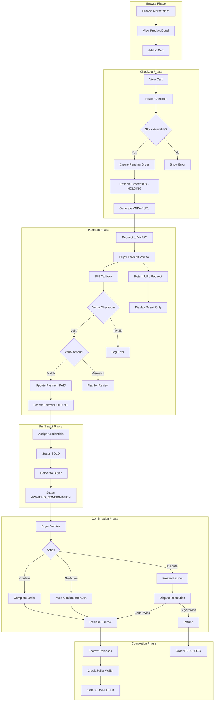
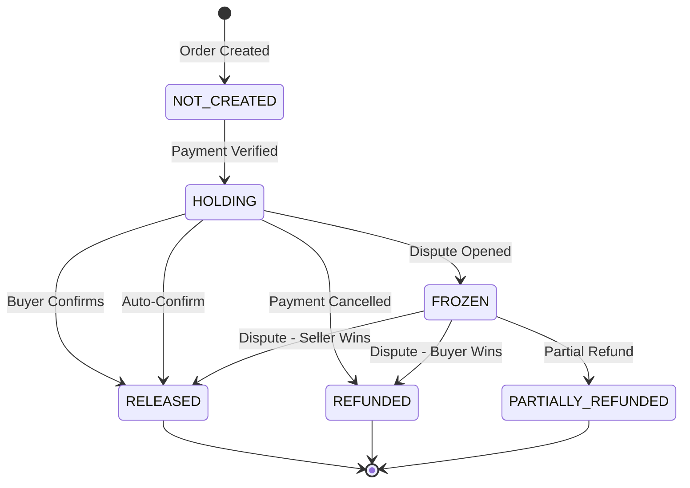

# AccountTrade Complete Transaction Workflow Design

## Executive Summary

This document provides a comprehensive design for the AccountTrade platform's end-to-end transaction workflow, covering the complete buyer journey from browsing to order completion, including payment processing via VNPAY, escrow management, credential delivery, dispute resolution, and admin oversight.

---

## Table of Contents

1. [End-to-End Transaction Workflow](#1-end-to-end-transaction-workflow)
2. [Explicit Role Definitions](#2-explicit-role-definitions)
3. [Escrow Design](#3-escrow-design)
4. [Security Verification Design](#4-security-verification-design)
5. [Dispute Resolution Workflow](#5-dispute-resolution-workflow)
6. [Manual Intervention Points](#6-manual-intervention-points)
7. [Status Definitions](#7-status-definitions)
8. [Database/Backend Design](#8-database-backend-design)
9. [VNPAY Sandbox + ngrok Integration](#9-vnpay-sandbox--ngrok-integration)

---

## 1. End-to-End Transaction Workflow

### 1.1 Step-by-Step Narrative

#### Phase 1: Browse and Cart

**Step 1.1 - Browse Products**

- Buyer visits marketplace page
- System displays posts with `stock_status = IN_STOCK`
- Each post shows available credential count derived from `Post_Credentials` where `credential_status = AVAILABLE`
- Buyer can filter by category, price range, search by title

**Step 1.2 - View Product Detail**

- Buyer clicks on a post to view details
- System shows: title, description, price, seller info, available stock count
- System verifies real-time stock availability

**Step 1.3 - Add to Cart**

- Buyer clicks "Add to Cart" button
- System validates:
  - User is logged in as Buyer role
  - Post is not owned by the buyer
  - Post has `stock_status = IN_STOCK`
  - At least one `AVAILABLE` credential exists
  - Post is not already in cart
- If valid, creates `Cart` record linking user to post
- System shows success notification with cart count update

#### Phase 2: Checkout

**Step 2.1 - View Cart**

- Buyer navigates to cart page
- System displays all cart items with:
  - Post thumbnail, title, price
  - Seller name
  - Stock availability indicator
- System calculates subtotal
- Buyer can remove items or proceed to checkout

**Step 2.2 - Initiate Checkout**

- Buyer clicks "Proceed to Checkout"
- System performs pre-checkout validation:
  - Re-validates stock for all cart items
  - Verifies credentials are still available
  - Calculates total amount
- System creates a `PendingOrder` record with status `AWAITING_PAYMENT`
- System reserves credentials by changing status from `AVAILABLE` to `HOLDING`
- System sets order expiration timer - default 5 minutes

**Step 2.3 - Payment Method Selection**

- Buyer selects VNPAY as payment method
- System generates VNPAY payment URL with:
  - Order ID - unique transaction reference
  - Amount - in VND
  - Return URL - ngrok endpoint for frontend redirect
  - IPN URL - ngrok endpoint for server callback
  - Secure hash - checksum for validation

#### Phase 3: Payment Processing

**Step 3.1 - Redirect to VNPAY**

- Buyer is redirected to VNPAY payment page
- `PendingOrder` status remains `AWAITING_PAYMENT`
- Credentials remain in `HOLDING` status
- Timer countdown continues

**Step 3.2 - Buyer Completes Payment on VNPAY**

- Buyer enters payment details on VNPAY
- VNPAY processes payment
- Two parallel notifications occur:
  1. **Return URL**: Browser redirect - DO NOT TRUST for order completion
  2. **IPN Callback**: Server-to-server call - TRUST for order completion

**Step 3.3 - IPN Callback Processing - CRITICAL**

```
IPN Handler Steps:
1. Receive callback from VNPAY
2. Verify checksum using VNPAY secret key
3. Validate amount matches pending order
4. Check for duplicate callback using order ID
5. If valid and not duplicate:
   - Update Payment record to PAID
   - Update Order status to PAID
   - Create Escrow record in HOLDING status
   - DO NOT release credentials yet
6. Return success response to VNPAY
```

**Step 3.4 - Return URL Processing - DISPLAY ONLY**

```
Return URL Handler Steps:
1. Receive redirect from VNPAY
2. Verify checksum for display purposes
3. Show payment result to buyer
4. Redirect to order confirmation page
5. DO NOT update order status based on this alone
6. If IPN not received yet, poll for status or show pending state
```

#### Phase 4: Order Creation and Credential Assignment

**Step 4.1 - Order Confirmation**

- After successful IPN processing:
  - `Order` status changes to `PAID`
  - `Escrow` record created with status `HOLDING`
  - Payment record marked as `PAID`

**Step 4.2 - Credential Assignment**

- System assigns reserved credentials to order:
  - Change credential status from `HOLDING` to `SOLD`
  - Link credential to order via `sold_to_order_id`
- Order status changes to `CREDENTIAL_ASSIGNED`

**Step 4.3 - Credential Delivery**

- Buyer can view credentials on order detail page:
  - Username displayed
  - Password displayed with reveal toggle
  - Security notes if any
- System logs credential access in `Credential_Access_Logs`
- Order status changes to `AWAITING_BUYER_CONFIRMATION`
- Confirmation timer starts - default 24 hours

#### Phase 5: Buyer Confirmation Period

**Step 5.1 - Buyer Verifies Account**

- Buyer uses credentials to log into purchased account
- Buyer has confirmation window to verify:
  - Credentials work correctly
  - Account matches description
  - No issues with the purchased product

**Step 5.2a - Buyer Confirms Success**

- Buyer clicks "Confirm Receipt" button
- System triggers:
  - Order status → `COMPLETED`
  - Escrow status → `RELEASED`
  - Seller wallet balance increased
  - Notification sent to seller
- Transaction is complete

**Step 5.2b - Buyer Opens Dispute**

- Buyer clicks "Report Issue" button
- System creates `Dispute` record
- Order status → `DISPUTED`
- Escrow status → `FROZEN`
- Both parties notified
- Dispute resolution process begins

**Step 5.2c - Auto-Confirmation - No Buyer Action**

- If buyer does not respond within confirmation window:
  - System auto-confirms at end of window
  - Order status → `COMPLETED`
  - Escrow status → `RELEASED`
  - Seller wallet balance increased
  - Notification sent to both parties

#### Phase 6: Escrow Release

**Step 6.1 - Normal Release**

- Triggered by:
  - Buyer confirmation
  - Auto-confirmation after timeout
- Actions:
  - Escrow status → `RELEASED`
  - Calculate platform fee
  - Credit seller wallet with amount minus fee
  - Create wallet transaction record
  - Update seller dashboard stats

**Step 6.2 - Release After Dispute Resolution**

- Admin resolves dispute in seller's favor
- Actions same as normal release
- Additional audit log entry for dispute resolution

#### Phase 7: Refund Flow

**Step 7.1 - Refund Triggers**

- Buyer wins dispute
- Admin determines refund is warranted
- Seller fails to provide valid replacement

**Step 7.2 - Refund Processing**

- Order status → `REFUNDED`
- Escrow status → `REFUNDED`
- Credential status → `INVALID` or `REPLACED`
- VNPAY refund API called if within refund window
- Otherwise manual refund processing
- Buyer wallet credited or bank transfer
- Notification sent to both parties

---

### 1.2 System Workflow Diagram



---

### 1.3 Status Transition Tables

#### Order Status Transitions

| Current State               | Event                        | Next State                  | Actor          |
| --------------------------- | ---------------------------- | --------------------------- | -------------- |
| -                           | Create pending order         | PENDING                     | System         |
| PENDING                     | Payment initiated            | AWAITING_PAYMENT            | System         |
| AWAITING_PAYMENT            | Payment confirmed            | PAID                        | System via IPN |
| AWAITING_PAYMENT            | Payment failed               | PAYMENT_FAILED              | System via IPN |
| AWAITING_PAYMENT            | Timeout expired              | PAYMENT_EXPIRED             | System timer   |
| PAID                        | Credentials assigned         | PROCESSING                  | System         |
| PROCESSING                  | Credentials delivered        | AWAITING_BUYER_CONFIRMATION | System         |
| AWAITING_BUYER_CONFIRMATION | Buyer confirms               | COMPLETED                   | Buyer          |
| AWAITING_BUYER_CONFIRMATION | Auto-confirm timeout         | COMPLETED                   | System timer   |
| AWAITING_BUYER_CONFIRMATION | Buyer disputes               | DISPUTED                    | Buyer          |
| DISPUTED                    | Admin resolves - seller wins | COMPLETED                   | Admin          |
| DISPUTED                    | Admin resolves - buyer wins  | REFUNDED                    | Admin          |
| DISPUTED                    | Replacement provided         | AWAITING_BUYER_CONFIRMATION | System         |
| Any                         | Admin cancels                | CANCELLED                   | Admin          |

#### Credential Status Transitions

| Current State | Event                    | Next State | Actor  |
| ------------- | ------------------------ | ---------- | ------ |
| AVAILABLE     | Reserved for checkout    | HOLDING    | System |
| HOLDING       | Payment confirmed        | SOLD       | System |
| HOLDING       | Payment failed/expired   | AVAILABLE  | System |
| HOLDING       | Marked invalid           | INVALID    | Admin  |
| SOLD          | Dispute - invalid        | DISPUTED   | System |
| DISPUTED      | Dispute resolved - valid | SOLD       | Admin  |
| DISPUTED      | Replacement provided     | REPLACED   | System |
| DISPUTED      | Refund issued            | INVALID    | Admin  |

---

## 2. Explicit Role Definitions

### 2.1 Buyer Role

#### Capabilities by Stage

**Browsing Stage**

- View all available posts with IN_STOCK status
- Search and filter products
- View product details and seller information
- View available stock count

**Cart Stage**

- Add products to cart - max 1 quantity per post
- Remove items from cart
- View cart with pricing summary
- Clear entire cart

**Checkout Stage**

- Initiate checkout process
- Select payment method - VNPAY
- View order summary before payment
- Cancel checkout before payment - releases held credentials

**Payment Stage**

- Complete payment via VNPAY
- View payment status
- Receive payment confirmation

**Post-Payment Stage**

- View purchased credentials
- Download/save credential information
- Report issues with credentials

**Confirmation Stage**

- Confirm successful receipt
- Open dispute within confirmation window
- Request replacement for invalid credentials
- Communicate with seller via dispute messages

**Dispute Stage**

- Provide evidence for claims
- Respond to seller counter-arguments
- Accept replacement credentials
- Accept or reject resolution proposals

#### Restrictions

- Cannot purchase own posts
- Cannot modify order after payment
- Cannot reopen closed disputes
- Limited to one active dispute per order

---

### 2.2 Seller Role

#### Responsibilities

**Post Creation**

- Create accurate product descriptions
- Set competitive pricing
- Upload quality thumbnails
- Select appropriate categories

**Credential Management**

- Upload valid credentials before listing
- Ensure credentials are accurate and working
- Maintain sufficient stock levels
- Remove invalid or expired credentials promptly
- Never reuse sold credentials

**Order Fulfillment**

- No action required - system auto-assigns credentials
- Monitor for disputes and respond promptly
- Provide replacement credentials when required

**Dispute Response**

- Respond to buyer complaints within SLA - 24 hours
- Provide evidence of credential validity
- Offer replacement if original is invalid
- Accept or contest dispute resolution

**Financial Management**

- Receive payouts only after escrow release
- Maintain accurate wallet information
- Understand platform fee structure

#### Restrictions

- Cannot purchase own posts
- Cannot modify posts with active orders
- Cannot delete posts with sold credentials
- Must maintain minimum credibility score
- Subject to sanctions for fraudulent behavior

#### Seller Sanctions

- Warning for first offense
- Temporary suspension for repeated issues
- Permanent ban for fraud
- Credential quality score affects visibility
- Excessive disputes trigger manual review

---

### 2.3 Admin Role

#### Core Responsibilities

**Escrow Management**

- Monitor all escrow transactions
- Manually release escrow when warranted
- Process refunds through admin panel
- Freeze escrow during investigations
- Review escrow before release for flagged sellers

**Payment Oversight**

- Review callback mismatch cases
- Manually verify payments when IPN fails
- Approve large transactions
- Investigate suspicious payment patterns
- Process manual refunds

**Credential Verification**

- Verify credential validity on buyer complaints
- Check for duplicate credentials across posts
- Audit seller credential quality
- Mark credentials as invalid/replaced
- Investigate repeated login failure reports

**Dispute Resolution**

- Review evidence from both parties
- Request additional information
- Mediate between buyer and seller
- Make binding resolution decisions
- Issue partial refunds when appropriate
- Sanction fraudulent parties

**Security Monitoring**

- Monitor for suspicious transaction patterns
- Detect potential money laundering
- Identify duplicate/fake accounts
- Review high-risk transactions
- Audit access logs

**User Management**

- Activate/deactivate user accounts
- Change user roles
- Reset passwords
- Review user credibility scores
- Apply sanctions

#### Manual Intervention Points

| Trigger                       | Admin Action                  | System Update                  |
| ----------------------------- | ----------------------------- | ------------------------------ |
| Payment callback mismatch     | Verify payment manually       | Update payment status          |
| No available credential       | Assign from reserve or refund | Update order status            |
| Duplicate credential detected | Investigate and resolve       | Mark credentials appropriately |
| Buyer reports invalid account | Verify and decide             | Update statuses                |
| Seller unresponsive           | Auto-resolve or extend        | Update dispute                 |
| Suspicious activity           | Freeze and investigate        | Flag for review                |
| Refund request                | Approve or deny               | Process refund                 |
| Forced escrow release         | Manual release                | Credit seller wallet           |
| Account replacement           | Verify and assign             | Update credential              |

---

## 3. Escrow Design

### 3.1 Business Rules

#### Money Capture Rules

1. Money is considered captured when VNPAY IPN confirms successful payment
2. Capture must be verified via checksum validation
3. Amount must match pending order total exactly
4. Capture triggers immediate escrow creation

#### Escrow Creation Rules

1. Escrow created immediately after verified payment
2. Initial status: HOLDING
3. Escrow amount = Order total - Platform fee
4. Platform fee calculated at time of escrow creation
5. Escrow linked to order and seller

#### Escrow Release Rules

1. **Normal Release**: After buyer confirmation or auto-confirmation timeout
2. **Dispute Release**: After admin resolution in seller favor
3. **Partial Release**: Admin-determined percentage for partial issues
4. Release credits seller wallet, not direct payment

#### Escrow Freeze Rules

1. Automatically frozen when dispute opened
2. Frozen during admin investigation
3. Frozen for flagged sellers pending review
4. Frozen for suspicious transaction patterns
5. No release while frozen

#### Escrow Refund Rules

1. Full refund when buyer wins dispute
2. Partial refund for partial delivery issues
3. Refund credits buyer wallet or processes via VNPAY refund API
4. Refund closes order with REFUNDED status

### 3.2 Timeout Windows

| Window                 | Duration   | Purpose                               |
| ---------------------- | ---------- | ------------------------------------- |
| Payment Window         | 15 minutes | Time to complete VNPAY payment        |
| Credential Reservation | 15 minutes | Hold credentials during checkout      |
| Buyer Confirmation     | 24 hours   | Time for buyer to verify credentials  |
| Dispute Response       | 24 hours   | Time for seller to respond to dispute |
| Dispute Resolution     | 72 hours   | Time for admin to resolve             |
| Auto-Complete          | 24 hours   | Auto-confirm after no buyer action    |

### 3.3 Non-Response Scenarios

**Buyer Does Not Respond**

- After 24 hours without confirmation or dispute
- System auto-confirms order
- Escrow released to seller
- Order marked COMPLETED
- Notification sent to both parties

**Seller Does Not Respond to Dispute**

- After 24 hours without seller response
- Dispute auto-resolved in buyer favor
- Escrow refunded to buyer
- Seller credibility score reduced
- Order marked REFUNDED

### 3.4 Evidence Storage for Disputes

| Evidence Type          | Storage             | Retention                   |
| ---------------------- | ------------------- | --------------------------- |
| Credential screenshots | Secure file storage | 90 days post-resolution     |
| Communication logs     | Database            | 1 year                      |
| Access logs            | Database            | 90 days                     |
| Payment records        | Database            | 7 years - legal requirement |
| Admin notes            | Database            | 1 year                      |
| Resolution decisions   | Database            | 1 year                      |

### 3.5 Escrow State Machine



---

## 4. Security Verification Design

### 4.1 Payment Authenticity Verification

#### VNPAY Checksum Validation

```
Process:
1. Receive callback parameters from VNPAY
2. Sort all parameters alphabetically
3. Concatenate parameter values
4. Generate HMAC-SHA512 hash using secret key
5. Compare with vnp_SecureHash from callback
6. If match: Valid callback
7. If mismatch: Reject and log security alert
```

#### IPN vs Return URL Security

| Aspect            | IPN Callback     | Return URL    |
| ----------------- | ---------------- | ------------- |
| Source            | VNPAY server     | Buyer browser |
| Trust Level       | HIGH             | LOW           |
| Use Case          | Order completion | Display only  |
| Checksum Required | Yes              | Yes           |
| Idempotent        | Must be          | N/A           |

### 4.2 Preventing Fake Payment Success

**Never Trust Frontend Redirect**

1. Return URL is for display purposes only
2. Never update order status based on return URL alone
3. Always wait for IPN callback or poll payment status
4. If IPN delayed, show pending state to user

**IPN Processing Rules**

1. Always verify checksum
2. Validate amount matches order
3. Check for duplicate callbacks
4. Use database transaction for updates
5. Return proper response to VNPAY

### 4.3 Credential Security

#### Storage Security

1. Passwords stored encrypted at rest - AES-256
2. Encryption key managed via environment variables
3. Never log credentials in plain text
4. Decrypt only when displaying to authorized buyer

#### Access Control

1. Credentials visible only to:
   - Buyer who purchased
   - Seller who created - before sale only
   - Admin for dispute resolution
2. Access logged in Credential_Access_Logs
3. Rate limit credential views
4. Notify on multiple access attempts

### 4.4 Duplicate Credential Prevention

**Detection Mechanisms**

1. Hash username+password combination
2. Check for existing hash before accepting new credential
3. Flag duplicates for admin review
4. Prevent sale of duplicate credentials

**Status Management**
| Status | Meaning | Can Be Sold |
|--------|---------|-------------|
| AVAILABLE | Ready for sale | Yes |
| HOLDING | Reserved during checkout | No |
| SOLD | Sold to buyer | No |
| DISPUTED | Under dispute | No |
| REPLACED | Replaced by another | No |
| INVALID | Not usable | No |

### 4.5 Credential Assignment Audit Trail

**Logged Information**

- Credential ID
- Order ID
- Assignment timestamp
- Previous status
- New status
- System user or process that triggered change

**Audit Queries**

- View assignment history per credential
- View all assignments per order
- View seller credential statistics
- Detect suspicious patterns

### 4.6 Seller Behavior Auditing

**Monitored Behaviors**

1. Credential validity rate
2. Dispute frequency
3. Response time to disputes
4. Duplicate credential attempts
5. Stock manipulation patterns
6. Price manipulation

**Alert Triggers**

- More than 10% invalid credential rate
- More than 5% dispute rate
- No response to 3 consecutive disputes
- Attempt to upload duplicate credentials
- Sudden price changes on high-volume items

### 4.7 Login Failure Detection

**Tracking**

- Buyer reports of invalid credentials
- Multiple access attempts from different IPs
- Time between credential delivery and complaint

**Analysis**

- Pattern detection for repeated failures
- Cross-reference with seller history
- Flag for admin review if pattern detected

### 4.8 Admin Verification Process

**For Buyer Claims**

1. Request screenshot of login failure
2. Verify credential was delivered
3. Test credential if necessary - with buyer permission
4. Check seller history for similar complaints
5. Decide: refund, replacement, or reject

**For Seller Defense**

1. Request proof of credential validity
2. Verify credential was working at time of sale
3. Check for buyer manipulation evidence
4. Consider replacement offer
5. Decide: release escrow or refund

---

## 5. Dispute Resolution Workflow

### 5.1 Dispute Scenarios

#### Scenario 1: Credentials Not Received

**Situation**: Buyer paid but cannot access credentials

**Flow**:

1. Buyer opens dispute - reason: credentials not received
2. System checks credential assignment
3. If assignment exists: Show to buyer
4. If no assignment: Auto-assign or flag for admin
5. Admin reviews if auto-assign fails
6. Resolution: Provide credentials or refund

**Evidence Reviewed**:

- Order status and timeline
- Credential assignment records
- Access logs

#### Scenario 2: Invalid Credentials

**Situation**: Buyer received credentials but cannot login

**Flow**:

1. Buyer opens dispute - reason: invalid credentials
2. Seller notified - 24 hour response window
3. Seller can: provide replacement, contest, or accept refund
4. If seller provides replacement: Buyer tests
5. If seller contests: Admin verifies
6. Admin decision: refund or release

**Evidence Reviewed**:

- Screenshots of login failure
- Credential access logs
- Seller credential history
- Admin credential test results

#### Scenario 3: Credentials Already Used/Changed/Expired

**Situation**: Credentials work but account is compromised

**Flow**:

1. Buyer opens dispute - reason: account compromised
2. Seller responds with account creation/verification info
3. Admin reviews both claims
4. Check if seller has history of similar issues
5. Decision based on preponderance of evidence

**Evidence Reviewed**:

- Account creation screenshots from seller
- Account status screenshots from buyer
- Seller history
- Time between delivery and complaint

#### Scenario 4: Product Description Mismatch

**Situation**: Account features don't match listing

**Flow**:

1. Buyer opens dispute - reason: not as described
2. Buyer provides specific mismatches
3. Seller responds to each point
4. Admin compares listing vs actual
5. Decision: partial refund, full refund, or reject

**Evidence Reviewed**:

- Original listing - cached
- Screenshots of actual account
- Communication between parties

#### Scenario 5: Seller Claims Valid Delivery

**Situation**: Seller disputes buyer complaint

**Flow**:

1. Admin requests evidence from both
2. Seller provides: credential creation proof, validity proof
3. Buyer provides: failure screenshots
4. Admin may test credential directly
5. Decision based on evidence

**Evidence Reviewed**:

- All above evidence types
- Admin test results
- Party credibility scores

#### Scenario 6: Potential Buyer Fraud

**Situation**: Buyer may be falsely claiming issues

**Red Flags**:

- Multiple disputes from same buyer
- Disputes immediately after confirmation window
- Inconsistent evidence
- Pattern of similar complaints

**Flow**:

1. Flag for enhanced review
2. Request additional evidence
3. Check buyer dispute history
4. If fraud suspected: reject dispute, flag account
5. Repeated fraud: suspend account

#### Scenario 7: VNPAY Success but Local Update Failed

**Situation**: Payment confirmed by VNPAY but order not updated

**Flow**:

1. System detects via reconciliation job
2. Or buyer reports paid but order pending
3. Admin verifies payment in VNPAY dashboard
4. Manual order update if verified
5. Resume normal flow

**Evidence Reviewed**:

- VNPAY transaction records
- Payment callback logs
- Order status history

#### Scenario 8: IPN Delayed or Duplicated

**Situation**: IPN arrives late or multiple times

**For Delayed IPN**:

1. Process normally if order still pending
2. If order already cancelled: Create new order or refund
3. Notify affected parties

**For Duplicate IPN**:

1. Check if order already processed
2. If processed: Acknowledge but don't reprocess
3. Log for audit purposes

### 5.2 Dispute Resolution Decision Matrix

| Scenario      | Buyer Evidence | Seller Evidence   | Likely Outcome    |
| ------------- | -------------- | ----------------- | ----------------- |
| Invalid creds | Strong         | Weak              | Refund            |
| Invalid creds | Weak           | Strong            | Release to seller |
| Invalid creds | Strong         | Strong            | Replacement       |
| Not received  | N/A            | No assignment     | Refund            |
| Not received  | N/A            | Assignment exists | Show to buyer     |
| Mismatch      | Documented     | Admitted          | Partial refund    |
| Mismatch      | Vague          | Strong            | Release to seller |
| Buyer fraud   | Inconsistent   | Strong            | Reject dispute    |

---

## 6. Manual Intervention Points

### 6.1 Complete Intervention Catalog

#### INT-001: Payment Callback Mismatch

**Trigger**: IPN amount differs from order amount
**Admin Action**:

1. Verify actual payment in VNPAY dashboard
2. If overpayment: Issue partial refund
3. If underpayment: Request additional payment or refund
4. Update order status manually
   **System Update**: Payment status → VERIFIED_MANUAL or REFUNDED
   **Notifications**: Email to buyer explaining situation

#### INT-002: No Available Credential After Payment

**Trigger**: Payment successful but no AVAILABLE credentials found
**Admin Action**:

1. Check if credentials in HOLDING status
2. If found: Manually assign
3. If not found: Contact seller or issue refund
   **System Update**: Order status → PROCESSING or REFUNDED
   **Notifications**: Email to buyer, alert to seller

#### INT-003: Duplicate Credential Assignment Detected

**Trigger**: Same credential assigned to multiple orders
**Admin Action**:

1. Identify all affected orders
2. Assign unique credentials to each
3. If insufficient credentials: Issue refunds
4. Sanction seller if intentional
   **System Update**: Credentials reassigned, seller flagged
   **Notifications**: All affected buyers notified

#### INT-004: Buyer Reports Invalid Account

**Trigger**: Dispute opened for invalid credentials
**Admin Action**:

1. Review evidence from both parties
2. Test credential if necessary
3. Decide: refund, replacement, or reject
   **System Update**: Dispute status → RESOLVED
   **Notifications**: Both parties notified of decision

#### INT-005: Seller Unresponsive

**Trigger**: Seller doesn't respond to dispute within SLA
**Admin Action**:

1. Review available evidence
2. Make decision without seller input
3. Typically favor buyer if no seller defense
   **System Update**: Dispute auto-resolved
   **Notifications**: Seller notified of outcome

#### INT-006: Suspicious Transaction

**Trigger**: Fraud detection rules triggered
**Admin Action**:

1. Freeze escrow
2. Review transaction details
3. Verify buyer and seller identity
4. Release or refund based on findings
   **System Update**: Transaction flagged, escrow frozen/released
   **Notifications**: Parties notified of review

#### INT-007: Refund Approval

**Trigger**: Dispute resolved in buyer favor
**Admin Action**:

1. Verify refund amount
2. Approve refund processing
3. Update order and escrow status
   **System Update**: Order → REFUNDED, Escrow → REFUNDED
   **Notifications**: Both parties notified

#### INT-008: Forced Escrow Release

**Trigger**: Admin determines seller should receive funds
**Admin Action**:

1. Review case details
2. Override any holds
3. Process release
   **System Update**: Escrow → RELEASED
   **Notifications**: Seller notified of payout

#### INT-009: Account Replacement Approval

**Trigger**: Seller provides replacement credential
**Admin Action**:

1. Verify replacement is valid
2. Approve assignment to buyer
3. Update original credential status
   **System Update**: Old credential → REPLACED, new assigned
   **Notifications**: Buyer notified of replacement

#### INT-010: Seller Sanction

**Trigger**: Pattern of fraudulent behavior detected
**Admin Action**:

1. Review seller history
2. Determine appropriate sanction
3. Apply warning, suspension, or ban
   **System Update**: Seller account flagged/suspended
   **Notifications**: Seller notified of sanction

---

## 7. Status Definitions

### 7.1 Order Statuses

| Status                      | Meaning                         | Next States                                      | Triggered By |
| --------------------------- | ------------------------------- | ------------------------------------------------ | ------------ |
| PENDING                     | Order created, awaiting payment | AWAITING_PAYMENT, CANCELLED                      | System       |
| AWAITING_PAYMENT            | Redirected to payment gateway   | PAID, PAYMENT_FAILED, PAYMENT_EXPIRED            | System/IPN   |
| PAYMENT_FAILED              | Payment was unsuccessful        | AWAITING_PAYMENT, CANCELLED                      | IPN          |
| PAYMENT_EXPIRED             | Payment window exceeded         | CANCELLED                                        | Timer        |
| PAID                        | Payment confirmed               | PROCESSING                                       | IPN          |
| PROCESSING                  | Assigning credentials           | CREDENTIAL_ASSIGNED                              | System       |
| CREDENTIAL_ASSIGNED         | Credentials linked to order     | AWAITING_BUYER_CONFIRMATION                      | System       |
| AWAITING_BUYER_CONFIRMATION | Waiting for buyer action        | COMPLETED, DISPUTED                              | Buyer/Timer  |
| DISPUTED                    | Active dispute exists           | COMPLETED, REFUNDED, AWAITING_BUYER_CONFIRMATION | Admin        |
| COMPLETED                   | Successfully finished           | -                                                | System/Admin |
| CANCELLED                   | Cancelled before completion     | -                                                | System/Admin |
| REFUNDED                    | Money returned to buyer         | -                                                | Admin        |

### 7.2 Payment Statuses

| Status            | Meaning                   | Next States                     | Triggered By |
| ----------------- | ------------------------- | ------------------------------- | ------------ |
| INITIATED         | Payment URL generated     | PENDING, FAILED                 | System       |
| PENDING           | Awaiting gateway response | PAID, FAILED, CALLBACK_MISMATCH | IPN          |
| PAID              | Payment confirmed         | REFUNDED                        | IPN/Admin    |
| FAILED            | Payment unsuccessful      | PENDING                         | IPN          |
| CALLBACK_MISMATCH | Amount/status mismatch    | PAID, FAILED, REFUNDED          | Admin        |
| REFUNDED          | Money returned            | -                               | Admin        |

### 7.3 Credential Statuses

| Status    | Meaning                  | Can Be Sold | Triggered By       |
| --------- | ------------------------ | ----------- | ------------------ |
| AVAILABLE | Ready for sale           | Yes         | Seller upload      |
| HOLDING   | Reserved during checkout | No          | Checkout start     |
| SOLD      | Sold to buyer            | No          | Payment confirm    |
| DISPUTED  | Under dispute            | No          | Buyer complaint    |
| REPLACED  | Replaced by another      | No          | Dispute resolution |
| INVALID   | Not usable               | No          | Admin marking      |
| HIDDEN    | Hidden from inventory    | No          | Seller/Admin       |

### 7.4 Escrow Statuses

| Status             | Meaning               | Next States                            | Triggered By    |
| ------------------ | --------------------- | -------------------------------------- | --------------- |
| NOT_CREATED        | No escrow yet         | HOLDING                                | Payment confirm |
| HOLDING            | Funds held            | RELEASED, FROZEN, REFUNDED             | System          |
| FROZEN             | Locked during dispute | RELEASED, REFUNDED, PARTIALLY_REFUNDED | Admin           |
| RELEASED           | Paid to seller        | -                                      | System/Admin    |
| REFUNDED           | Returned to buyer     | -                                      | Admin           |
| PARTIALLY_REFUNDED | Split refund/release  | -                                      | Admin           |

### 7.5 Dispute Statuses

| Status       | Meaning             | Next States            | Triggered By |
| ------------ | ------------------- | ---------------------- | ------------ |
| OPENED       | Newly created       | UNDER_REVIEW, RESOLVED | Buyer        |
| UNDER_REVIEW | Admin investigating | RESOLVED               | Admin        |
| RESOLVED     | Decision made       | -                      | Admin        |
| CANCELLED    | Withdrawn           | -                      | Buyer        |

---

## 8. Database/Backend Design

### 8.1 Entity Relationship Diagram

```mermaid
erDiagram
    Users ||--o{ Posts : creates
    Users ||--o{ Orders : places
    Users ||--o{ Carts : has
    Users ||--o{ Wallets : owns
    Users ||--o{ Disputes : opens
    Users ||--o{ Credential_Access_Logs : views

    Posts ||--o{ Post_Credentials : contains
    Posts ||--o{ Order_Items : included_in
    Posts }o--|| Categories : belongs_to

    Orders ||--|| Payments : has
    Orders ||--|| Escrows : has
    Orders ||--o{ Order_Items : contains
    Orders ||--o{ Disputes : has
    Orders ||--o{ Credential_Assignments : links

    Post_Credentials ||--o{ Credential_Assignments : assigned_via
    Post_Credentials ||--o{ Credential_Access_Logs : viewed_in

    Payments ||--o{ Payment_Callbacks : receives
    Payments ||--o{ Refund_Requests : has

    Disputes ||--o{ Dispute_Messages : contains
    Disputes ||--o{ Admin_Reviews : reviewed_in

    Escrows ||--o{ Escrow_Transactions : logs

    USERS {
        int user_id PK
        string username
        string email
        string password_hash
        int role_id FK
        boolean is_active
        datetime created_at
    }

    POSTS {
        int post_id PK
        int seller_id FK
        string title
        decimal price
        text description
        string thumbnail_url
        int category_id FK
        enum stock_status
        datetime created_at
    }

    POST_CREDENTIALS {
        int credential_id PK
        int post_id FK
        int credential_status_id FK
        int sold_to_order_id FK
        string account_username
        string account_password
        text security_notes
        datetime created_at
    }

    ORDERS {
        int order_id PK
        string order_code
        int buyer_id FK
        decimal total_amount
        decimal platform_fee
        int order_status_id FK
        int payment_status_id FK
        int escrow_status_id FK
        datetime payment_expires_at
        datetime confirmation_expires_at
        datetime created_at
        datetime completed_at
    }

    ORDER_ITEMS {
        int item_id PK
        int order_id FK
        int post_id FK
        int credential_id FK
        decimal price_at_order
    }

    PAYMENTS {
        int payment_id PK
        int order_id FK
        string vnpay_txn_ref
        decimal amount
        string currency
        int payment_status_id FK
        string vnpay_response_code
        datetime paid_at
        datetime created_at
    }

    PAYMENT_CALLBACKS {
        int callback_id PK
        int payment_id FK
        string callback_type
        text raw_payload
        string verified_checksum
        boolean is_valid
        boolean is_processed
        datetime received_at
    }

    ESCROWS {
        int escrow_id PK
        int order_id FK
        int seller_id FK
        decimal amount
        decimal platform_fee
        int escrow_status_id FK
        datetime created_at
        datetime released_at
    }

    ESCROW_TRANSACTIONS {
        int transaction_id PK
        int escrow_id FK
        string transaction_type
        decimal amount
        int wallet_id FK
        string reference
        datetime created_at
    }

    DISPUTES {
        int dispute_id PK
        int order_id FK
        int buyer_id FK
        int seller_id FK
        int credential_id FK
        string reason
        text buyer_evidence
        text seller_evidence
        int dispute_status_id FK
        int resolved_by FK
        string resolution
        datetime created_at
        datetime resolved_at
    }

    DISPUTE_MESSAGES {
        int message_id PK
        int dispute_id FK
        int sender_id FK
        text message
        string attachment_url
        datetime created_at
    }

    CREDENTIAL_ASSIGNMENTS {
        int assignment_id PK
        int order_id FK
        int credential_id FK
        int assigned_by
        datetime assigned_at
    }

    CREDENTIAL_ACCESS_LOGS {
        int log_id PK
        int credential_id FK
        int user_id FK
        string ip_address
        string user_agent
        datetime viewed_at
    }

    ADMIN_REVIEWS {
        int review_id PK
        int order_id FK
        int admin_id FK
        string review_type
        text notes
        string decision
        datetime created_at
    }

    REFUND_REQUESTS {
        int request_id PK
        int payment_id FK
        int order_id FK
        decimal amount
        string reason
        int requested_by FK
        int approved_by FK
        string status
        datetime created_at
        datetime processed_at
    }

    AUDIT_LOGS {
        int log_id PK
        string entity_type
        int entity_id
        string action
        text old_value
        text new_value
        int performed_by FK
        string ip_address
        datetime created_at
    }

    NOTIFICATIONS {
        int notification_id PK
        int user_id FK
        string type
        string title
        text content
        boolean is_read
        datetime created_at
    }
```



### 8.2 New Entity Definitions

#### Order Entity

```java
@Entity
@Table(name = "Orders")
public class Order {
    @Id
    @GeneratedValue(strategy = GenerationType.IDENTITY)
    private Integer orderId;

    @Column(name = "order_code", unique = true, nullable = false)
    private String orderCode; // Human-readable: ORD-20240315-ABC123

    @ManyToOne(fetch = FetchType.LAZY)
    @JoinColumn(name = "buyer_id", nullable = false)
    private User buyer;

    @Column(name = "total_amount", nullable = false, precision = 15, scale = 2)
    private BigDecimal totalAmount;

    @Column(name = "platform_fee", precision = 15, scale = 2)
    private BigDecimal platformFee;

    @ManyToOne(fetch = FetchType.LAZY)
    @JoinColumn(name = "order_status_id")
    private OrderStatus orderStatus;

    @ManyToOne(fetch = FetchType.LAZY)
    @JoinColumn(name = "payment_status_id")
    private PaymentStatus paymentStatus;

    @ManyToOne(fetch = FetchType.LAZY)
    @JoinColumn(name = "escrow_status_id")
    private EscrowStatus escrowStatus;

    @Column(name = "payment_expires_at")
    private LocalDateTime paymentExpiresAt;

    @Column(name = "confirmation_expires_at")
    private LocalDateTime confirmationExpiresAt;

    @Column(name = "completed_at")
    private LocalDateTime completedAt;

    @CreationTimestamp
    @Column(name = "created_at")
    private LocalDateTime createdAt;

    @OneToMany(mappedBy = "order", cascade = CascadeType.ALL)
    private List<OrderItem> orderItems;

    @OneToOne(mappedBy = "order", cascade = CascadeType.ALL)
    private Payment payment;

    @OneToOne(mappedBy = "order", cascade = CascadeType.ALL)
    private Escrow escrow;
}
```

#### Payment Entity

```java
@Entity
@Table(name = "Payments")
public class Payment {
    @Id
    @GeneratedValue(strategy = GenerationType.IDENTITY)
    private Integer paymentId;

    @OneToOne(fetch = FetchType.LAZY)
    @JoinColumn(name = "order_id", nullable = false)
    private Order order;

    @Column(name = "vnpay_txn_ref", unique = true)
    private String vnpayTxnRef;

    @Column(name = "amount", nullable = false, precision = 15, scale = 2)
    private BigDecimal amount;

    @Column(name = "currency", length = 3)
    private String currency = "VND";

    @ManyToOne(fetch = FetchType.LAZY)
    @JoinColumn(name = "payment_status_id")
    private PaymentStatus paymentStatus;

    @Column(name = "vnpay_response_code")
    private String vnpayResponseCode;

    @Column(name = "vnpay_transaction_no")
    private String vnpayTransactionNo;

    @Column(name = "vnpay_bank_code")
    private String vnpayBankCode;

    @Column(name = "vnpay_card_type")
    private String vnpayCardType;

    @Column(name = "paid_at")
    private LocalDateTime paidAt;

    @CreationTimestamp
    @Column(name = "created_at")
    private LocalDateTime createdAt;

    @OneToMany(mappedBy = "payment")
    private List<PaymentCallback> callbacks;
}
```

#### PaymentCallback Entity

```java
@Entity
@Table(name = "Payment_Callbacks")
public class PaymentCallback {
    @Id
    @GeneratedValue(strategy = GenerationType.IDENTITY)
    private Integer callbackId;

    @ManyToOne(fetch = FetchType.LAZY)
    @JoinColumn(name = "payment_id")
    private Payment payment;

    @Column(name = "callback_type", length = 20)
    private String callbackType; // IPN or RETURN

    @Column(name = "raw_payload", columnDefinition = "TEXT")
    private String rawPayload;

    @Column(name = "computed_checksum")
    private String computedChecksum;

    @Column(name = "received_checksum")
    private String receivedChecksum;

    @Column(name = "is_valid")
    private Boolean isValid;

    @Column(name = "is_processed")
    private Boolean isProcessed = false;

    @Column(name = "processing_result")
    private String processingResult;

    @Column(name = "received_at")
    private LocalDateTime receivedAt;
}
```

#### Escrow Entity

```java
@Entity
@Table(name = "Escrows")
public class Escrow {
    @Id
    @GeneratedValue(strategy = GenerationType.IDENTITY)
    private Integer escrowId;

    @OneToOne(fetch = FetchType.LAZY)
    @JoinColumn(name = "order_id", nullable = false)
    private Order order;

    @ManyToOne(fetch = FetchType.LAZY)
    @JoinColumn(name = "seller_id", nullable = false)
    private User seller;

    @Column(name = "amount", nullable = false, precision = 15, scale = 2)
    private BigDecimal amount;

    @Column(name = "platform_fee", precision = 15, scale = 2)
    private BigDecimal platformFee;

    @ManyToOne(fetch = FetchType.LAZY)
    @JoinColumn(name = "escrow_status_id")
    private EscrowStatus escrowStatus;

    @Column(name = "frozen_reason")
    private String frozenReason;

    @Column(name = "released_at")
    private LocalDateTime releasedAt;

    @CreationTimestamp
    @Column(name = "created_at")
    private LocalDateTime createdAt;

    @OneToMany(mappedBy = "escrow")
    private List<EscrowTransaction> transactions;
}
```

#### Dispute Entity - Enhanced

```java
@Entity
@Table(name = "Disputes")
public class Dispute {
    @Id
    @GeneratedValue(strategy = GenerationType.IDENTITY)
    private Integer disputeId;

    @ManyToOne(fetch = FetchType.LAZY)
    @JoinColumn(name = "order_id", nullable = false)
    private Order order;

    @ManyToOne(fetch = FetchType.LAZY)
    @JoinColumn(name = "buyer_id", nullable = false)
    private User buyer;

    @ManyToOne(fetch = FetchType.LAZY)
    @JoinColumn(name = "seller_id", nullable = false)
    private User seller;

    @ManyToOne(fetch = FetchType.LAZY)
    @JoinColumn(name = "credential_id")
    private PostCredential credential;

    @Column(name = "reason", nullable = false)
    private String reason;

    @Column(name = "buyer_evidence", columnDefinition = "TEXT")
    private String buyerEvidence;

    @Column(name = "seller_evidence", columnDefinition = "TEXT")
    private String sellerEvidence;

    @ManyToOne(fetch = FetchType.LAZY)
    @JoinColumn(name = "dispute_status_id")
    private DisputeStatus disputeStatus;

    @ManyToOne(fetch = FetchType.LAZY)
    @JoinColumn(name = "resolved_by")
    private User resolvedBy;

    @Column(name = "resolution", columnDefinition = "TEXT")
    private String resolution;

    @Column(name = "resolution_type")
    private String resolutionType; // REFUND, RELEASE, PARTIAL, REPLACEMENT

    @Column(name = "seller_response_deadline")
    private LocalDateTime sellerResponseDeadline;

    @Column(name = "seller_responded_at")
    private LocalDateTime sellerRespondedAt;

    @CreationTimestamp
    @Column(name = "created_at")
    private LocalDateTime createdAt;

    @Column(name = "resolved_at")
    private LocalDateTime resolvedAt;

    @OneToMany(mappedBy = "dispute")
    private List<DisputeMessage> messages;
}
```

#### AuditLog Entity

```java
@Entity
@Table(name = "Audit_Logs")
public class AuditLog {
    @Id
    @GeneratedValue(strategy = GenerationType.IDENTITY)
    private Integer logId;

    @Column(name = "entity_type", nullable = false)
    private String entityType;

    @Column(name = "entity_id", nullable = false)
    private Integer entityId;

    @Column(name = "action", nullable = false)
    private String action;

    @Column(name = "old_value", columnDefinition = "TEXT")
    private String oldValue;

    @Column(name = "new_value", columnDefinition = "TEXT")
    private String newValue;

    @ManyToOne(fetch = FetchType.LAZY)
    @JoinColumn(name = "performed_by")
    private User performedBy;

    @Column(name = "ip_address")
    private String ipAddress;

    @Column(name = "user_agent")
    private String userAgent;

    @CreationTimestamp
    @Column(name = "created_at")
    private LocalDateTime createdAt;
}
```

### 8.3 Status Reference Tables

#### Order_Statuses

| status_id | status_name                 | description                                |
| --------- | --------------------------- | ------------------------------------------ |
| 1         | PENDING                     | Order created, awaiting payment initiation |
| 2         | AWAITING_PAYMENT            | Redirected to payment gateway              |
| 3         | PAYMENT_FAILED              | Payment was unsuccessful                   |
| 4         | PAYMENT_EXPIRED             | Payment window exceeded                    |
| 5         | PAID                        | Payment confirmed                          |
| 6         | PROCESSING                  | Assigning credentials                      |
| 7         | CREDENTIAL_ASSIGNED         | Credentials linked to order                |
| 8         | AWAITING_BUYER_CONFIRMATION | Waiting for buyer action                   |
| 9         | DISPUTED                    | Active dispute exists                      |
| 10        | COMPLETED                   | Successfully finished                      |
| 11        | CANCELLED                   | Cancelled before completion                |
| 12        | REFUNDED                    | Money returned to buyer                    |

#### Payment_Statuses

| status_id | status_name       | description               |
| --------- | ----------------- | ------------------------- |
| 1         | INITIATED         | Payment URL generated     |
| 2         | PENDING           | Awaiting gateway response |
| 3         | PAID              | Payment confirmed         |
| 4         | FAILED            | Payment unsuccessful      |
| 5         | CALLBACK_MISMATCH | Amount/status mismatch    |
| 6         | REFUNDED          | Money returned            |

#### Escrow_Statuses

| status_id | status_name        | description           |
| --------- | ------------------ | --------------------- |
| 1         | NOT_CREATED        | No escrow yet         |
| 2         | HOLDING            | Funds held            |
| 3         | FROZEN             | Locked during dispute |
| 4         | RELEASED           | Paid to seller        |
| 5         | REFUNDED           | Returned to buyer     |
| 6         | PARTIALLY_REFUNDED | Split refund/release  |

#### Dispute_Statuses

| status_id | status_name  | description         |
| --------- | ------------ | ------------------- |
| 1         | OPENED       | Newly created       |
| 2         | UNDER_REVIEW | Admin investigating |
| 3         | RESOLVED     | Decision made       |
| 4         | CANCELLED    | Withdrawn           |

---

## 9. VNPAY Sandbox + ngrok Integration

### 9.1 Architecture Overview

```
┌─────────────────────────────────────────────────────────────────────┐
│                         Development Environment                      │
│                                                                      │
│  ┌─────────────┐      ┌─────────────┐      ┌─────────────────────┐ │
│  │   Browser   │─────▶│ Spring Boot │─────▶│     MySQL DB        │ │
│  │             │      │   :8080     │      │                     │ │
│  └─────────────┘      └──────┬──────┘      └─────────────────────┘ │
│                              │                                       │
│                              │                                       │
│                       ┌──────▼──────┐                               │
│                       │    ngrok    │                               │
│                       │  :4040      │                               │
│                       └──────┬──────┘                               │
└──────────────────────────────┼──────────────────────────────────────┘
                               │
                               │ Public URL: https://abc123.ngrok.io
                               │
┌──────────────────────────────┼──────────────────────────────────────┐
│                         Internet                                     │
│                              │                                       │
│                       ┌──────▼──────┐                               │
│                       │ VNPAY Sandbox│                              │
│                       │   Server     │                               │
│                       └─────────────┘                               │
└─────────────────────────────────────────────────────────────────────┘
```

### 9.2 URL Configuration

**application-dev.properties**

```properties
# VNPAY Configuration
vnpay.tmn_code=YOUR_TMN_CODE
vnpay.hash_secret=YOUR_HASH_SECRET
vnpay.payment_url=https://sandbox.vnpayment.vn/paymentv2/vpcpay.html
vnpay.return_url=https://abc123.ngrok.io/api/payment/vnpay/return
vnpay.ipn_url=https://abc123.ngrok.io/api/payment/vnpay/ipn

# ngrok URL for local development
app.base_url=https://abc123.ngrok.io
```

### 9.3 Return URL vs IPN URL

| Aspect           | Return URL                           | IPN URL                       |
| ---------------- | ------------------------------------ | ----------------------------- |
| **Purpose**      | Redirect buyer after payment         | Server-to-server notification |
| **Triggered By** | Buyer browser                        | VNPAY server                  |
| **Reliability**  | Unreliable - buyer may close browser | Reliable - always sent        |
| **Timing**       | Immediate after payment              | Immediate or slightly delayed |
| **Trust Level**  | LOW - can be manipulated             | HIGH - server authenticated   |
| **Use Case**     | Display result, redirect user        | Update order status           |
| **Duplicates**   | Single redirect                      | May receive multiple times    |
| **Response**     | HTML page redirect                   | JSON response                 |

### 9.4 Why Not Trust Return URL Alone

**Security Risks**:

1. Buyer can modify URL parameters
2. Buyer can bypass redirect entirely
3. Browser extensions can intercept
4. Network issues may prevent redirect

**Correct Approach**:

1. Return URL: Show pending/success page, poll for status
2. IPN URL: Process payment, update order
3. Reconciliation job: Check pending orders against VNPAY

### 9.5 IPN Processing Implementation

```java
@PostMapping("/api/payment/vnpay/ipn")
public ResponseEntity<Map<String, String>> handleVnpayIpn(
        @RequestParam Map<String, String> params) {

    String orderId = params.get("vnp_TxnRef");
    String responseCode = params.get("vnp_ResponseCode");

    // 1. Verify checksum
    if (!vnpayService.verifyChecksum(params)) {
        log.warn("Invalid checksum for IPN: {}", orderId);
        return ResponseEntity.ok(Map.of("RspCode", "97", "Message", "Invalid checksum"));
    }

    // 2. Check for duplicate processing
    PaymentCallback existing = paymentCallbackRepository
        .findByVnpayTxnRefAndProcessed(orderId, true);
    if (existing != null) {
        log.info("Duplicate IPN for already processed payment: {}", orderId);
        return ResponseEntity.ok(Map.of("RspCode", "00", "Message", "Already processed"));
    }

    // 3. Find pending payment
    Payment payment = paymentRepository.findByVnpayTxnRef(orderId);
    if (payment == null) {
        log.error("Payment not found for IPN: {}", orderId);
        return ResponseEntity.ok(Map.of("RspCode", "01", "Message", "Order not found"));
    }

    // 4. Verify amount matches
    BigDecimal ipnAmount = new BigDecimal(params.get("vnp_Amount")).divide(new BigDecimal(100));
    if (!ipnAmount.equals(payment.getAmount())) {
        log.error("Amount mismatch for IPN: {} - expected {}, got {}",
            orderId, payment.getAmount(), ipnAmount);
        payment.setPaymentStatus(paymentStatusRepository.findByStatusName("CALLBACK_MISMATCH"));
        paymentRepository.save(payment);
        return ResponseEntity.ok(Map.of("RspCode", "04", "Message", "Invalid amount"));
    }

    // 5. Process payment result
    try {
        if ("00".equals(responseCode)) {
            paymentService.confirmPayment(payment, params);
        } else {
            paymentService.failPayment(payment, params);
        }

        // 6. Log callback as processed
        PaymentCallback callback = PaymentCallback.builder()
            .payment(payment)
            .callbackType("IPN")
            .rawPayload(objectMapper.writeValueAsString(params))
            .isValid(true)
            .isProcessed(true)
            .receivedAt(LocalDateTime.now())
            .build();
        paymentCallbackRepository.save(callback);

        return ResponseEntity.ok(Map.of("RspCode", "00", "Message", "Success"));

    } catch (Exception e) {
        log.error("Error processing IPN for payment: {}", orderId, e);
        return ResponseEntity.ok(Map.of("RspCode", "99", "Message", "Processing error"));
    }
}
```

### 9.6 Handling Delayed and Duplicate Callbacks

**Delayed Callback Handling**:

```java
// If order already cancelled, check if we should create new order or refund
if ("CANCELLED".equals(order.getOrderStatus().getStatusName())) {
    if ("00".equals(responseCode)) {
        // Payment succeeded but order cancelled
        // Option 1: Create new order and process
        // Option 2: Issue refund
        adminNotificationService.alertPaymentForCancelledOrder(order, payment);
    }
}
```

**Duplicate Callback Handling**:

```java
// Always check if already processed before any updates
@Transactional
public void processCallback(String txnRef, Map<String, String> params) {
    // Use database lock to prevent race conditions
    Payment payment = paymentRepository.findByVnpayTxnRefWithLock(txnRef)
        .orElseThrow(() -> new PaymentNotFoundException(txnRef));

    if (payment.isProcessed()) {
        log.info("Payment already processed: {}", txnRef);
        return; // Idempotent - safe to receive duplicate
    }

    // Process payment...
    payment.setProcessed(true);
    paymentRepository.save(payment);
}
```

### 9.7 Idempotent Payment Processing

**Key Principles**:

1. Use database transactions
2. Lock payment record during processing
3. Check processed flag before any updates
4. Log all callbacks for audit
5. Return same response for duplicates

**Implementation Pattern**:

```java
@Transactional(isolation = Isolation.SERIALIZABLE)
public PaymentResult processPayment(String txnRef, PaymentRequest request) {
    // 1. Get payment with lock
    Payment payment = paymentRepository.findByVnpayTxnRefWithLock(txnRef)
        .orElseThrow(() -> new PaymentNotFoundException(txnRef));

    // 2. Check idempotency key
    if (payment.getProcessedAt() != null) {
        return PaymentResult.alreadyProcessed(payment);
    }

    // 3. Process payment
    // ... business logic ...

    // 4. Mark as processed
    payment.setProcessedAt(LocalDateTime.now());
    paymentRepository.save(payment);

    return PaymentResult.success(payment);
}
```

### 9.8 Reconciliation Job

For cases where IPN is never received:

```java
@Scheduled(fixedRate = 300000) // Every 5 minutes
public void reconcilePendingPayments() {
    List<Payment> pendingPayments = paymentRepository
        .findByStatusAndCreatedAtBefore(
            "PENDING",
            LocalDateTime.now().minusMinutes(10)
        );

    for (Payment payment : pendingPayments) {
        try {
            VnpayTransactionStatus status = vnpayService.queryTransaction(
                payment.getVnpayTxnRef()
            );

            if ("00".equals(status.getResponseCode())) {
                // Payment succeeded - process manually
                paymentService.confirmPayment(payment, status.toMap());
                adminNotificationService.alertManualProcessing(payment);
            } else if (status.isExpired()) {
                // Payment expired - cancel order
                paymentService.expirePayment(payment);
            }
        } catch (Exception e) {
            log.error("Reconciliation failed for payment: {}",
                payment.getVnpayTxnRef(), e);
        }
    }
}
```

---

## Implementation Roadmap

### Phase 1: Core Infrastructure

1. Create new status tables and entities
2. Implement Order, Payment, Escrow entities
3. Create status transition services
4. Implement audit logging

### Phase 2: Payment Integration

1. Implement VNPAY payment URL generation
2. Create IPN handler with security validation
3. Create Return URL handler for display
4. Implement idempotent processing
5. Add reconciliation job

### Phase 3: Escrow System

1. Implement escrow creation on payment
2. Create escrow release logic
3. Implement escrow freeze for disputes
4. Add refund processing

### Phase 4: Credential Management

1. Implement credential reservation during checkout
2. Create credential assignment on payment
3. Add credential access logging
4. Implement duplicate detection

### Phase 5: Dispute System

1. Create dispute creation flow
2. Implement seller response workflow
3. Create admin review interface
4. Implement resolution processing

### Phase 6: Admin Tools

1. Create admin dashboard for disputes
2. Implement manual intervention endpoints
3. Add seller audit tools
4. Create reporting and monitoring

### Phase 7: Testing & Security

1. Unit tests for all services
2. Integration tests for payment flow
3. Security audit
4. Load testing

---

## Summary

This comprehensive transaction workflow design provides:

1. **Complete Buyer Journey**: From browsing to order completion
2. **Secure Payment Processing**: VNPAY integration with proper validation
3. **Robust Escrow System**: Protecting both buyers and sellers
4. **Credential Security**: Encrypted storage and controlled access
5. **Dispute Resolution**: Fair process for all parties
6. **Admin Oversight**: Manual intervention when needed
7. **Audit Trail**: Complete transaction history
8. **Idempotent Processing**: Safe handling of duplicate callbacks

The design is production-ready and addresses the unique challenges of a digital account marketplace while maintaining security and trust.
